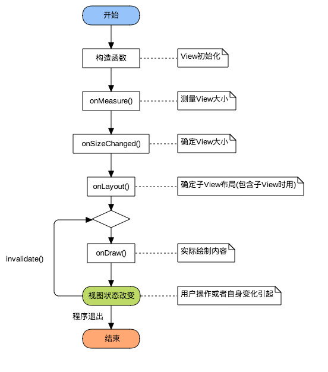

### view绘制流程 ###

> 1.测量View大小（onMeasure）

	@Override
	protected void onMeasure(int widthMeasureSpec, int heightMeasureSpec) {
	    int widthsize  MeasureSpec.getSize(widthMeasureSpec);      //取出宽度的确切数值
	    int widthmode  MeasureSpec.getMode(widthMeasureSpec);      //取出宽度的测量模式
	    
	    int heightsize  MeasureSpec.getSize(heightMeasureSpec);    //取出高度的确切数值
	    int heightmode  MeasureSpec.getMode(heightMeasureSpec);    //取出高度的测量模式
	}

注意：
如果对View的宽高进行修改了，不要调用 super.onMeasure( widthMeasureSpec, heightMeasureSpec); 要调用 setMeasuredDimension( widthsize, heightsize); 这个函数。	

> 2.确定View大小（onSizeChanged）

- 这个函数在视图大小发生改变时调用。
- 
	@Override
	protected void onSizeChanged(int w, int h, int oldw, int oldh) {
	    super.onSizeChanged(w, h, oldw, oldh);
	}

Q: 在测量完View并使用setMeasuredDimension函数之后View的大小基本上已经确定了，那么为什么还要再次确定View的大小呢？

A: 这是因为View的大小不仅由View本身控制，而且受父控件的影响，所以我们在确定View大小的时候最好使用系统提供的onSizeChanged回调函数。

> 3.确定子View布局位置（onLayout）

- 这个函数是在viewGroup中才用到，用来确定子View的位置，调用以下函数来设置子View位置。

	child.layout(l, t, r, b);

>4.绘制内容（onDraw）

	@Override
	protected void onDraw(Canvas canvas) {
	    super.onDraw(canvas);
	}