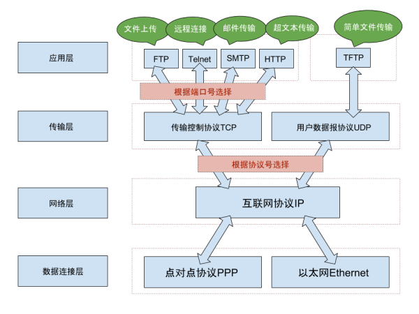

### 网络层级 ###
>1.数据连接层
	
	以太网：以太网(Ethernet)是局域网的通信协议标准。

>2.网络层

	IP：Internet Protocol，互联网协议

>3.传输层

	TCP/UDP
	TCP：传输控制协议(Transmission Control Protocol)是一种面向连接的、可靠的、基于字节流的传输层通信协议。
	UDP：用户数据报协议(User Datagram Protocol)是一种无连接的传输层协议，提供面向事务的简单不可靠信息传送服务。

>4.应用层

	HTTP/FTP/SMTP...

	超文本传输协议（HTTP，HyperText Transfer Protocol)

>个人理解：

	理论上，有以太网和HTTP协议就可以实现局域网的数据传递，由HTTP自己来实现可靠传输机制。每一个在网络上传输的应用层协议都需要完成同样一套安全传输机制。把这段重复的可靠传输机制抽象出来就是TCP,它把可靠传输机制代码封装成了接口函数API,就是socket。用端口来区别不同的应用层。到此网络传播也只是在广播域的范围，所以就有了IP层，只用一个字节来表示协议号，理论上只能辨识255种上层协议。比如：TCP/UDP/ICMP/IGMP...

	TCP提供一种可靠传输机制，有状态；
	UDP提供一种更多的空间来辨别上层的协议，无状态；
	（udp端口占两个字节,理论上可以分辨65535种应用协议）

>SOCKET：TCP/IP网络的API。

       TCP/IP代表传输控制协议/网际协议，指的是一系列协议。

       TCP和UDP使用IP协议从一个网络传送数据包到另一个网络。把IP想像成一种高速公路，它允许其它协议在上面行驶并找到到其它电脑的出口。TCP和UDP是高速公路上的“卡车”，它们携带的货物就是像HTTP，文件传输协议FTP这样的协议等。
       TCP和UDP是FTP，HTTP和SMTP之类使用的传输层协议。虽然TCP和UDP都是用来传输其他协议的，它们却有一个显著的不同：TCP提供有保证的数据传输，而UDP不提供。这意味着TCP有一个特殊的机制来确保数据安全的不出错的从一个端点传到另一个端点，而UDP不提供任何这样的保证。

        HTTP(超文本传输协议)是利用TCP在两台电脑(通常是Web服务器和客户端)之间传输信息的协议。客户端使用Web浏览器发起HTTP请求给Web服务器，Web服务器发送被请求的信息给客户端。

       记住，需要IP协议来连接网络;TCP是一种允许我们安全传输数据的机制，，使用TCP协议来传输数据的HTTP是Web服务器和客户端使用的特殊协议。

       Socket 接口是TCP/IP网络的API，Socket接口定义了许多函数或例程，用以开发TCP/IP网络上的应用程序。

>个人理解socket:
	
	网络、传输层的接口函数。

