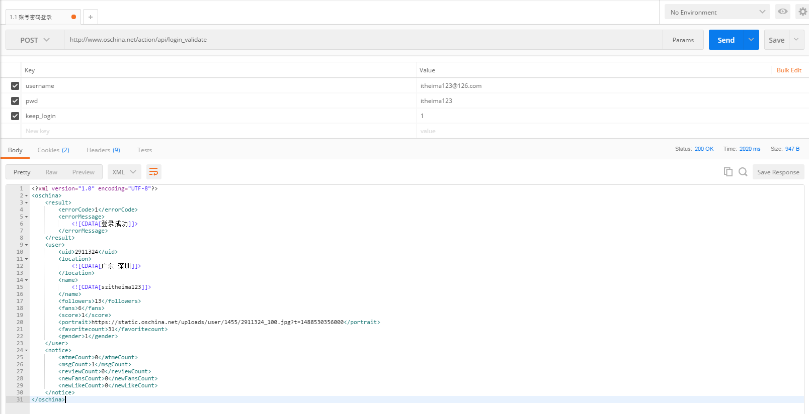

##网络请求使用OkHttpUtils

1.配置

	compile 'com.zhy:okhttputils:2.6.2'
 
2.加入日志输出,最好在application类中初始化.

	 OkHttpClient okHttpClient = new OkHttpClient.Builder()
                .addInterceptor(new LoggerInterceptor("REQUEST"))
                //其他配置
                .build();
        OkHttpUtils.initClient(okHttpClient);
3.使用方式

	OkHttpUtils.get()
                .url(url)
                .params(map)
                .build()
                .execute(new StringCallback() {
                    @Override
                    public void onError(Call call, Exception e, int id) {
                        Log.d(TAG, "onError: "+e.getMessage());
                    }

                    @Override
                    public void onResponse(String response, int id) {
                        Log.d(TAG, "response: "+response);
                        mResponse = response;

                    }
                });
4.注意要点
使用GsonOrXmlFormat工具生成javaBean时,需要去掉根节点,并且必须设置根节点注释,子节点注释可选.

			//@SuppressWarnings("serial")
			@XStreamAlias("oschina")
			public class xxxDeamBean {
				private ResultBean result;    
	       		private UserBean user;
				...
			}

