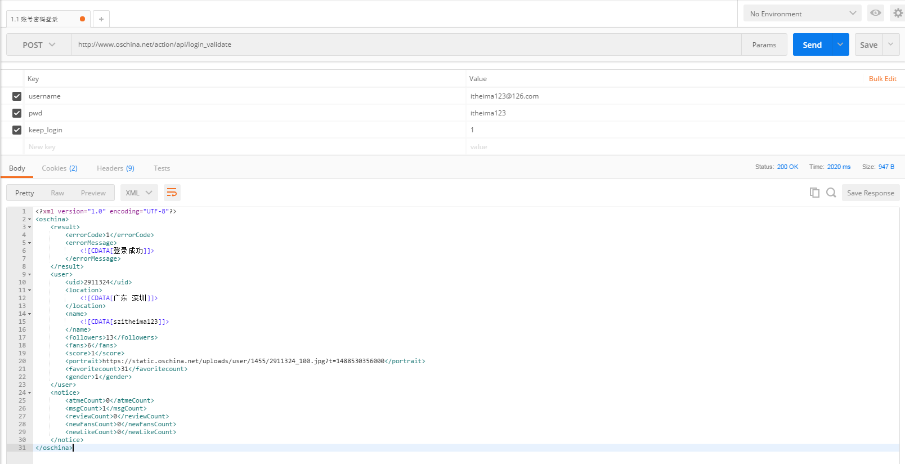

#一. 网络解析 json/xml--->javaBean
##1.通用插件Plugins
	GsonOrXmlFormat

##2.配置(gson转换器和xml转换器)

	compile 'com.squareup.retrofit2:retrofit:2.2.0'
    compile 'com.squareup.retrofit2:converter-gson:2.1.0'
    compile ('com.squareup.retrofit2:converter-simplexml:2.0.1'){

        exclude group:'xpp3',

        module:'xpp3'

        exclude group:'stax',

        module:'stax-api'

        exclude group:'stax',

        module:'stax'}

##3.设置接口
	public interface Api {
    /**
     * 泛型T你想要解析后数据结构
     */
    @GET("login_validate")
    Call<xxxDeamBean> getRequest(@Query("username") String username, @Query("pwd") String pwd, @Query("keep_login") String keep_login);
}

##4.封装工具类
	public class NBMailRetrofit {
    private static NBMailRetrofit sNBMailRetrofit;
    public static final String BASE_URL = "http://www.oschina.net/action/api/";

    private final Api mApi;
    private Gson mGson = new GsonBuilder().setLenient().create();//设置宽大处理畸形的json

    private NBMailRetrofit () {
        //使用Retrofit来实现Api接口 需要配置gson转换器
        Retrofit retrofit = new Retrofit
                .Builder()
                .addConverterFactory(GsonConverterFactory.create(mGson))
                .addConverterFactory(SimpleXmlConverterFactory.create())
                .baseUrl(BASE_URL)
                .build();
        mApi = retrofit.create(Api.class);
    }

    public static NBMailRetrofit getInstance () {
        if (sNBMailRetrofit == null) {
            synchronized (NBMailRetrofit.class) {
                if (sNBMailRetrofit == null) {
                    sNBMailRetrofit = new NBMailRetrofit();
                }
            }
        }
        return sNBMailRetrofit;
    }

    public Api getApi () {
        return mApi;
    }

}

##5.使用方式
	 Call<xxxDeamBean> request = NBMailRetrofit.getInstance().getApi().getRequest(username, pwd, keep_login);
	        request.enqueue(new Callback<xxxDeamBean>() {
	            @Override
	            public void onResponse(Call<xxxDeamBean> call, Response<xxxDeamBean> response) {
	                Log.d(TAG, "onResponse: "+response.body());
	                xxxDeamBean bean = response.body();
	            }
	
	            @Override
	            public void onFailure(Call<xxxDeamBean> call, Throwable t) {
	                Log.d(TAG, "onFailure: "+t.getMessage());
	            }
	        });
	
##6.注意事项
	1.json格式的比较容易解析,使用工具直接生成javaBean即可.
	2.xml格式的文件不容易解析,使用工具生成javaBean以后还需要去掉根目录的节点,并且必须设置根节点注释,子节点注释可选.
		//@SuppressWarnings("serial")
		@XStreamAlias("oschina")
		public class xxxDeamBean {
			private ResultBean result;    
       		private UserBean user;
			...
		}

