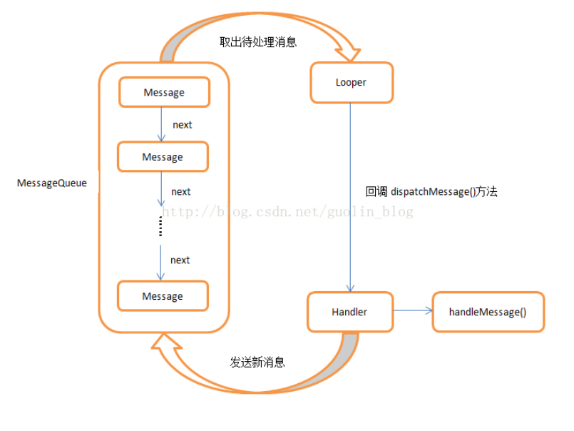
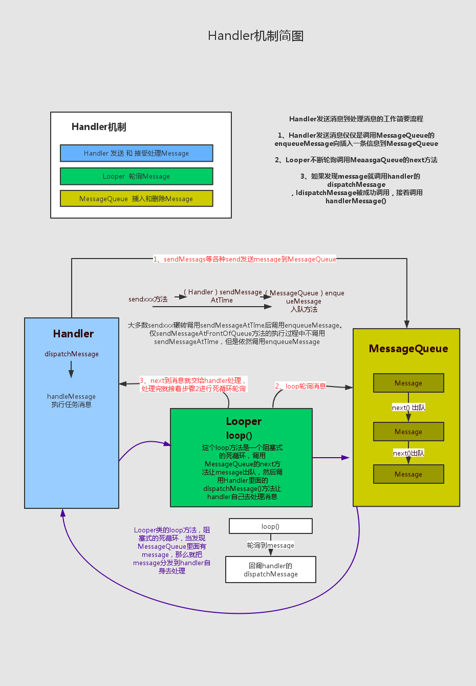

### Handler MessageQueue Looper

##### 一 初始化Handler的过程
	1.会判断是否有Looper,如果没有会报错,提示调用方法Looper.prepare();
	主线程会自动初始化Looper.

	2.会创建MessageQueue队列,且只有一个.

ps:子线程创建Handler,子线程创建的Handle还是在子线程,无法更新UI.
<在子线程更新UI必须要用到主线程的Handler;>

        new Thread(){
            @Override
            public void run() {
                Log.d(TAG, "run: ");
                Looper.prepare();
                mHandler = new Handler(Looper.myLooper()){
                    @Override
                    public void handleMessage(Message msg) {
                        mName = "zhangsan";
                    }
                };
                Looper.loop();
            }
        }.start();
	

##### 二 异步消息处理流程
Android官方文档：

    class LooperThread extends Thread {  
          public Handler mHandler;  
      
          public void run() {  
              Looper.prepare();  
      
              mHandler = new Handler() {  
                  public void handleMessage(Message msg) {  
                      // process incoming messages here  
                  }  
              };  
      
              Looper.loop();  
          }  
      } 

##### 三 子线程更新UI的几种方式

1. Handler的post()方法

2. View的post()方法

3. Activity的runOnUiThread()方法 

PS:
虽然看起来是在子线程更新的操作,但实际都回到了主线程执行.最终内部调用的都是handler.post(Runnable action);

