# 使用Android studio进行ndk开发 #

## 方式一(ndk-build) ##

### 1.下载ndk ###
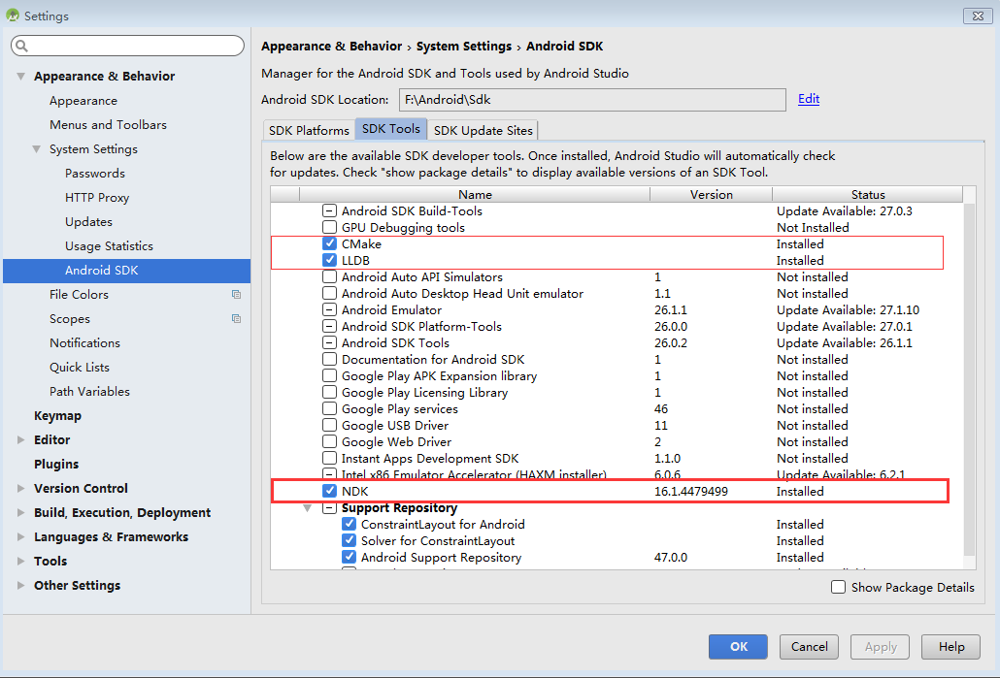

### 2.设置 ###

	在gradle.properties里加一句：android.useDeprecatedNdk=true
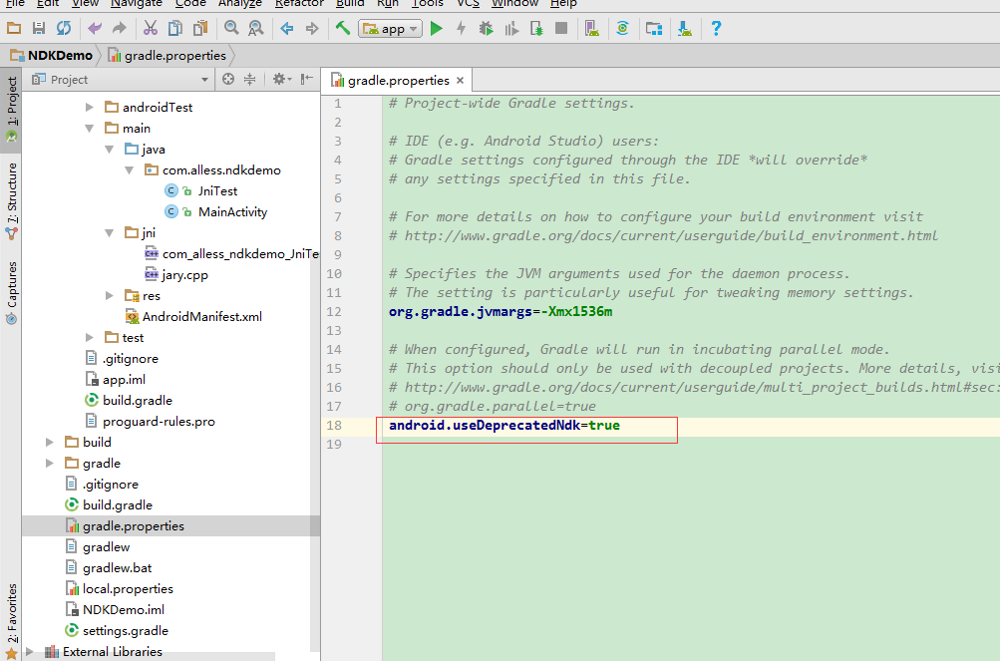

### 3.使用 ###

#### a.新建java类 ####

	public class JniTest2 {
    //静态代码块，导入c库。
    static{
        System.loadLibrary("jniLab2");
    }

    //提供方法接口调用c代码，比普通接口多个native。
    public native String getString();
	}

#### b.生成头文件 ####
	根据class文件生成头文件（找不到class文件位置make project一下）

	在main目录下执行命令：javah -d jni -classpath E:\DEMO\NDKDemo\ndkdemo2\build\intermediates\classes\debug com.alless.ndkdemo2.JniTest2

	会在main目录下生成jni目录，并生成.h文件。

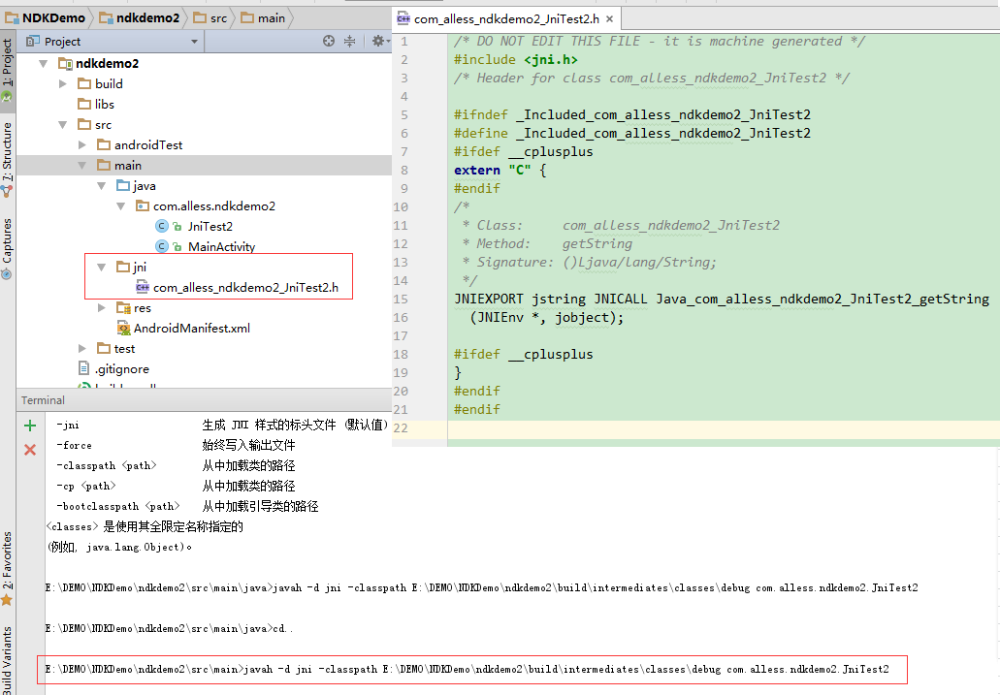

#### c.编写c/c++文件 ####
	将头文件里面的方法名复制进c文件中，补充其他参数。

	c/c++文件后缀应该要与代码里面的书写方式对应。

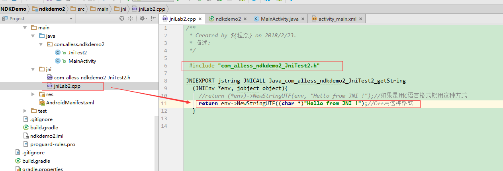

#### d.添加build规则 ####

	在build.gradle的defaultConfig中添加：

        ndk {
            moduleName "jniLab2"         //生成的so名字
            abiFilters "armeabi-v7a", "x86"  //输出指定三种abi体系结构下的so库。
            stl "stlport_static"    //打开.c 的 debug 
        }

	无法生成"armeabi"，弹出警告：
	Error:(81) Android NDK: Application targets deprecated ABI(s): armeabi    
	Error:(82) Android NDK: Support for these ABIs will be removed in a future NDK release.  

#### e.生成so文件 ####
 
	运行或编译会在文件夹：E:\DEMO\NDKDemo\ndkdemo2\build\intermediates\ndk\debug\lib
	生成so文件，可以复制出去。

#### f.so文件存放位置 ####
	1.放置在main->jniLibs目录下。
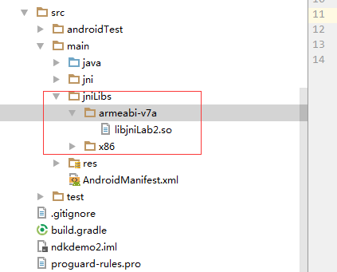

	2.放置在app->libs目录下，需要在build.gradle的defaultConfig中添加
	
        sourceSets{
            main{
                jniLibs.srcDirs = ['libs']
            }
        }

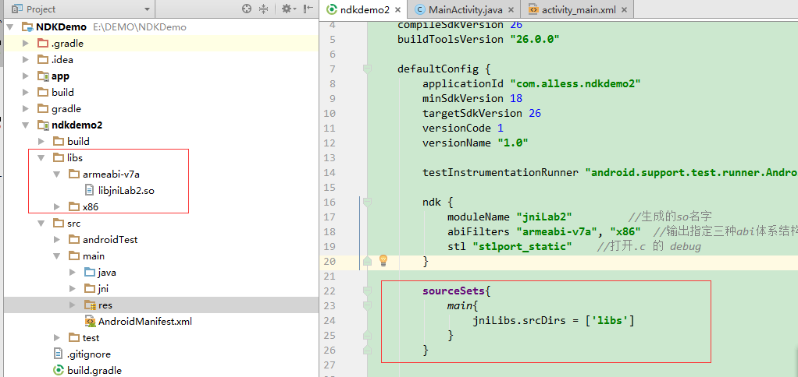

## 方式二(CMake) ##

### 1.下载ndk ###

### 2.新建project ###
	勾选 include C++ support,自动生成各种需求文件。
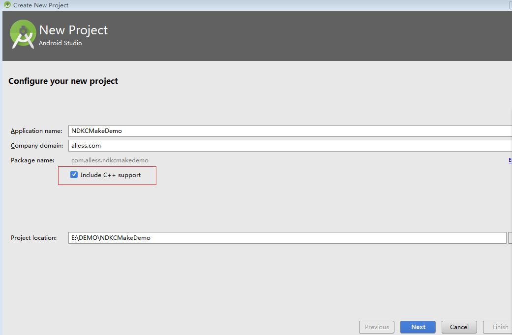

### 3.自动生成 ###
	main目录下多出cpp文件夹，包含c/c++文件。
	module目录下多出CMakeLists.txt文件。
	build.gradle里增加配置信息。
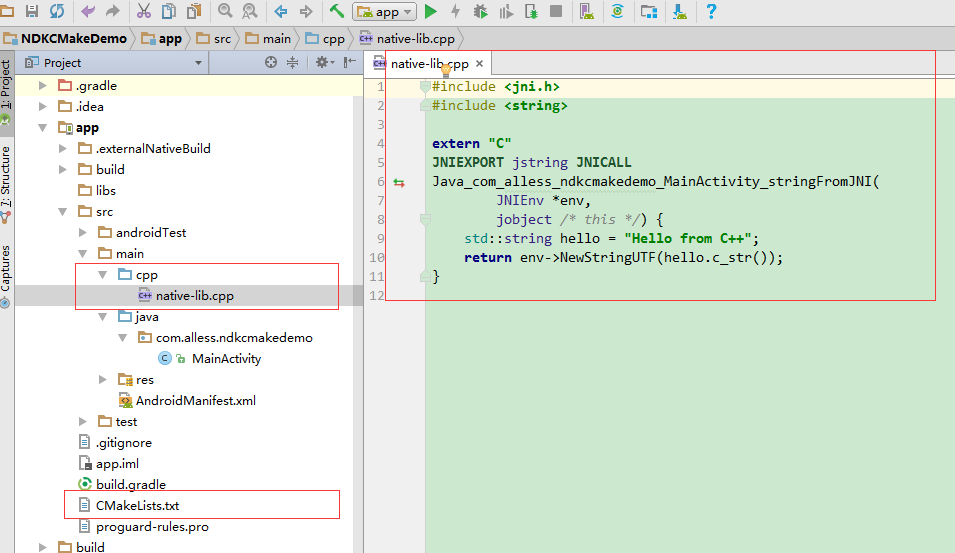
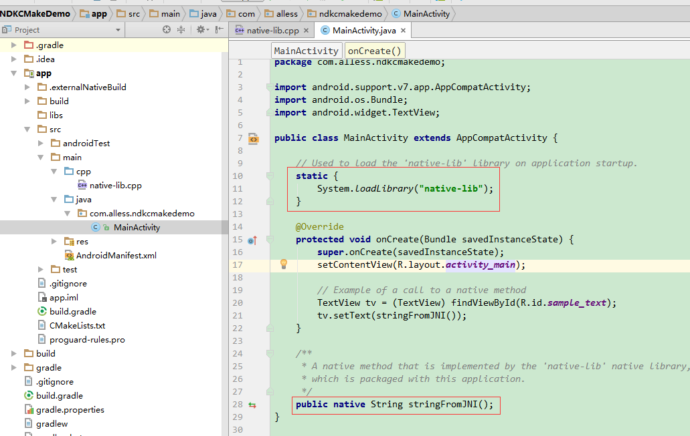
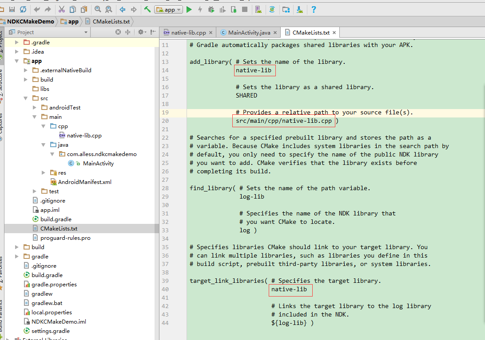
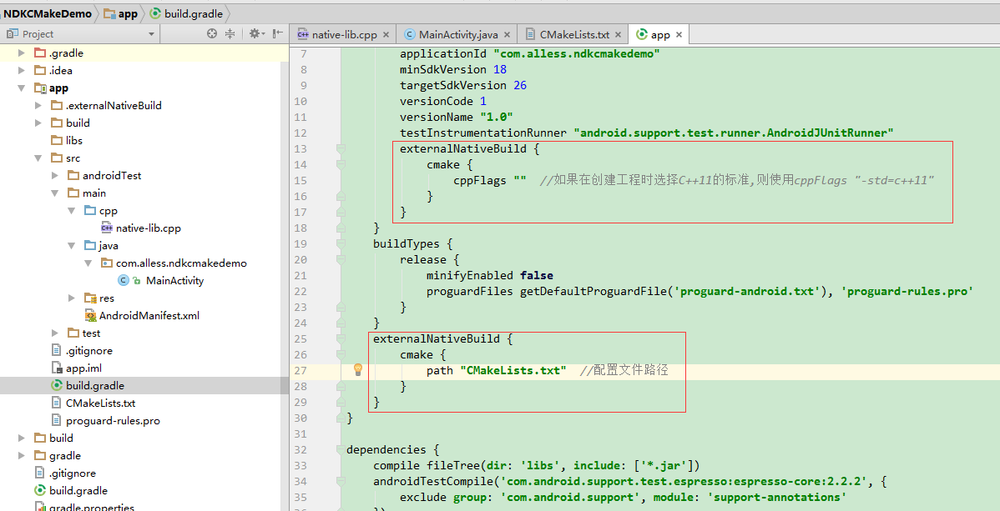

### 4.生成so文件 ###
	make project一下，生成所有架构的so文件，如果需要指定输出需配置。
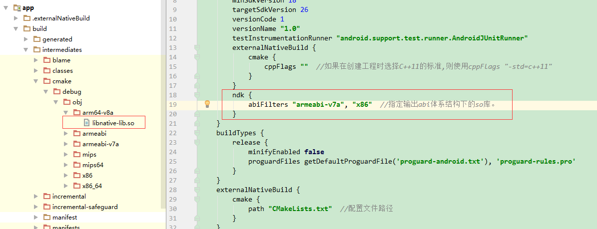

## 总结 ##
	ndk开发流程：
	1.编写需要用来调用c代码的专用java类
	2.编写与java类对应的c文件。（遵守jni书写规则）
	3.将c文件编译成so文件。（在linux平台下运行的二进制文件）
	java类和so文件可移植使用。

## 问题 ##

	1，cmake指定输出so文件位置。
	在CMakeLists.txt文件中配置：
	# 设置生成的so动态库最后输出的路径
	set(CMAKE_LIBRARY_OUTPUT_DIRECTORY ${PROJECT_SOURCE_DIR}/src/main/jniLibs/${ANDROID_ABI})
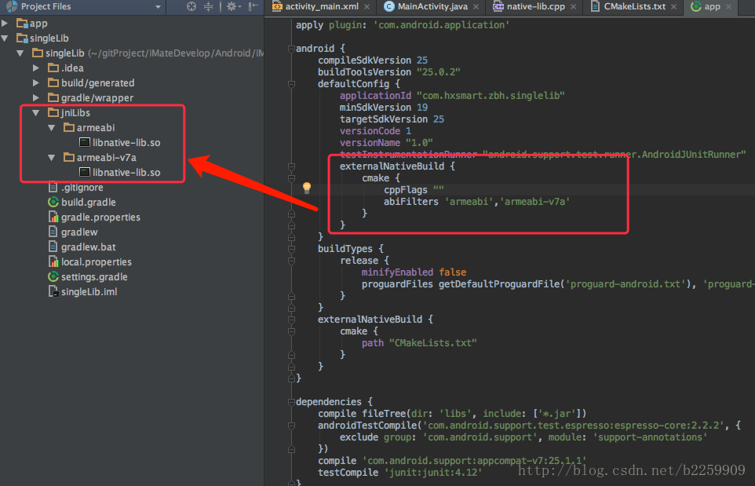