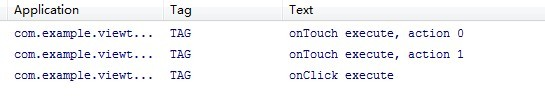
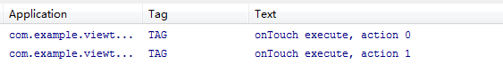

### view的事件传递 ###
#### 操作 ####
>1.给一个Button注册一个触摸事件和点击事件。

	button.setOnTouchListener(new OnTouchListener() {  
	    @Override  
	    public boolean onTouch(View v, MotionEvent event) {  
	        Log.d("TAG", "onTouch execute, action " + event.getAction());  
	        return false;  //3.改为true
	    }  
	}); 

	button.setOnClickListener(new OnClickListener() {  
	    @Override  
	    public void onClick(View v) {  
	        Log.d("TAG", "onClick execute");  
	    }  
	}); 

>2.触发点击事件。(都实现了)
	

>3.把onTouch方法里的返回值改成true，再运行一次。(只有触摸事件)

#### 分析 ####
>View中dispatchTouchEvent方法的源码：

    public boolean dispatchTouchEvent(MotionEvent event) {  
        if (mOnTouchListener != null && (mViewFlags & ENABLED_MASK) == ENABLED &&  
                mOnTouchListener.onTouch(this, event)) {  
            return true;  
        }  
        return onTouchEvent(event);  //onClick方法是在这里面执行的。
    } 
 
- 第一个条件：mOnTouchListener ，在设置触摸监听的时候就被赋值了。
- 第二个条件：(mViewFlags & ENABLED_MASK) == ENABLED是判断当前点击的控件是否是enable的，按钮默认都是enable的，因此这个条件恒定为true。
- 第三个条件：mOnTouchListener.onTouch(this, event)，其实也就是去回调控件注册touch事件时的onTouch方法。也就是说如果我们在onTouch方法里返回true，就会让这三个条件全部成立，从而整个方法直接返回true。如果我们在onTouch方法里返回false，就会再去执行onTouchEvent(event)方法。

>结论：
	
	如果有注册触摸和点击事件的话，dispatchTouchEvent中会先执行onTouch方法，如果onTouch方法返回了true，dispatchTouchEvent方法就返回true结束了，不会执行onClick。

#### 问题 ####
>1. onTouch和onTouchEvent有什么区别，又该如何使用？

	从源码中可以看出，这两个方法都是在View的dispatchTouchEvent中调用的，onTouch优先于onTouchEvent执行。如果在onTouch方法中通过返回true将事件消费掉，onTouchEvent将不会再执行。
	
	
	另外需要注意的是，onTouch能够得到执行需要两个前提条件，第一mOnTouchListener的值不能为空，第二当前点击的控件必须是enable的。因此如果你有一个控件是非enable的，那么给它注册onTouch事件将永远得不到执行。对于这一类控件，如果我们想要监听它的touch事件，就必须通过在该控件中重写onTouchEvent方法来实现。