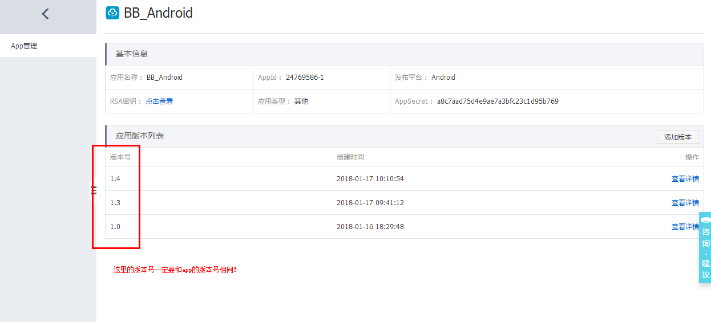

# Android集成使用方法 #
一、依赖

添加maven仓库地址：

	repositories {
		maven {
	  	 url "http://maven.aliyun.com/nexus/content/repositories/releases"
		}
	}

添加gradle坐标版本依赖：

	compile 'com.aliyun.ams:alicloud-android-hotfix:3.1.9'

二、配置文件

1.权限

	<! -- 网络权限 -->
	<uses-permission android:name="android.permission.INTERNET" />
	<uses-permission android:name="android.permission.ACCESS_NETWORK_STATE" />
	<uses-permission android:name="android.permission.ACCESS_WIFI_STATE" />
	<! -- 外部存储读权限，调试工具加载本地补丁需要 -->
	<uses-permission android:name="android.permission.READ_EXTERNAL_STORAGE"/>

2.元数据（平台申请）

	<meta-data
	android:name="com.taobao.android.hotfix.IDSECRET"
	android:value="App ID" />
	<meta-data
	android:name="com.taobao.android.hotfix.APPSECRET"
	android:value="App Secret" />
	<meta-data
	android:name="com.taobao.android.hotfix.RSASECRET"
	android:value="RSA密钥" />

3.混淆

	#基线包使用，生成mapping.txt
	-printmapping mapping.txt
	#生成的mapping.txt在app/buidl/outputs/mapping/release路径下，移动到/app路径下
	#修复后的项目使用，保证混淆结果一致
	#-applymapping mapping.txt
	#hotfix
	-keep class com.taobao.sophix.**{*;}
	-keep class com.ta.utdid2.device.**{*;}
	#防止inline
	-dontoptimize

三、使用

1、在应用入口处初始化（application类中）

	@Override
	protected void attachBaseContext(Context base) {
		super.attachBaseContext(base);
		initSophix1();
	}

	private void initSophix1() {
			// initialize最好放在attachBaseContext最前面，初始化直接在Application类里面，切勿封装到其他类
			SophixManager.getInstance().setContext(this)
					.setAppVersion(getVersionName())
					.setAesKey(null)
					.setEnableDebug(true)//调试模式，发布版本设置false
					.setPatchLoadStatusStub(new PatchLoadStatusListener() {
						@Override
						public void onLoad(final int mode, final int code, final String info, final int handlePatchVersion) {
							// 补丁加载回调通知
							if (code == PatchStatus.CODE_LOAD_SUCCESS) {
								// 表明补丁加载成功
								Log.e(TAG, "onLoad:PatchStatus.CODE_LOAD_SUCCESS "+"补丁加载成功");
							} else if (code == PatchStatus.CODE_LOAD_RELAUNCH) {
								// 表明新补丁生效需要重启. 开发者可提示用户或者强制重启;
								// 建议: 用户可以监听进入后台事件, 然后调用killProcessSafely自杀，以此加快应用补丁，详见1.3.2.3
								Log.e(TAG, "onLoad:PatchStatus.CODE_LOAD_RELAUNCH "+"补丁生效需要重启");
							} else {
								// 其它错误信息, 查看PatchStatus类说明
								Log.e(TAG, "onLoad: 其他"+code);
							}
						}
					}).initialize();
	
		}

2.获取补丁

	@Override
	public void onCreate() {
		// TODO Auto-generated method stub
		super.onCreate();
		initSophix2();
	}

	private void initSophix2() {
		// queryAndLoadNewPatch不可放在attachBaseContext 中，否则无网络权限，建议放在后面任意时刻，如onCreate中
		SophixManager.getInstance().queryAndLoadNewPatch();
	}

四、注意事项
	
1.控制台，应用版本列表，添加版本的时候，版本号一定要和应用app的版本号相同，否则找不到。

