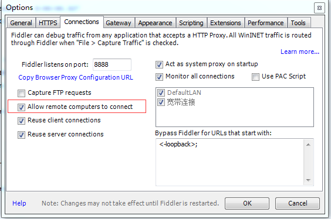
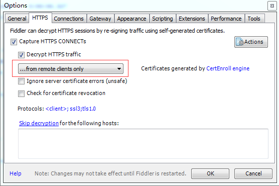

### Fiddler4 抓包 ###

前提，手机和电脑在同一局域网，如果出现问题重启fiddler。

#### 一、安装pc客户端 ####

下载fiddler安装。

#### 二、pc客户端设置 ####

菜单栏Tools-->Options-->Connections,勾选Allow remote computers to connect。

### 三、Android端设置 ###

打开手机设置-->WLAN设置-->选择已连接的网络，修改网络，设置手动代理，主机名设置为电脑端的ip地址，端口设置为8888。

### 四、下载安装证书 ###

手机浏览器上访问 电脑IP:8888，提示下载证书，如果不能安装，进入手机设置，安全，凭证存储，从sd卡安装，选择刚下载好的证书安装。

### 五、只抓取手机app的网络 ###

