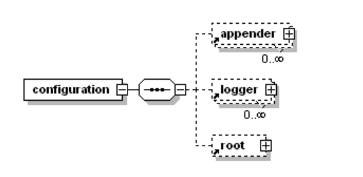

### slf4j日志框架使用说明 ###

### 配合logback使用 ###

#### 1.依赖 ####

	dependencies {
	
	    implementation 'org.slf4j:slf4j-api:1.7.25'
	    implementation 'com.github.tony19:logback-android:2.0.0'
	}

#### 2.在assets目录添加文件logback.xml ####

	<?xml version="1.0" encoding="UTF-8"?>
	<!-- debug属性用来决定是否打印logback的日志信息 -->
	<configuration>
	    <!-- 定义日志路径 -->
	    <property name="LOG_FILE" value="downloadRes" />
	    <!--声明一个属性, 用来指定log文件存放的路径 -->
	    <property name="LOG_DIR" value="/mnt/sdcard/Ubox/log/test1" />
	
	    <property name="maxHistory" value="5"/>
	
	    <!--控制台打印日志-->
	    <appender name="Logcat" class="ch.qos.logback.classic.android.LogcatAppender">
	        <encoder>
	            <pattern>[%thread] %msg</pattern>
	        </encoder>
	    </appender>
	
	    <!-- 声明一个RollingFileAppender -->
	    <appender name="BASE_ROLE_FILE" class="ch.qos.logback.core.rolling.RollingFileAppender">
	        <!-- onMatch是与level匹配的是否允许输出，onMismatch是与level不匹配的是否允许输出-->
	        <filter class="ch.qos.logback.classic.filter.LevelFilter">
	            <level>INFO</level>
	            <onMatch>ACCEPT</onMatch>
	            <onMismatch>ACCEPT</onMismatch>
	        </filter>
	        <!--根据时间+文件大小滚动日志文件
	            时间：精确到天，最大记录天数maxHistory天
	            文件：单个文件大小控制在maxFileSize,多出的会xx_0.zip,xx_1.zip… -->
	        <rollingPolicy class="ch.qos.logback.core.rolling.TimeBasedRollingPolicy">
	            <!--日志文件后缀.log，压缩文件后缀.zip-->
	            <fileNamePattern>${LOG_DIR}/${LOG_FILE}_%d{yyyyMMdd}_%i.log.zip</fileNamePattern>
	            <maxHistory>${maxHistory}</maxHistory>
	            <timeBasedFileNamingAndTriggeringPolicy class="ch.qos.logback.core.rolling.SizeAndTimeBasedFNATP">
	                <maxFileSize>1MB</maxFileSize>
	            </timeBasedFileNamingAndTriggeringPolicy>
	        </rollingPolicy>
	        <!-- 输出log的格式 -->
	        <encoder>
	            <pattern>%d{yyyy-MM-dd HH:mm:ss.SSS} [%thread] %-5level- %msg%xEx%n</pattern>
	        </encoder>
	    </appender>
	    <!--总的log级别开关-->
	    <root level="INFO">
	        <appender-ref ref="BASE_ROLE_FILE" />
	        <appender-ref ref="Logcat" />
	    </root>
	</configuration>

#### 3.初始化 ####

	Logger mLogger = LoggerFactory.getLogger(VmLog.class);//参数不能为空字符串，否则控制台无法输出日志。

示例

~~~java
public class Foo {
    static final Logger logger= LoggerFactory.getLogger(Foo.class);
    public void doIt(){
        logger.debug("Did it again!");
    }
}
~~~

## 记录

* <logger>元素有且仅有一个 name 属性、一个可选的level 属性和一个可选的 additivity 属性。<logger>元素可以包含零个或多个<appender-ref>元素。

* <root>元素配置根 logger。该元素有一个 level 属性。没有 name 属性，因为已经被命名

  为“ROOT”。

  > 所以root其实是一个叫ROOT的<logger>标签

定制化操作，详见logback2.xml说明。