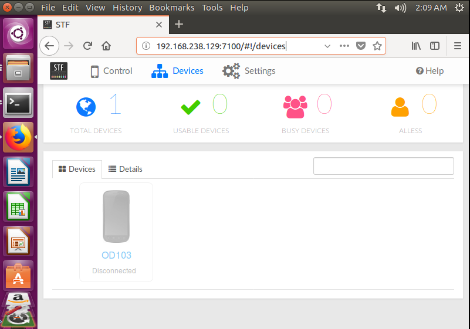

### STF（Smartphone Test Farm） ###

#### 介绍 ####

[官网入口](https://openstf.io/)

简单一点来说，stf是一个手机设备管理平台，可以通过浏览器远程控制安卓手机（最多上百台，前提是这些手机设备已经连接在stf服务器上）。对于开发者来说，最方便的还是可以通过android studio连接调试。stf现在是开源项目，所以也叫openstf。

#### 服务器集成 ####

> 官方不保证windows上能运行，最好是在linux和mac上。

	On Windows you're on your own. In theory you might be able to get STF installed via Cygwin or similar, but we've never tried. In principle we will not provide any Windows installation support, but please do send a documentation pull request if you figure out what to do.

> 在linux上搭建主要参考这个链接：[STF的环境搭建和运行](https://testerhome.com/topics/2988) ，需要注意的有以下几点。

 	1.nodejs 的安装不需要编译，直接设置软链接就可以了。
	2.这个帖子里没有yasm的安装，在安装stf之前，请先安装yasm。
		下载地址：http://www.tortall.net/projects/yasm/releases
		./configure
		make
		sudo make install
	3.安装stf的时候不要使用sudo 
		npm install -g stf

> 安装stf时报错，参考。

[Failed to install stf using npm](https://github.com/openstf/stf/issues/995)

[Error: EACCES: permission denied](https://stackoverflow.com/questions/38323880/error-eacces-permission-denied)

#### 演示 ####

1.启动rethinkDB

	rethinkdb

2.启动stf服务端

	stf local --public-ip 192.168.238.129 --allow-remote
	//--public-ip 192.168.238.129 本机ip，提供局域网其他机器访问。

3.浏览器中输入http://localhost:7100/（或http://192.168.238.129:7100/），进入登录页面，填入任意用户名和邮箱登录。

> linux的浏览器中显示

> windows的浏览器中显示（当前windows系统中正在使用设备）。

4.浏览器控制设备，主要操作功能：

	实时屏幕操作和显示。

	安装卸载APK。

	设备信息的展示（如：网络状态、MIME、android版本、手机型号等等）。

	展示日志打印。

	远程debug。

5.android studio连接，在terminal输入adb connect 192.168.238.129:7401，即可连上设备。

#### 说明 ####

stf对于手机设备测试来说确实很方便，集中一个设备室，将所有手机连上stf服务器，其他测试人员只需要登录浏览器就可以方便的测试任意设备。
