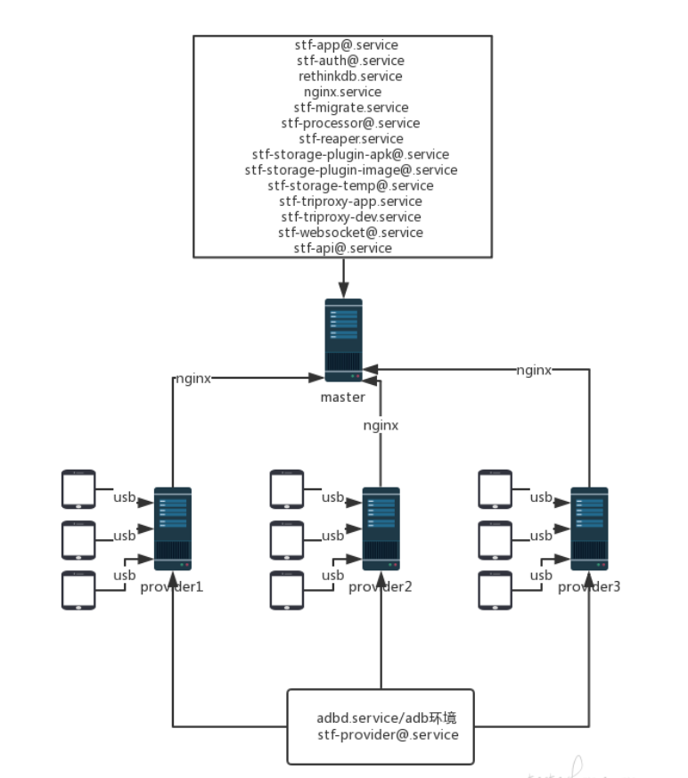
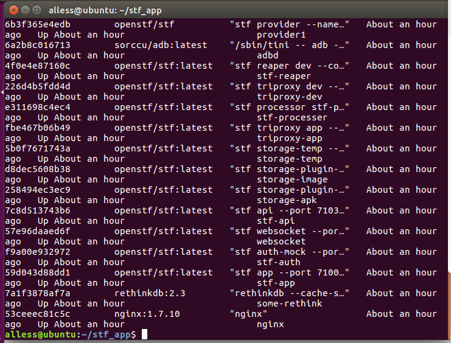
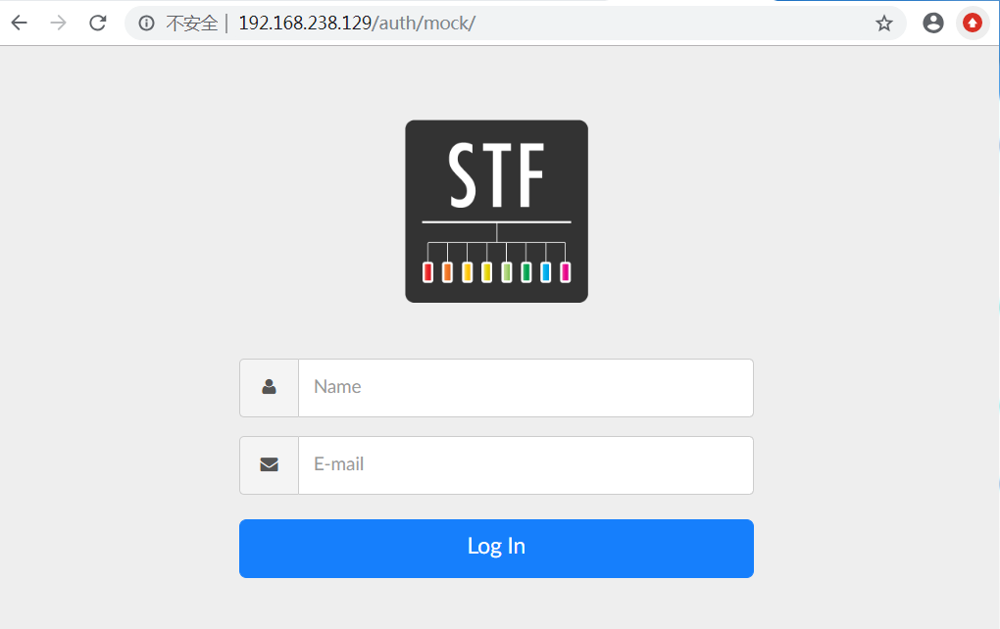
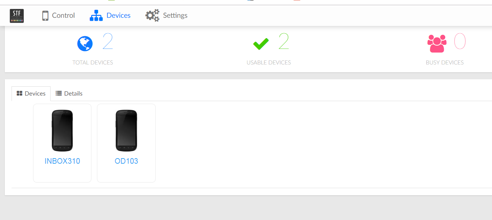
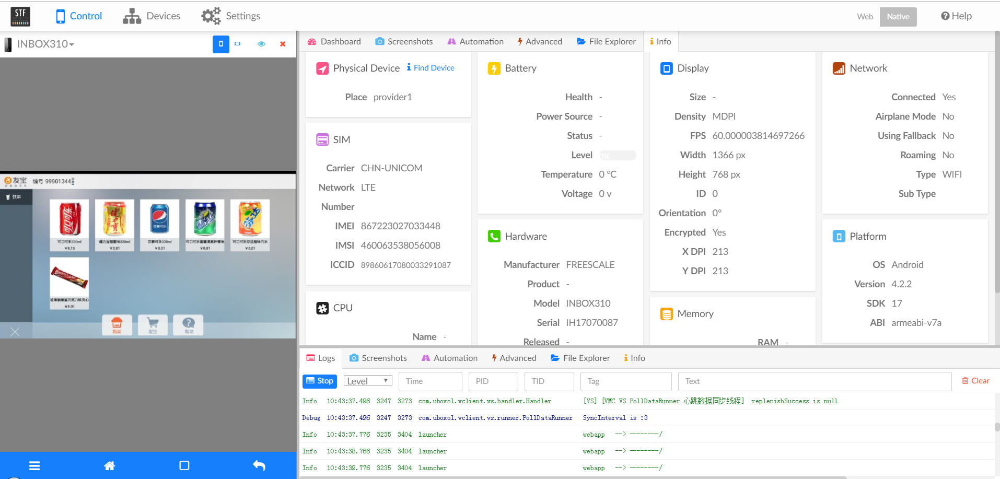

### 介绍 ###

之前使用官方介绍的[常规方式](https://github.com/openstf/stf/blob/master/README.md)集成过stf，先装一堆必须的基础库，再安装stf包，然后使用。
这种方式使用的弊端，环境安装复杂，无法使用云端服务器，无法配置多个服务节点。

现在来看一下也是官方推荐的另一种stf[集群化部署](https://github.com/openstf/stf/blob/master/doc/DEPLOYMENT.md)方式。主要就是用一台主服务器，多台节点服务器。节点服务器连接安卓设备，将信息传给主服务器。

参考网上一张图。

### 大概流程 ###

1.主服务器和节点服务器都要安装运行环境，使用docker容器管理镜像的方式来安装，比较方便快捷。

2.主服务器会启动一些服务。

- rethinkdb.service
- stf-app@.service
- stf-auth@.service
- stf-log-rethinkdb.service
- stf-migrate.service
- stf-notify-hipchat.service
- stf-processor@.service
- stf-provider@.service
- stf-reaper.service
- stf-storage-plugin-apk@.service
- stf-storage-plugin-image@.service
- stf-storage-temp@.service
- stf-triproxy-app.service
- stf-triproxy-dev.service
- stf-websocket@.service
- stf-api@.service

3.节点服务器会启动一些服务。

- adbd.service
- rethinkdb.service

### 完整流程（ubuntu16.04LTS） ###

1.安装docker。

- [参考地址](https://blog.csdn.net/qq_36892341/article/details/73918672)

2.拉取以下镜像。

	docker pull openstf/stf:latest
	docker pull sorccu/adb:latest 
	docker pull rethinkdb:2.3 
	docker pull openstf/ambassador:latest 
	docker pull nginx:1.7.10

3.准备工作（主服务器）。

- 创建一个工作目录。

		本例：/home/alless/stf_app

- 配置一个nginx.conf文件，放在工作目录。（如果新增节点服务器需要在nginx.conf里面修改配置，略）

		daemon off;
		worker_processes 1;
		
		events {
		  worker_connections 1024;
		}
		#如果nginx与服务器不在一台上将127.0.0.1改为服务器IP。
		http {
		  upstream stf_app {
		    server 127.0.0.1:7100 max_fails=0;
		  }
		
		  upstream stf_auth {
		    server 127.0.0.1:7101 max_fails=0;
		  }
		
		  upstream stf_storage_apk {
		    server 127.0.0.1:7104 max_fails=0;
		  }
		
		  upstream stf_storage_image {
		    server 127.0.0.1:7105 max_fails=0;
		  }
		
		  upstream stf_storage {
		    server 127.0.0.1:7106 max_fails=0;
		  }
		
		  upstream stf_websocket {
		    server 127.0.0.1:7102 max_fails=0;
		  }
		
		  upstream stf_api {
		    server 127.0.0.1:7103 max_fails=0;
		  }
		
		  types {
		    application/javascript  js;
		    image/gif               gif;
		    image/jpeg              jpg;
		    text/css                css;
		    text/html               html;
		  }
		
		  map $http_upgrade $connection_upgrade {
		    default  upgrade;
		    ''       close;
		  }
		
		  server {
		    listen 80;
		#    server_name www.你的域名.com;
		    keepalive_timeout 70; 
		#    resolver 114.114.114.114 8.8.8.8 valid=300s;
		#    resolver_timeout 10s;
		
		# 如果不配置,图像minicap等服务将直连provider服务器,
		# 通过配置可以让nginx转发请求到provider服务器,这样对外时可以不用暴露provider服务器.
		# floor4 : provider的 --name
		# proxy_pass :  provider的内网IP
		
		#    location ~ "^/d/floor4/([^/]+)/(?<port>[0-9]{5})/$" {
		#      proxy_pass http://192.168.0.106:$port/;
		#      proxy_http_version 1.1;
		#      proxy_set_header Upgrade $http_upgrade;
		#      proxy_set_header Connection $connection_upgrade;
		#      proxy_set_header X-Forwarded-For $remote_addr;
		#      proxy_set_header X-Real-IP $remote_addr;
		#    }
		
		
		
		    location /auth/ {
		      proxy_pass http://stf_auth/auth/;
		    }
		
		    location /api/ {
		      proxy_pass http://stf_api/api/;
		    }
		
		    location /s/image/ {
		      proxy_pass http://stf_storage_image;
		    }
		
		    location /s/apk/ {
		      proxy_pass http://stf_storage_apk;
		    }
		
		    location /s/ {
		      client_max_body_size 1024m;
		      client_body_buffer_size 128k;
		      proxy_pass http://stf_storage;
		    }
		
		    location /socket.io/ {
		      proxy_pass http://stf_websocket;
		      proxy_http_version 1.1;
		      proxy_set_header Upgrade $http_upgrade;
		      proxy_set_header Connection $connection_upgrade;
		      proxy_set_header X-Forwarded-For $proxy_add_x_forwarded_for;
		      proxy_set_header X-Real-IP $http_x_real_ip;
		    }
		
		    location / {
		      proxy_pass http://stf_app;
		      proxy_set_header X-Forwarded-For $proxy_add_x_forwarded_for;
		      proxy_set_header X-Real-IP $http_x_real_ip;
		    }
		  }
		}	

4.启动主服务器服务，执行脚本文件main_provider.sh

	#文件目录
	workdir="/home/alless/stf_app"
	
	#服务器IP
	hostname="192.168.238.129"
	
	echo "停止所有正在运行的容器"
	sudo docker stop $(sudo docker ps -a -q)
	sleep 3
	
	echo "删除所有的容器"
	sudo docker rm -v $(sudo docker ps -a -q)
	sleep 3
	
	echo "启动nginx"
	docker run -d  --name nginx -v "${workdir}/nginx.conf:/etc/nginx/nginx.conf:ro" --net host nginx:1.7.10 nginx
		
	echo "启动 rethinkdb"
	docker run -d --name some-rethink -v "${workdir}/rethinkdb_data:/data" --net host rethinkdb:2.3 rethinkdb --cache-size 2048 --no-update-check
	sleep 3
	
	echo "初始化rethinkdb"
	docker run --rm --name stf-migrate --net host openstf/stf:latest stf migrate
	sleep 3
	
	echo "启动 stf app"
	docker run -d --name stf-app --net host -e "SECRET=YOUR_SESSION_SECRET_HERE" openstf/stf:latest stf app --port 7100 --auth-url http://${hostname}/auth/mock/ --websocket-url ws://${hostname}/
	sleep 3
	
	echo "启动 stf auth-mock"
	docker run -d --name stf-auth --net host -e "SECRET=YOUR_SESSION_SECRET_HERE" openstf/stf:latest stf auth-mock --port 7101 --app-url http://${hostname}/
	sleep 1
	
	echo "启动 stf websocket"
	docker run -d --name websocket --net host -e "SECRET=YOUR_SESSION_SECRET_HERE" openstf/stf:latest stf websocket --port 7102 --storage-url http://${hostname}/ --connect-sub tcp://127.0.0.1:7150 --connect-push tcp://127.0.0.1:7170
	sleep 1
	
	echo "启动 stf api"
	docker run -d --name stf-api --net host -e "SECRET=YOUR_SESSION_SECRET_HERE" openstf/stf:latest stf api --port 7103 --connect-sub tcp://127.0.0.1:7150 --connect-push tcp://127.0.0.1:7170
	sleep 1
	
	echo "启动 stf storage-plugin-apk"
	docker run -d --name storage-apk --net host openstf/stf:latest stf storage-plugin-apk --port 7104 --storage-url http://${hostname}/
	sleep 1
	
	echo "启动 stf storage-plugin-image"
	docker run -d --name storage-image --net host openstf/stf:latest stf storage-plugin-image --port 7105 --storage-url http://${hostname}/
	sleep 1
	
	echo "启动 stf storage-temp"
	docker run -d --name storage-temp --net host -v "${workdir}/storage:/data" openstf/stf:latest stf storage-temp --port 7106 --save-dir /data
	sleep 1
	
	echo "启动 stf triproxy app"
	docker run -d --name triproxy-app --net host openstf/stf:latest stf triproxy app --bind-pub "tcp://*:7150" --bind-dealer "tcp://*:7160" --bind-pull "tcp://*:7170"
	sleep 1
	
	echo "启动 stf processor"
	docker run -d --name stf-processer --net host openstf/stf:latest stf processor stf-processer --connect-app-dealer tcp://127.0.0.1:7160 --connect-dev-dealer tcp://127.0.0.1:7260
	sleep 1
	
	echo "启动 stf triproxy dev"
	docker run -d --name triproxy-dev --net host openstf/stf:latest stf triproxy dev --bind-pub "tcp://*:7250" --bind-dealer "tcp://*:7260" --bind-pull "tcp://*:7270"
	sleep 1
	
	echo "启动 stf reaper dev"
	docker run -d --name stf-reaper --net host openstf/stf:latest stf reaper dev --connect-push tcp://127.0.0.1:7270 --connect-sub tcp://127.0.0.1:7150 --heartbeat-timeout 30000

5.启动节点服务器服务，执行脚本文件sub_provider.sh
	
	#服务器IP
	hostname="192.168.238.129"
	echo "启动adbd"
	docker run -d --name adbd --privileged -v /dev/bus/usb:/dev/bus/usb --net host sorccu/adb:latest
	sleep 3
	
	echo "启动stf provider"
	docker run -d --name provider1 --net host openstf/stf \
	stf provider --name provider1 \
	--connect-sub tcp://${hostname}:7250 \
	--connect-push tcp://${hostname}:7270 \
	--min-port=15000 --max-port=25000 --heartbeat-interval 20000 --allow-remote --no-cleanup \
	--storage-url http://${hostname}

6.以上流程顺利的话，查看容器运行情况，服务都在运行中。

	sudo docker ps -a

### 使用说明 ###

浏览器输入hostname(192.168.238.129)就可以显示stf登录页了。

当前连接设备，一台工控，一台锤子手机。

ps:工控使用普通显示器无法被stf识别，日志显示  minitouch says: "Unable to find a suitable touch device"，找不到触摸设备，必须插上带触摸屏的显示器才可以。

### 总结 ###

当前已经实现stf集群化部署的内容，只需要把hostname(192.168.238.129)映射到外网（这需要管理员修改路由），即可通过外网访问。

理论上远程控制多台工控设备功能可以实现。

实际上，要部署主服务器，还要在工控旁搭建节点服务器，节点服务器通过usb拓展线连接多台工控设备，每台工控设备都需要接上触摸显示屏。