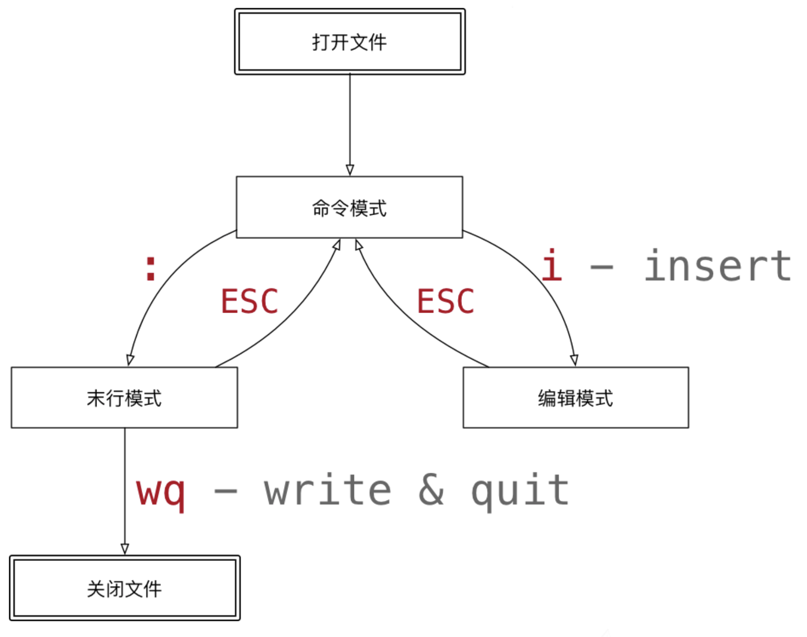

## vi&vim基础功能使用

[引用地址](https://www.cnblogs.com/randysun/p/11463130.html)

#### vi模式切换

只需要记住esc是回到命令模式，然后记住以下一些命令就可以了。

文本编辑

* i（insert）是编辑模式，进入编辑模式以后，键盘上的按键都是用来输入文本的。编辑模式下其实可以用鼠标选中文本复制和粘贴（command+c/v），只能用键盘移动改变光标位置。

保存/退出

* :wq（write quit）保存退出
* :q!（quit）不保存退出

撤销/反撤销

* u (undo)是撤销
* control+r 是反撤销

删除行

* dd

选中/删除/复制/粘贴

* v （Visual可视化）是可以通过移动光标选中文本
* d （delete）删除选中的文本
* y （copy）复制选中的文本
* x （cut）剪切选中的文本
* p（paste）将复制或者剪切的文本粘贴

查找/替换

* / 是查找（例如/123 查找123，n是下一个，N是上一个）
* :%s/旧文本/新文本/gc（文本替换，会有提示）