# Java垃圾回收

#### jvm运行时内存数据区域

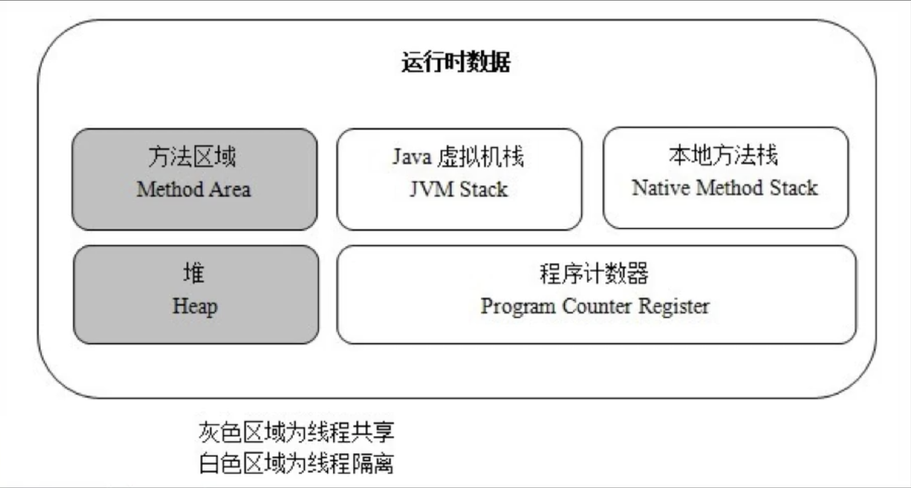

#### 程序计数器

#### 本地方法栈

#### Java虚拟机栈（JVM Stack）

* Java虚拟机栈描述的是Java方法的执行模型：每个方法执行的时候都会创建一个帧（Frame）栈用于存放局部变量表，操作栈，动态链接，方法出口等信息。一个方法等执行过程，就是这个方法对于帧栈的入栈出栈过程。
* 线程隔离

#### 堆（Heap）

* 堆里存放的是对象的实例
* 是Java虚拟机管理内存中最大的一块
* GC主要的工作区域，为了高效的GC，会把堆细分更多的子区域
* 线程共享

#### 方法区

* 存放了每个Class的结构信息，包括常量池、字段描述、方法描述

* GC的非主要工作区域

* ~~~java
  public void method1(){
    Object obj = new Object();
  }
  生成了2部分的内存区域，1）obj这个引用变量，因为是方法内的变量，放到JVM Stack里面 2）真正Object class的实例对象，放到Heap里面
  上述的new语句一共消耗12个bytes，JVM规定引用占4个bytes（在JVM Stack），而空对象是8个bytes（在Heap）
  方法结束后，对应Stack中的变量马上回收，但是Heap中的对象要等到GC来回收
  ~~~

* 方法区主要回收两部分内容：废弃常量与无用类。

  * 类回收需要满足的3个条件（比较难）：
    * 该类所有的实例都已经被GC，也就是JVM中不存在该Class的任何实例
    * 加载该类的ClassLoader已经被GC
    * 该类对应的java.lang.Class对象没有在任何地方被引用，如不能在任何地方通过反射访问该类的方法

* 在大量使用反射、动态代理、CGLib等字节码框架、动态生成JSP以及OSGi这类频繁自定义ClassLoader的场景都需要JVM具备类卸载的支持以保证方法区不会溢出。

## JVM垃圾回收（GC）模型

### 垃圾判断算法

#### 引用计数算法（Reference Counting）

* 给对象添加一个引用计数器，当有一个地方引用它，计数器加1，当引用失效，计数器减1，任何时刻计数器为0的对象就是不可能再被使用的
* 引用计数算法无法解决对象循环引用的问题

#### 根搜索算法（Root Tracing）

* 在实际的生产语言中（Java、C#等），都是使用根搜索算法判定对象是否存活

* 算法基本思路就是通过一系列的称为“GC Roots”的点作为起始进行向下搜索，当一个对象到GC Roots没有任何引用链（Reference Chain）相连，则证明此对象是不可用的

  * 在Java语言中，GC Roots包括

    * 在VM栈（帧中的本地变量）中的引用
    * 方法区中的静态引用
    * JNI（即一般说的Native方法）中的引用

    > 可以理解为，成员方法中的引用，成员变量的引用不算（这样就解决了对象循环引用的问题吧）

### 垃圾回收算法

#### 标记-清除算法（Mark-Sweep）

* 算法分为“标记”和“清除”两个阶段，首先标记出所有需要回收的对象，然后回收所有需要回收的对象

* 缺点

  * 效率问题，标记和清理两个过程效率都不高
  * 空间问题，标记清理之后会产生大量不连续的内存碎片，空间碎片太多可能会导致后续使用中无法找到足够的连续内存而提前触发另一次的垃圾搜集动作
  * 效率不高，需要扫描所有对象。堆越大，GC越慢
  * 存在内存碎片问题。GC次数越多，碎片越严重

  > GC慢，碎片多。

* 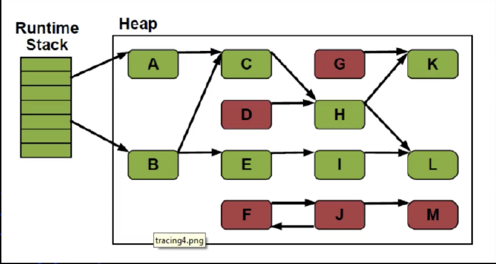

  > 从运行时的GC Roots开始找，绿色的都是被标记保留的，没有标记的被清除。

#### 标记-整理算法（Mark-Compact）

* 标记过程仍然一样，但后续步骤不是进行直接清理，而是令所有存活的对象一端移动，然后直接清理掉这端边界以外的内存。
* 没有内存碎片
* 比Mark-Sweep耗费更多的时间进行compact
* 

#### 复制收集算法（Copying）

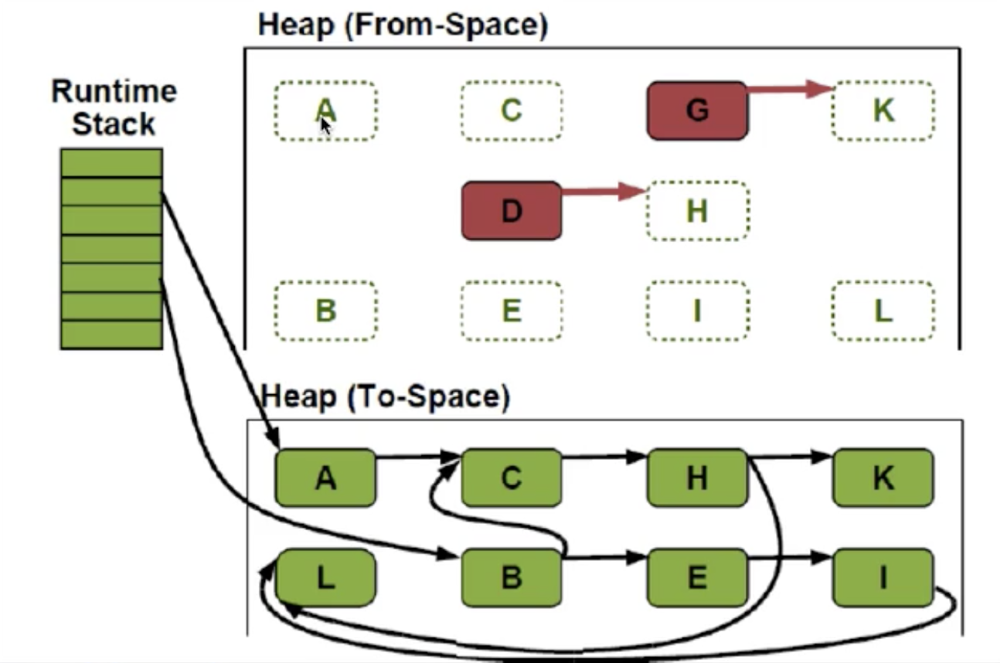

> 把上面存活的对象都复制到下面，然后清空上部分空间。

* 将可用内存划分为两块，每次只使用其中的一块，当半区内存用完了，仅将还存活的对象复制到另外一块上面，然后就把原来整块内存空间一次性清理掉
* 这样使得每次内存回收都是对整个半区的回收，内存分配时也就不用考虑内存碎片等复杂情况，只要移动堆顶指针，按顺序分配内存就可以了，实现简单，运行高效。只是这种算法的代价是将内存缩小为原来的一半，代价高昂
* 现在的商业虚拟机中都是用了这一种收集算法来回收新生代
* 将内存分为一块较大的eden空间和2块较少的survivor空间，每次使用eden和其中一块survivor，当回收时将eden和survivor还存活的对象一次性拷贝到另一块survivor空间上，然后清理掉eden和用过的survivor。**survivor如何有足够的空间？**
* Oracle Hotspot虚拟机默认eden和survivor的大小比例是8:1，也就是每次只有10%的内存是“浪费”的。
* 复制收集算法在对象存活率高的时候，效率有所下降
* 如果不想浪费50%的空间，就需要有额外的空间进行分配担保用于应付半区内存中所有对象都100%存活的极端情况，所以在老年代一般不能直接选用这种算法
* 只需要扫描存活的对象，效率更高
* 不会产生碎片
* 需要浪费额外的内存作为复制区
* 复制算法非常适合生命周期比较短的对象，因为每次GC总能回收大部分的对象，复制的开销比较小
* 根据IBM的专门研究，98%的Java对象只会存活1个GC周期，对这些对象很适合用复制算法。而且不用1:1的划分工作区和复制区的空间

#### 分代算法（Generational）

* 当前商业虚拟机的垃圾收集都是采用“分代收集”（Generational Collecting）算法，根据对象不同的存活周期将内存划分为几块

* 一般是把Java堆分作新生代和老年代，这样就可以根据各个年代的特点采用最适当的收集算法，譬如新生代每次GC都有大批对象死去，只有少量存活，那就选用复制算法只需要付出少量存活对象的复制成本就可以完成收集。
* 综合前面几种GC算法的优缺点，针对不同生命周期的对象采用不同的GC算法

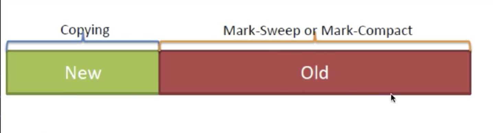

* Hotspot JVM 6中共划分为三个代：年轻代（Young Generation）、老年代（Old Generation）和永久代（Permanent Generation）（古老的叫法，jdk8以后叫元空间）。

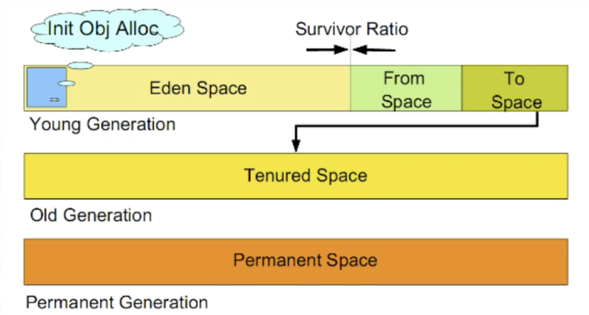

* 年轻代（Young Generation）
  * 新生成的对象都放在年轻代，年轻代用复制算法进行GC（理论上，年轻代对象的生命周期非常短，所以适合复制算法）
  * 年轻代分三个区，一个Eden区，两个Survivor区（可以通过参数设置Survivor个数）。对象在Eden区中生成，当Eden区满时，还存活的对象将被复制到一个Survivor区，当这个Survivor区满时，此区的存活对象将被复制到另外一个Survivor区，当第二个Survivor区也满了的时候，从第一个Survivor区复制过来的并且此时还存活的对象，将被复制到老年代，2个Survivor是完全对称，轮流替换。
  * Eden和2个Survivor的缺省比例是8:1:1，也就是10%的空间会被浪费，可以根据GC log的信息调整大小的比例。
* 老年代（Old Generation）
  * 存放了经过一次或多次GC还存活的对象
  * 一般采用Mark-Sweep或者Mark-Compact算法进行GC
  * 有多种垃圾收集器可以选择，每种垃圾收集器可以看作一个GC算法的具体实现，可以根据具体应用的需求选用合适的垃圾收集器（追求吞吐量？追求最短的响应时间？）
* 永久代（元空间）
  * 并不属于堆（Heap），但是GC也会涉及到这个区域
  * 存放了每个Class的结构信息，包括常量池、字段描述、方法描述。与垃圾收集要收集的Java对象关系不大。

### 垃圾回收器的实现和选择

#### 垃圾回收器（Garbage Collector）

* 分代模型：GC的宏观愿景；
* 垃圾回收器：GC的具体实现
* Hotspot JVM提供多种垃圾回收器，我们需要根据具体应用的需要采用不同的回收器
* 没有万能的垃圾回收器，每种垃圾回收器都有自己的适用场景

#### 垃圾收集器的“并行”和“并发”

* 并行（Parallel）：指多个收集器的线程同时工作，但是用户线程处于等待状态
* 并发（Concurrent）：指收集器在工作的同时，可以允许用户线程工作
  * 并发不代表解决了GC停顿的问题，在关键的步骤还是要停顿，比如在收集器标记垃圾的时候。但在清除垃圾的时候，用户线程可以和GC线程并发执行。

#### 垃圾收集算法

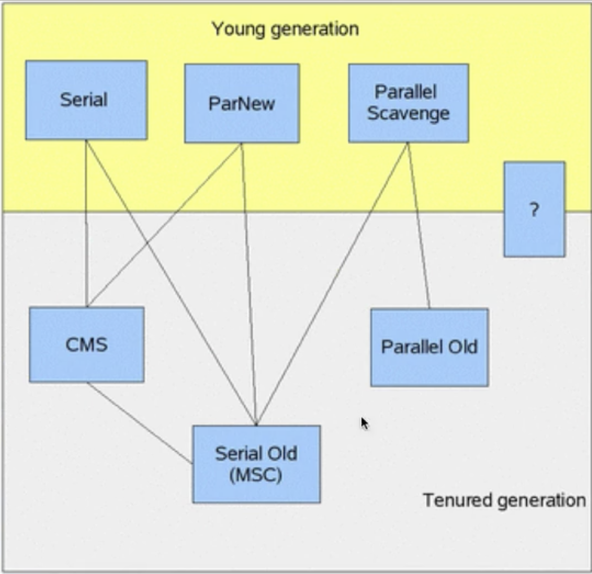

#### Serial收集器

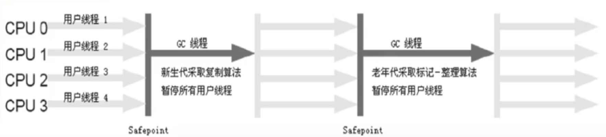

* 最早的收集器，单线程进行GC
* New和Old Generation都可以使用
* 在新生代，采用复制算法；在老年代，采用Mark-Compact算法
* 因为是单线程GC，没有多线程切换的额外开销，简单实用
* Hotspot Client模式缺省的收集器

#### ParNew收集器

* ParNew收集器就是Serial的多线程版本，除了使用多个收集线程外，其余行为包括算法、STW、对象分配规则、回收策略等都与Serial收集器一摸一样。
* 对应的这种收集器是虚拟机运行在Server模式的默认新生代收集器，在单CPU的环境中，ParNew收集器并不会比Serial收集器有更好的效果。
* Serial收集器在新生代的多线程版本
* 使用复制算法（因为针对新生代）
* 只有在多CPU的环境下，效率才会比Serial收集器高
* 可以通过-XX:ParallelGCThreads来控制GC线程数的多少。需要结合具体CPU的个数
* Server模式下新生代的缺省收集器。

#### Parallel Scavenge收集器

* Parallel Scanvenge收集器也是一个多线程收集器，也是使用复制算法，但它的对象分配规则与回收策略都与ParNew收集器有所不同，它是以吞吐量最大化（即GC时间占总运行时间最小）为目标的收集器实现，它允许较长时间的STW换取总吞吐量最大化

#### Serial Old收集器

* Serial Old是单线程收集器，使用标记-整理算法，是老年代的收集器。

#### Parallel Old收集器

* 老年代版本吞吐量优先收集器，使用多线程和标记-整理算法，JVM1.6提供，在此之前，新生代使用了PS收集器的话，老年代除Serial Old外别无选择，因为PS无法与CMS收集器配合工作。

#### Parallel Old

* Parallel Scavenge在老年代的实现
* 在JVM1.6才出现Parallel Old
* 采用多线程，Mark-Compact算法
* 更注重吞吐量
* Parallel Scavenge+Parallel Old = 高吞吐量，但GC停顿可能不理想

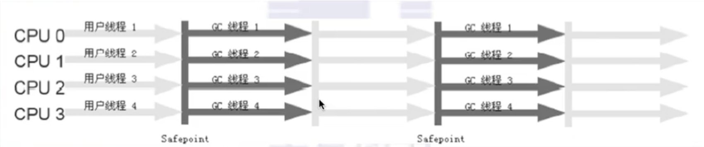

#### CMS（Concurrent Mark Sweep）

* CMS是一种以最短停顿时间为目标的收集器，使用CMS并不能达到GC效率最高（总体GC时间最小），但它能尽可能降低GC时服务的停顿时间，CMS收集器使用的是标记-清除算法

### 内存分配

1. 堆上分配

   大多数情况在eden上分配，偶尔会直接在old上分配，取决于GC的实现

2. 栈上分配

   原子类型的局部变量（是指的原始数据类型吗？）

### 内存回收

* GC要做的是将哪些dead的对象所占用的内存回收掉
  * Hotspot认为没有引用的对象是dead的
  * Hotspot将引用分为四种：Strong、Soft、Weak、Phantom
    * Strong即默认通过Object o = new Object()这种方式赋值的引用
    * Soft、Weak、Phantom这三种则都是继承Reference
* 在Full GC时会对Reference类型的引用进行特殊处理
  * Soft：内存不够时一定会被GC、长期不用也会被GC
  * Weak：一定会被GC，当被mark为dead，会在ReferenceQueue中通知
  * Phantom：本来就没引用，当从jvm heap中释放时会通知

### GC的时机

* 在分代模型的基础上，GC从时机上分为两种：Scanvenge GC和Full GC
* Scanvenge GC（Minor GC）
  * 触发时机：新对象生成时，Eden空间满了
  * 理论上Eden区大多数对象会在Scanvenge GC回收，复制算法的执行效率会很高，Scanvenge GC时间比较短
* Full GC
  * 对整个JVM进行整理，包括Young、Old和Perm
  * 主要的触发时机：1）Old满了2）Perm满了3）system.gc()
  * 效率很低，尽量减少Full GC。

### GC垃圾收集器的JVM参数定义

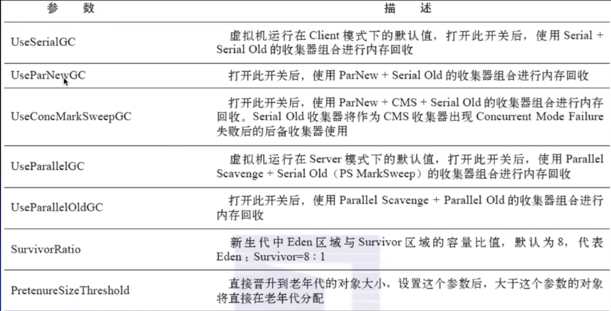

### Java内存泄露的经典原因

#### 对象定义在错误的范围（Wrong Scope）

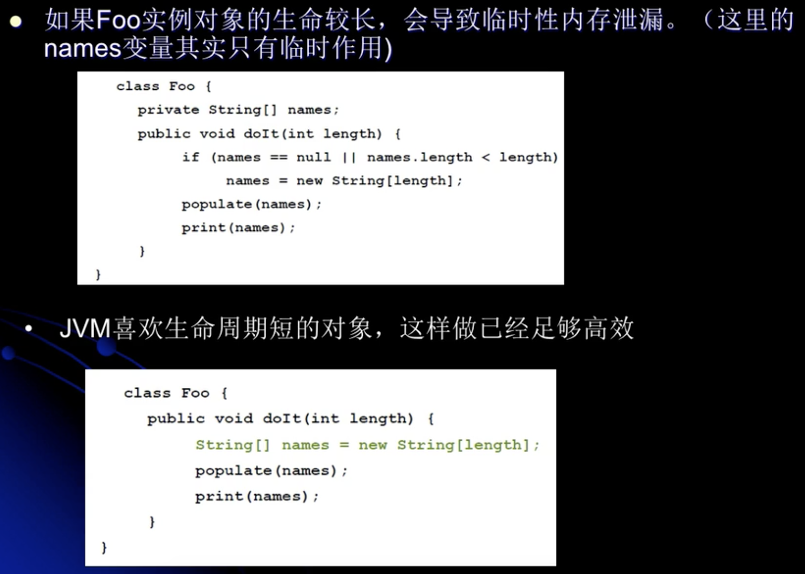

#### 异常（Exception）处理不当

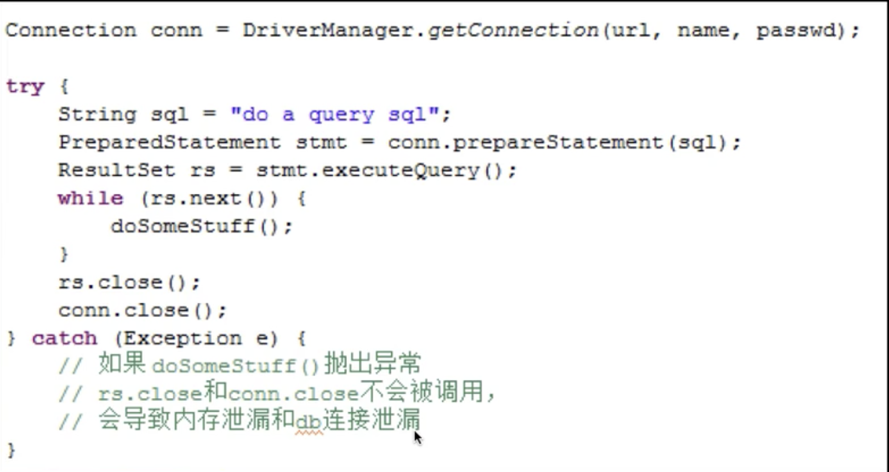

#### 集合数据管理不当

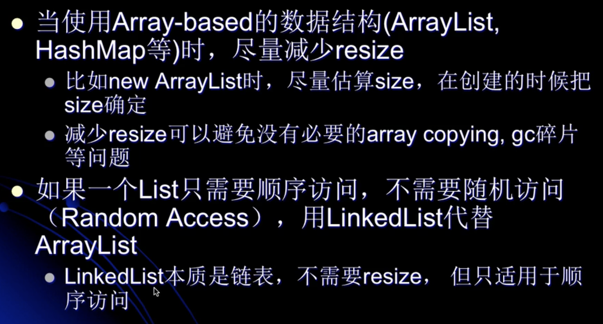

### GC实战

#### 案例一GC

~~~java
/**
 * Created by chengjie on 2020-03-26
 * Description:
 * 

 * -verbose:gc  //输出gc日志
 * -Xms20M      //堆起始大小20m
 * -Xmx20M      //堆最大容量20m
 * -Xmn10M      //新生代大小10m
 * -XX:+PrintGCDetails  //打印GC详情
 * -XX:SurvivorRatio=8  //新生代eden空间占比80%，from survivor和to survivor平分20%
 */
public class MyTest1 {
    public static void main(String[] args) {
        int size = 1024 * 1024;
        byte[] myAlloc1 = new byte[2 * size];
        byte[] myAlloc2 = new byte[2 * size];
        byte[] myAlloc3 = new byte[3 * size];
        System.out.println("hello world");
    }
}
~~~

输出日志

~~~java
[GC (Allocation Failure) [PSYoungGen: 5789K->560K(9216K)] 5789K->4664K(19456K), 0.0027308 secs] [Times: user=0.02 sys=0.00, real=0.00 secs] 
hello world
Heap
 PSYoungGen      total 9216K, used 3953K [0x00000007bf600000, 0x00000007c0000000, 0x00000007c0000000)
  eden space 8192K, 41% used [0x00000007bf600000,0x00000007bf950468,0x00000007bfe00000)
  from space 1024K, 54% used [0x00000007bfe00000,0x00000007bfe8c010,0x00000007bff00000)
  to   space 1024K, 0% used [0x00000007bff00000,0x00000007bff00000,0x00000007c0000000)
 ParOldGen       total 10240K, used 4104K [0x00000007bec00000, 0x00000007bf600000, 0x00000007bf600000)
  object space 10240K, 40% used [0x00000007bec00000,0x00000007bf002020,0x00000007bf600000)
 Metaspace       used 2966K, capacity 4496K, committed 4864K, reserved 1056768K
  class space    used 326K, capacity 388K, committed 512K, reserved 1048576K

~~~

日志解析

~~~java
Allocation Failure：表示的是GC的错误原因，可能有很多种。
PSYoungGen：Parallel Scavenge收集器 Young Generation 年轻代。
5789K->560K(9216K)：年轻代GC前使用的空间->年轻代GC后使用的空间（年轻代总的空间）（总的空间减掉了一个暂不使用的survivor）
5789K->4664K(19456K)：堆(年轻代+老年代)GC前使用的空间->堆GC后使用的空间（堆总的空间）
  
年轻代总大小9216k，老年代总大小10240k(19456-9216)。
GC前：
  年轻代,使用了大小5789k,使用占比63%
  老年代,使用了大小0k,使用占比0%
GC后：
  年轻代,使用了560k,使用占比6%
  老年代,使用了大小4104k(4664-560),使用占比40%
一次GC的结果：
  年轻代的5789k,移动了4104k到老年代，释放了1125k，还有560k。
  
上面Heap后面的年轻代数据不一样，可能是因为GC结束以后，年轻代的空间还在变化。
~~~

#### 个人总结：

垃圾收集，将堆内存划分成两块，新生代和老年代，不同的区域使用不同的算法，新生代使用复制移动算法（垃圾频率高，复制非垃圾对象），老年代使用标记清除算法（垃圾频率低，标记垃圾对象）。