# 字节码文件

1. 使用javap -verbose命令分析一个字节码文件时，将会分析该字节码文件的魔数、版本号、常量池、类信息、类的构造方法、类中的方法信息、类变量与成员变量等信息。
2. 魔数：所有的.class字节码文件的前4个字节都是魔数，魔数值固定为：0xCAFEBABE。（可以理解为咖啡宝贝）
3. 魔数之后的4个字节为版本信息，前两个字节表示minor version（次版本号），后两个字节表示major version（主版本号），例如版本号为00 00 00 34，换算成十进制，表示次版本号为0，主版本号为52（代表java8）,该文件的版本号为1.8.0。
4. 常量池（constant pool）：紧接着主版本号之后的就是常量池入口。一个Java类中定义的很多信息都是由常量池来维护和描述的，可以将常量池看作是Class文件的资源仓库。比如说Java类中定义的方法与变量信息，都是存储在常量池中。常量池中主要存储两类常量：字面量与符号引用。字面量如文本字符串，Java中声明为final的常量值等，而符号引用如类和接口等全局限定名，字段的名称和描述符，方法的名称和描述符等。
5. 常量池的总体结构：Java类所对应的常量池主要由常量池数量与常量池数组（常量表）这两部分共同构成。常量池数量紧跟在主版本号后面，占据2个字节；常量池数组则紧跟在常量池数量之后。常量池数组与一般的数组不同的是，常量池数组中不同的元素的类型、结构都是不同的，长度自然也就不同；但是，每一种元素的第一个数据都是一个U1类型，该字节是个标志位，占据1个字节。JVM在解析常量池时，会根据这个U1类型来获取元素的具体类型。值得注意的是，常量池数组中元素的个数=常量池数-1（其中0暂时不使用），目的是满足某些常量池索引值的数据在特定情况下需要表达「不引用任何一个常量池」的含义；根本原因在于，索引为0也是一个常量（保留常量），只不过它不位于常量表中，这个常量就对应null值；所以，常量池的索引从1而非0开始。
6. 在JVM规范中，每个变量/字段都有描述信息，描述信息主要的作用是描述字段的数据类型、方法的参数列表（包括数量、类型与顺序）与返回值。根据描述规则，基本类型和void都用一个大写字符来表示，对象类型则使用字符L加对象的全限定名称来表示，为了压缩字节码文件的体积，对于基本类型，JVM表示：B-byte,S-short,I-int,J-long,F-float,D-double,Z-boolean,V-void,L-对象类型（Ljava/lang/String;）分号结尾。
7. 对于数组类型来说，每一个维度使用一个前置的[来表示，如int[]被记录为[I，String[ ] [ ]被记录为[[Ljava/lang/String;
8. 用描述符描述方法时，按照先参数列表，后返回值的顺序来描述，参数列表按照参数的严格顺序放在一组（）之内，如方法：String getRealName(int id,String name)的描述符为：(I,[Ljava/lang/String;)[Ljava/lang/String;

#### 字节码总体文件结构

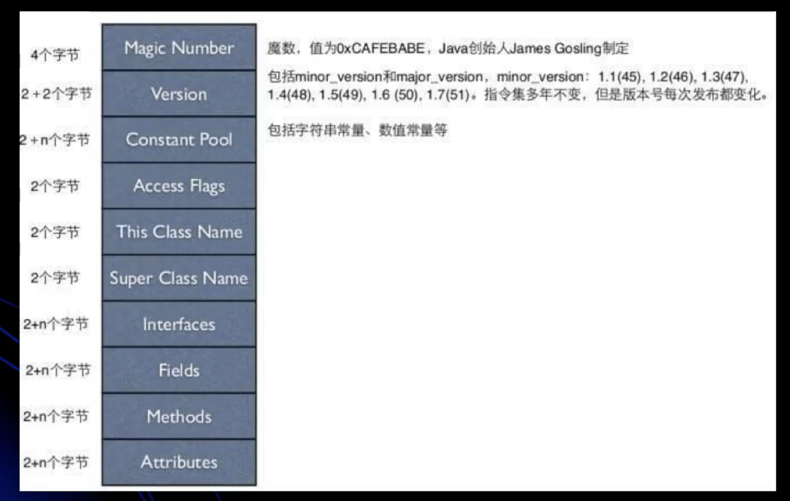

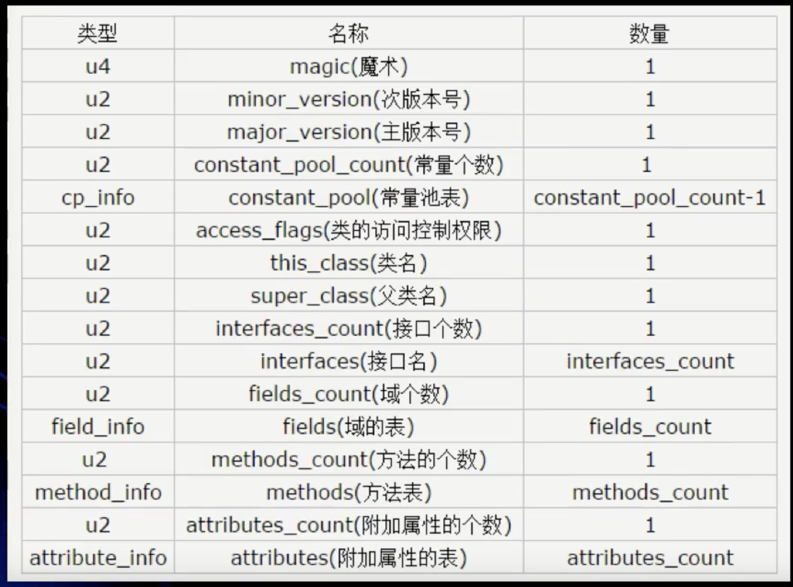

#### 常量池表结构

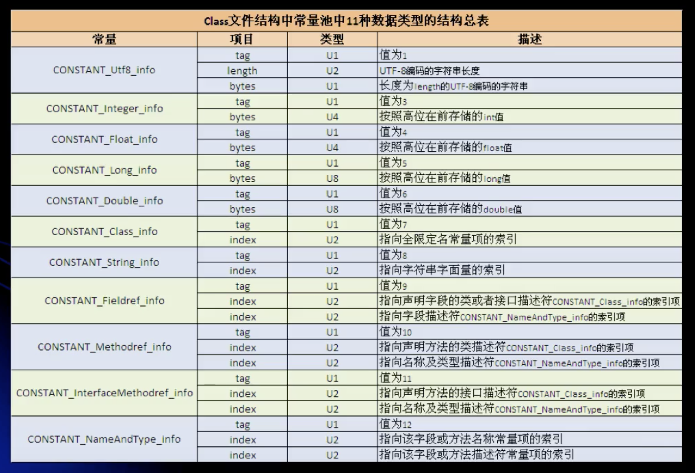

#### 访问控制权限

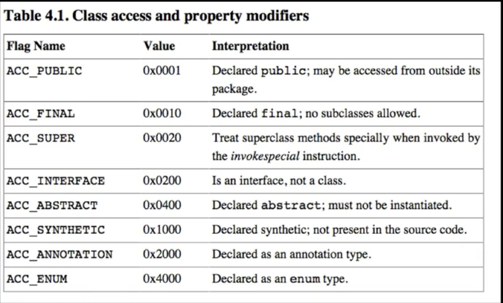

#### 字段表结构

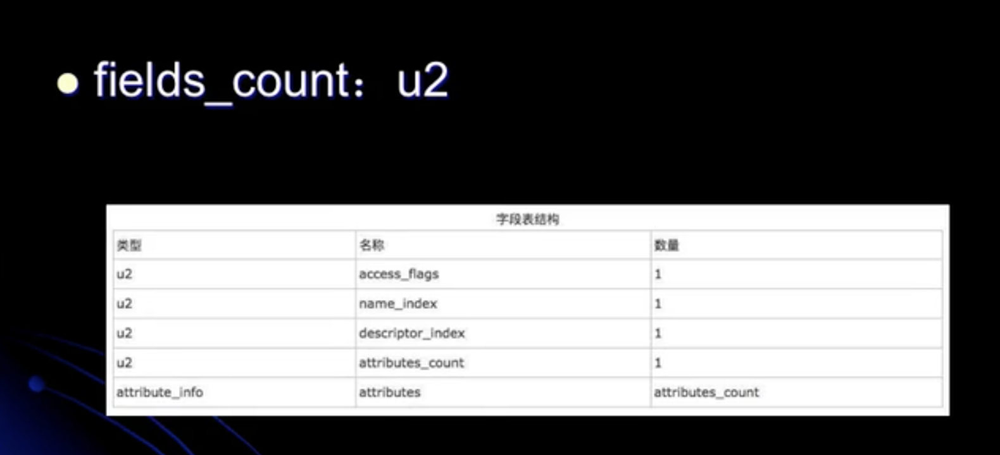

#### 方法表结构

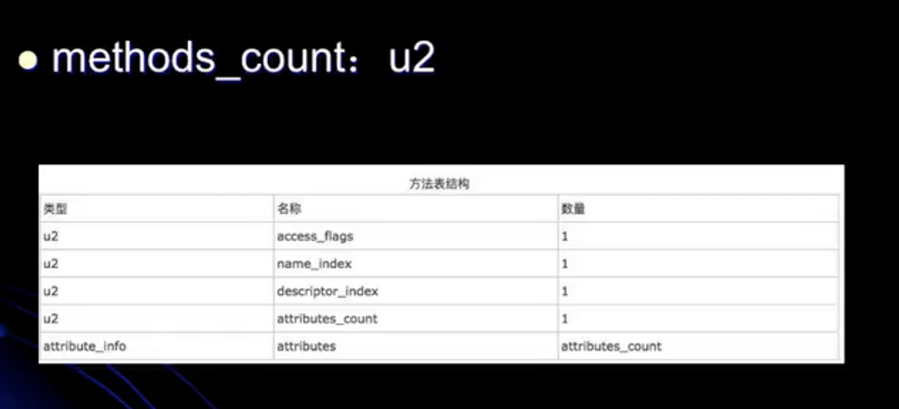

#### 方法里的属性结构

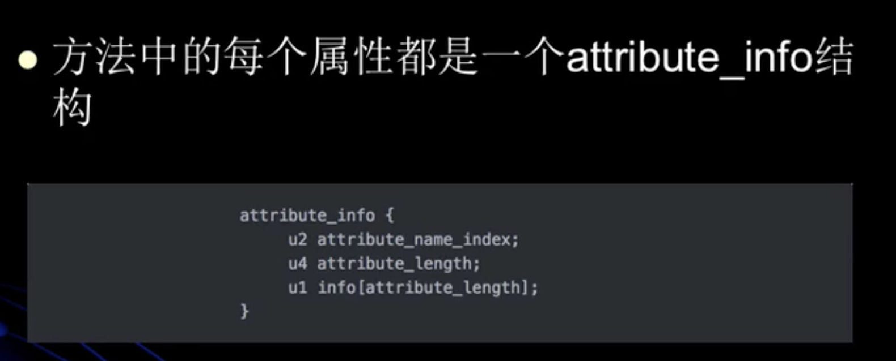

> JVM预定义里部分attribute，但是编译器自己页可以实现自己的attribute写入class文件里，工运行时使用。
>
> 不同的attribute通过attrib_name_index来区分

#### Code Atrribute

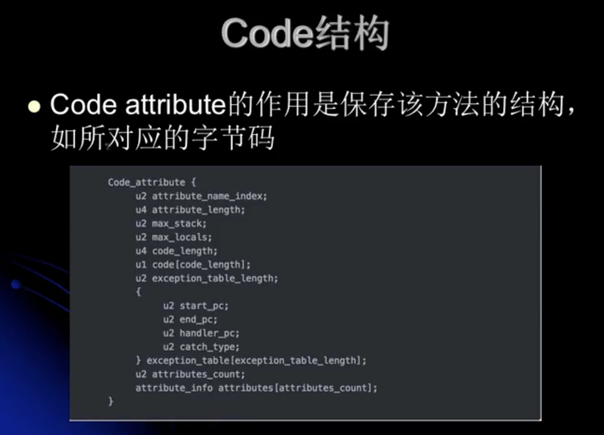

* attrubute_length表示attribute所包含的字节数，不包含attribute_name_index和attribute_length字段。

* max_stack表示这个方法运行的任何时刻所能达到的操作数栈的最大深度。

* max_locals表示方法执行期间创建的局部变量的数目，包含用来表示传入的参数的局部变量。

* code_length表示该方法所包含的字节码字节数以及具体的指令码。

* 具体字节码即是该方法被调用时，虚拟机所执行的字节码。

* exception_table，这里存放的是处理异常的信息。

* 每个exception_table表项由start_pc，end_pc，handler_pc，catch_type组成。

* start_pc和end_pc表示在code数组中的从start_pc到end_pc处（包含start_pc,不包含end_pc）的指令抛出的异常会由这个表项来处理。

* handler_pc表示处理异常的代码的开始处，catch_type表示会被处理的异常类型，它指向常量池里的一个异常类，当catch_type为0时，表示处理所有的异常。

* LineNumberTable：这个属性用来表示code数组中的字节码和java代码行数之间的关系。这个属性可以用来在调试的时候定位代码执行的行数。

  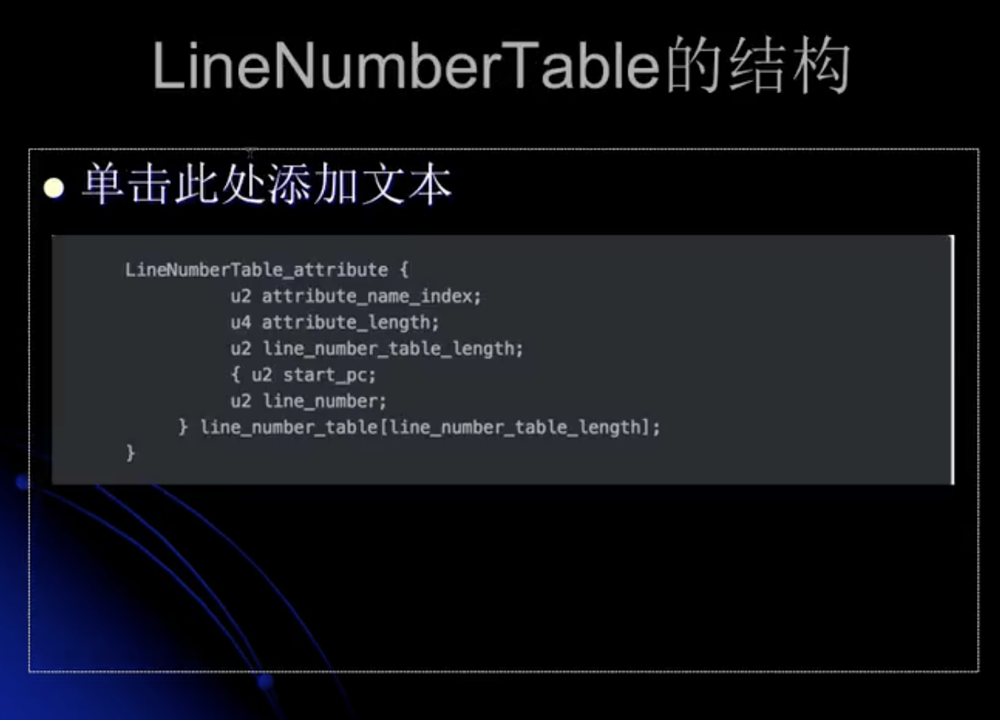

#### LocalVariableTable

* Start表示code代码中的起始位置。
* Length表示长度。所以变量的作用域是（start到start+length）。
* Slot表示变量占用的槽位置（可能会被复用），double和long是占两个槽。
* Signature表示变量类型。

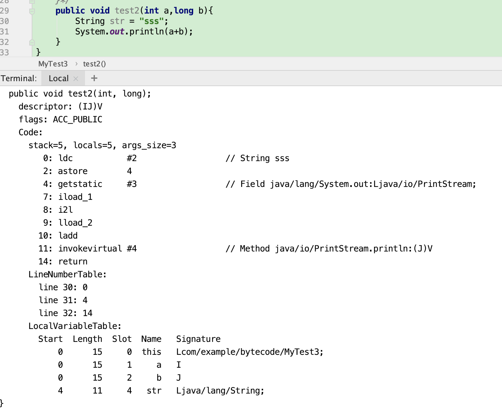

#### 二进制字节码文件解析

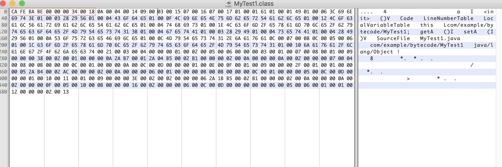

1. 魔数，4个字节。

   ~~~java
   CA FE BA BE
   ~~~

2. 版本号，4个字节。次版本号（2）+主版本号（2）。

   ~~~java
   00 00 00 34
   //次版本号：0，主版本号：52（表示java1.8）
   ~~~

3. 常量表数量，2个字节。

   ~~~java
   00 18
   //常量表数量：24-1=23。
   ~~~

4. 常量表，n个字节。

   > 常量表结构，第一个字节固定为tag，根据tag值对应常量表，去找常量类型。
   >
   > 方法引用（Methodref）->类（Class）.方法描述符（NameAndType）->Utf8(类名).Utf8(方法名):Utf8(参数列表和返回值)
   >
   > 字段引用（Fieldref）->类（Class）.方法描述符（NameAndType）->Utf8(类名).Utf8(字段名):Utf8(字段类型)

   ~~~java
   Constant pool:
      #1 = Methodref          #4.#20         // java/lang/Object."<init>":()V
      #2 = Fieldref           #3.#21         // com/example/bytecode/MyTest1.a:I
      #3 = Class              #22            // com/example/bytecode/MyTest1
      #4 = Class              #23            // java/lang/Object
      #5 = Utf8               a
      #6 = Utf8               I
      #7 = Utf8               <init>
      #8 = Utf8               ()V
      #9 = Utf8               Code
     #10 = Utf8               LineNumberTable
     #11 = Utf8               LocalVariableTable
     #12 = Utf8               this
     #13 = Utf8               Lcom/example/bytecode/MyTest1;
     #14 = Utf8               getA
     #15 = Utf8               ()I
     #16 = Utf8               setA
     #17 = Utf8               (I)V
     #18 = Utf8               SourceFile
     #19 = Utf8               MyTest1.java
     #20 = NameAndType        #7:#8          // "<init>":()V
     #21 = NameAndType        #5:#6          // a:I
     #22 = Utf8               com/example/bytecode/MyTest1
     #23 = Utf8               java/lang/Object
   ~~~

   ~~~java
   0A（tag10，Methodref） 00 04(index,指向Class) 00 14(index,指向NameAndType) 
   #1 = Methodref          #4.#20
   09（tag9,Fieldref） 00 03(index,指向Class) 00 15(index,指向NameAndType)
   #2 = Fieldref           #3.#21
   07（tag7,Class） 00 16(index,指向全限定名的常量项)
   #3 = Class							#22
   07 00 17 
   #4 = Class							#23
   01（tag1,Utf8） 00 01(length,utf-8字符串长度) 61（bytes,字符串“a”）
   #5 = Utf8								a
   01 00 01 49 (字符串“I”)
   #6 = Utf8								I
   01 00 06 3C 69 6E 69 74 3E (字符串“<init>”)
   #7 = Utf8								<init>
   01 00 03 28 29 56 (字符串“()V”)
   #8 = Utf8								()V
   01 00 04 43 6F 64 65 (字符串“Code”)
   #9 = Utf8								Code
   01 00 0F 4C 69 6E 65 4E 75 6D 62 65 72 54 61 62 6C 65 (字符串“LineNumberTable”)
   #10 = Utf8							LineNumberTable
   01 00 12 4C 6F 63 61 6C 56 61 72 69 61 62 6C 65 54 61 62 6C 65 (字符串“LocalVariableTable”)
   #11 = Utf8							LocalVariableTable
   01 00 04 74 68 69 73 (字符串“this”)
   #12 = Utf8							this
   01 00 1E 4C 63 6F 6D 2F 65 78 61 6D 70 6C 65 2F 62 79 74 65 63 6F 64 65 2F 4D 79 54 65 73 74 31 3B (字符串“Lcom/example/bytecode/MyTest1;”)
   #13 =Utf8								Lcom/example/bytecode/MyTest1;
   01 00 04 67 65 74 41 (字符串“getA”)
   #14 =Utf8								getA
   01 00 03 28 29 49 (字符串“()I”)
   #15 =Utf8								()I
   01 00 04 73 65 74 41 (字符串“setA”)
   #16 =Utf8								setA
   01 00 04 28 49 29 56 (字符串“(I)V”)
   #17 =Utf8								(I)V
   01 00 0A 53 6F 75 72 63 65 46 69 6C 65 （字符串“SourceFile”）
   #18 =Utf8								SourceFile
   01 00 0C 4D 79 54 65 73 74 31 2E 6A 61 76 61 (字符串“MyTest1.java”)
   #19 =Utf8								MyTest1.java
   0C（tag12,NameAndType） 00 07(index,指向字段或方法的名称常量) 00 08 （index,指向字段或方法的描述符常量）
   #20 =NameAndType				#7:#8
   0C 00 05 00 06 
   #21 =NameAndType				#5:#6
   01 00 1C 63 6F 6D 2F 65 78 61 6D 70 6C 65 2F 62 79 74 65 63 6F 64 65 2F 4D 79 54 65 73 74 31(字符串“com/example/bytecode/MyTest1”)
   #22 =Utf8								com/example/bytecode/MyTest1
   01 00 10 6A 61 76 61 2F 6C 61 6E 67 2F 4F 62 6A 65 63 74(字符串“java/lang/Object”)
   #23 =Utf8								java/lang/Object
     
     00 03 00 01 00 07 00 08 00 01 00 09 00 00 00 38 00 02 00 01 00 00 00 0A 2A B7 00 01 2A 04 B5 00 02 B1 00 00 00 02 00 0A 00 00 00 0A 00 02 00 00 00 07 00 04 00 08 00 0B 00 00 00 0C 00 01 00 00 00 0A 00 0C 00 0D 00 00 00 01 00 0E 00 0F 00 01 00 09 00 00 00 2F 00 01 00 01 00 00 00 05 2A B4 00 02 AC 00 00 00 02 00 0A 00 00 00 06 00 01 00 00 00 0B 00 0B 00 00 00 0C 00 01 00 00 00 05 00 0C 00 0D 00 00 00 01 00 10 00 11 00 01 00 09 00 00 00 3E 00 02 00 02 00 00 00 06 2A 1B B5 00 02 B1 00 00 00 02 00 0A 00 00 00 0A 00 02 00 00 00 0F 00 05 00 10 00 0B 00 00 00 16 00 02 00 00 00 06 00 0C 00 0D 00 00 00 00 00 06 00 05 00 06 00 01 00 01 00 12 00 00 00 02 00 13
   ~~~

5. 类的访问标志符，2个字节。

   ~~~java
   00 21
   // 查询访问控制符表 flags: ACC_PUBLIC（0x0001）, ACC_SUPER（0x0020）
   ~~~

6. 本类名，2个字节。

   ~~~java
   00 03
   //#3->#22->com/example/bytecode/MyTest1
   ~~~

7. 父类名，2个字节。

   ~~~java
   00 04 
   //#4->#23->java/lang/Object
   ~~~

8. 接口个数，2个字节。

   ~~~java
   00 00
   //没有接口
   ~~~

9. 字段个数，2个字节。

   ~~~java
   00 01
   //1个字段
   ~~~

10. 字段表，n个字节。

    ~~~java
    00 02(访问控制符) 00 05（名称索引） 00 06（描述符索引） 00 00（属性数量）
    //flags:ACC_PRIVATE #5->a	#6->I
    ~~~

11. 


#### 查看字节码辅助插件

* jclasslib Bytecode viewer

#### Java指令

* javap -verbose 完全类名
* java -verbose -p 完全类名 //私有方法也会打印出来。

#### 方法调用

```
* 栈帧（stack frame）
* 栈帧是一种用于帮助虚拟机执行方法调用与方法执行的数据结构。
* 栈帧本身是一种数据结构，封装了方法的局部变量表、动态链接信息、方法的返回地址以及操作数栈等信息。
* 符号引用，直接引用
* 有些符号引用是在类加载阶段或是第一次使用时就会转换为直接引用，这种转换叫做静态解析；
* 另外一些符号引用则是在每次运行期转换为直接引用，这种转换叫做动态链接，这体现为Java的多态性。
```

1. invokeinterface：调用接口中的方法，实际上是在运行期决定的，决定到底调用实现该接口的哪个对象的特定方法。
2. invokestatic：调用静态方法。
3. invokespecial：调用自己的私有方法，构造方法（<init>）以及父类的方法。
4. invokevirtual：调用虚方法，运行期动态查找的过程。
5. invokedynamic：动态调用方法。

* 静态解析的四种情形

  1. 静态方法

  2. 父类方法

  3. 构造方法

  4. 私有方法（无法被重写）

     > 以上4类方法称作非虚方法，他们是在类加载阶段就可以将符号引用转换为直接引用的。

