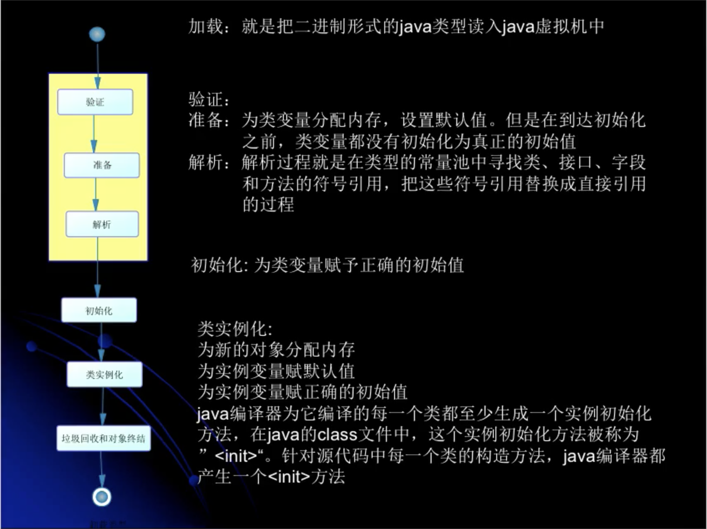
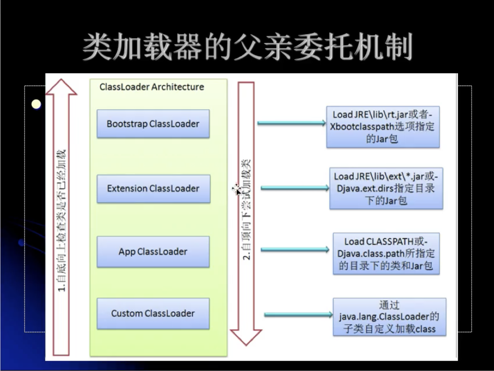
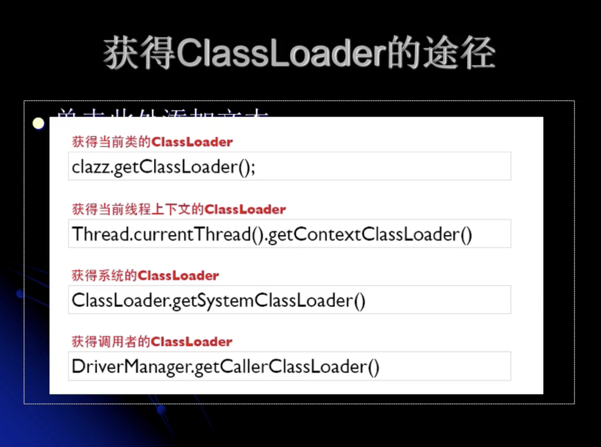

## 深入理解JVM

* 在Java代码中，类型的加载、连接与初始化过程都是在程序运行期间完成的。

### 类的加载、连接与初始化

#### 类的加载、连接与初始化

* 加载：查找并加载类的二进制数据。（存储到内存里）
* 连接
  * 验证：确保被加载的类的正确性。
  * 准备：为类的静态变量分配内存，并将其初始化为默认值。
  * 解析：把类中的符号引用转换为直接引用。（例如方法的引用替换为内存地址）
* 初始化：为类的静态变量赋予正确的初始化值。
* 使用：使用类创建对象、调用类的相关方法。
* 卸载：从内存中移除。（无法再使用这个类了）



#### 类的使用方式

* Java程序对类的使用方式可分为两种

  * 主动使用
    * 创建类的实例（new一个对象）
    * 访问某个类或接口的静态变量，或者对该静态变量赋值（getstatic,putstatic）
    * 调用类的静态方法(invokestatic)
    * 反射（如Class.forName("com.test.Test")）
    * 初始化一个类的子类
    * Java虚拟机启动时被标明为启动类的类（包含main方法的入口类）
    * JDK1.7开始提供了动态语言的支持：java.lang.invoke.MethodHandle实例的解析结果REF_getStatic，REF_putStatic，REF_invokeStatic句柄对应的类没有初始化，则初始化

  * 被动使用（除了以上主动使用之外的场景，被动使用，不会导致类的初始化）

    ==这里的类的初始化，我的理解是包含加载与连接，老师讲的是不包含，意味可能会多次加载连接？但不会初始化？==

* 所有的Java虚拟机实现必须在每个类或接口被Java程序“首次主动使用”时才初始化他们。

  ~~~ java
  /**
   * 1、对于静态字段类说，只有直接定义了该字段的类才会被初始化。
   * 2、当一个类在初始化时，要求其父类全部都已经初始化完毕。
   * -XX:+TraceClassLoading 用于追踪类的加载信息，并打印出来。
   * jvm参数设置的三种情况
   * -XX:+<option>，表示开启option选项
   * -XX:-<option>，表示关闭option选项
   * -XX:<option>=<value>，表示将option选项的值设置为value
   */
  public class MyTest1 {
      public static void main(String[] args) {
          //执行语句1，使用父类的静态变量，仅初始化父类。（子类有加载）
          System.out.println(Child1.parentName);
          /**
           * 输出结果1：
           * Parent1 static block
           * Parent1
           */
  
          //执行语句2，使用子类的静态变量，初始化父类和子类。
          //System.out.println(Child1.childName);
          /**
           * 输出结果2：
           * Parent1 static block
           * Child1 static block
           * Child1
           */
      }
  }
  
  class Parent1{
      public static String parentName = "Parent1";
      static {
          System.out.println("Parent1 static block ");
      }
  }
  
  class Child1 extends Parent1{
      public static String childName = "Child1";
      static {
          System.out.println("Child1 static block");
      }
  }
  ~~~

  

#### 类的加载

* 类的加载指的是将类的.class文件中的二进制数据读入到内存中，将其放在运行时数据区的方法区内，然后在内存中创建一个java.lang.Class对象（规范并未说明Class对象位于哪里，Hotspot虚拟机将其放在了方法区中）用来封装类在方法区的数据结构。
* 加载.class文件的方式
  * 从本地系统中直接加载
  * 通过网络下载.class文件
  * 从zip，jar等归档文件中加载.class文件
  * 从专有数据库中提取.class文件
  * 将Java源文件动态编译为.class文件
* 类加载器并不需要等到某个类被“首次主动使用”时再加载它
* JVM规范允许类加载器在预料某个类将要被使用时就预先加载它，如果在预先加载的过程中遇到了.class文件缺失或存在错误，类加载器必须在程序首次主动使用该类时才报告错误（Link ageError错误）
* 如果这个类一直没有被程序主动使用，那么类加载器就不会报告错误

#### 助记符

* anewarray:表示创建一个引用类型的（如类、接口、数组）数组，并将其引用值压入栈顶
* newarray:表示创建一个指定的原始类型（如int、float、char等）的数组，并将其引用压入栈顶。

#### 类加载器

> 拓展类加载器和系统类加载器是由根类加载器加载的，根类加载器不是Java类，由C++编写的，内建于jvm，机器指令，负责开启整个加载过程。
>
> 启动类加载器还会负责加载供JRE正常运行所需要的基本组件，例如java.util、java.lang等。
>
> 每个类都会使用自己的类加载器（即加载自身的类加载器）来去加载其他类（指的是所依赖的类）。

* Java虚拟机自带的加载器
  * 根类加载器（Bootstrap）
  * 扩展类加载器（Extension）
  * 系统（应用）类加载器（System）
* 用户自定义的类加载器
  * java.lang.ClassLoader的子类
  * 用户可以定制类的加载方式





#### 类的初始化

* 静态变量的声明语句，以及静态代码块都被看作类的初始化语句，Java虚拟机会按照初始化语句在类文件中的先后顺序来依此执行它们。

  ```java
  public class MyTest7 {
      public static void main(String[] args) {
          System.out.println(Parent7.b);//打印结果： 1
      }
  }
  
  class Parent7{
      public static int a;
      static {
          b = 2;
      }
      public static int b =1;
  
  }
  ```

* 对象的初始化可能是在类完成初始化之前。

  ~~~java
  public class MyTest3 {
      private static int  a = 1;
  
      private static MyTest3  mMyTest3 = new MyTest3();
  
      private static int b = 2;
  
      static {
          System.out.println("static block");
      }
  
  
      private MyTest3(){
          System.out.println("a="+a);
          System.out.println("b="+b);
      }
  
      public static void main(String[] args) {
  
      }
  }
  打印结果：  
  a=1
  b=0
  static block
  分析：
  类的加载&连接：
    a = 0;
  	mMyTest3 = null;
  	b = 0;
  类的初始化：
    a = 1
    mMyTest3 = new MyTest3()->对象的初始化->执行构造函数代码(打印 a=1,b=0)
    b = 2
    
  ~~~

  

#### 接口的初始化

* （主要是变量默认为public static final）

当Java虚拟机初始化一个类时，要求它的所有父类都已经被初始化，但是这条规则并不适用于接口。

* 在初始化一个类时，并不会先初始化它所实现的接口。
* 在初始化一个接口时，并不会先初始化它的父接口。

因此，一个父接口并不会因为它的子接口或者实现类的初始化而初始化，只有当程序首次使用特定接口的静态变量时，才会导致该接口的初始化。

#### 自定义类加载器

1. 继承ClassLoader。
2. 重写findClass方法。
3. 在findClass方法里，使用defineClass返回结果。

~~~java
public class MyClassloader1 extends ClassLoader {
    public MyClassloader1() {
        super();//默认系统类加载器当做该类加载器的父加载器
    }

    public MyClassloader1(ClassLoader parent) {
        super(parent);//指定该类加载器的父加载器
    }

    //重写findClass方法，只有父类加载器无法加载才会执行
    @Override
    protected Class<?> findClass(String name) throws ClassNotFoundException {
        System.out.println("findClass name:" + name);
        byte[] data = loadClassData(name);
        return defineClass(name, data, 0, data.length);
    }

    //加载类文件
    private byte[] loadClassData(String name) {
        InputStream is = null;
        ByteArrayOutputStream bos = null;
        byte[] data = null;
        try {
            is = new FileInputStream(new File(name + ".class"));
            bos = new ByteArrayOutputStream();
            byte[] buffer = new byte[1024];
            int off = 0;
            while ((off = is.read(buffer)) != -1) {
                bos.write(buffer, 0, off);
            }
            data = bos.toByteArray();
        } catch (Exception e) {
            e.printStackTrace();
        } finally {
            try {
                is.close();
                bos.close();
            } catch (Exception e) {
                e.printStackTrace();
            }
        }
        System.out.println("datalength:"+data.length);
        System.out.println("data:"+new String(data));
        return data;
    }

    public static void main(String[] args) throws Exception {
        MyClassloader1 myClassloader1 = new MyClassloader1();
        Class<?> aClass = myClassloader1.loadClass("com.example.libtestclassload.MyTest1");
        Object instance = aClass.newInstance();
        System.out.println("aClass:"+aClass);
        System.out.println("instance:"+instance);
    }
~~~


#### 命名空间

* 每个类加载器都有自己的命名空间，**命名空间由该加载器及所有父加载器所加载的类组成**。

* 在同一个命名空间中，不会出现类的完整名字（包括类的包名）相同的两个类。

* 在不同的命名空间中，有可能会出现类的完整名字（包括类的包名）相同的两个类。

  > 所以一个Java类是由自己的类名和类加载器所共同决定的，即使同一个字节码文件，不同类加载器加载的，还是属于不同的类。

~~~java
 /**
     * 一：正常运行，是不会执行MyClassloader2类里的findClass方法的。会走系统类加载器，加载成功，不会重复加载。打印结果：
     * clazz1.hashCode:1639705018
     * instance1:com.example.libtestclassload.MyTest1@610455d6
     * clazz2.hashCode:1639705018
     * instance2:com.example.libtestclassload.MyTest1@511d50c0
     *
     * 二：删除项目.class文件下的Mytest1.class文件，会走自定义类加载器，因为类加载器命名空间的问题，会重复加载。打印结果：
     * findClass name:com.example.libtestclassload.MyTest1
     * clazz1.hashCode:1360875712
     * instance1:com.example.libtestclassload.MyTest1@60e53b93
     * findClass name:com.example.libtestclassload.MyTest1
     * clazz2.hashCode:644117698
     * instance2:com.example.libtestclassload.MyTest1@6f94fa3e
     * 
     * @param args
     * @throws Exception
     */
    public static void main(String[] args) throws Exception {
        MyClassloader2 loader1 = new MyClassloader2();
        loader1.setPath("/Users/chengjie/Desktop/");
        Class<?> clazz1 = loader1.loadClass("com.example.libtestclassload.MyTest1");
        Object instance1 = clazz1.newInstance();
        System.out.println("clazz1.hashCode:"+clazz1.hashCode());
        System.out.println("instance1:"+instance1);

        MyClassloader2 loader2 = new MyClassloader2();
        loader2.setPath("/Users/chengjie/Desktop/");
        Class<?> clazz2 = loader2.loadClass("com.example.libtestclassload.MyTest1");
        Object instance2 = clazz2.newInstance();
        System.out.println("clazz2.hashCode:"+clazz2.hashCode());
        System.out.println("instance2:"+instance2);

    }
~~~

#### 类加载示例

1. 类的内部调用其他类的加载

   ~~~java
   public class MySample {
       public MySample(){
           new MyCat();
       }
   
       public static void main(String[] args) throws Exception {
           MyClassloader2 loader = new MyClassloader2();
           loader.setPath("/Users/chengjie/Desktop/");
           Class<?> aClass = loader.loadClass("com.example.libtestclassload.MySample");
           Object instance = aClass.newInstance();
       }
   }
   ~~~

   * MySample是由自定义加载器指定加载的。如果MySample被加载成功了，则MyCat会由成功加载MySample的类加载器（可能是系统类加载器也可能是自定义加载器）去加载。
   * 子加载器所加载的类能够访问到父加载器所加载的类。
   * 父加载器所加载的类无法访问到子加载器所加载的类。

#### sun.misc.Launcher构造函数

1. 获取拓展类加载器

   ~~~java
           Launcher.ExtClassLoader var1;
           try {
               var1 = Launcher.ExtClassLoader.getExtClassLoader();
           } catch (IOException var10) {
               throw new InternalError("Could not create extension class loader", var10);
           }
   ~~~

2. 获取应用类加载器（应用类加载器作为成员变量）

   ~~~java
           try {
               this.loader = Launcher.AppClassLoader.getAppClassLoader(var1);
           } catch (IOException var9) {
               throw new InternalError("Could not create application class loader", var9);
           }
   ~~~

3. 设置线程上下文类加载器

   ~~~java
    Thread.currentThread().setContextClassLoader(this.loader);
   ~~~

4. 安全管理器设置

#### ClassLoader.getSystemClassLoader()

1. initSystemClassLoader，从Launcher里获取应用类加载器

   ~~~java
      sun.misc.Launcher l = sun.misc.Launcher.getLauncher();
               if (l != null) {
                   scl = l.getClassLoader();
   ~~~

2. 验证系统属性，如果"java.system.class.loader"属性没有指定自定义类加载器，则返回应用类加载器。否则，将应用类加载器作为自定义类加载器的父类加载器，**自定义类加载器作为当前的系统类加载器，并且设置为当前线程的上下文类加载器。**

   ~~~java
   scl = AccessController.doPrivileged(
                           new SystemClassLoaderAction(scl));
   ~~~

   ~~~java
    String cls = System.getProperty("java.system.class.loader");
           if (cls == null) {
               return parent;
           }
   
           Constructor<?> ctor = Class.forName(cls, true, parent)
               .getDeclaredConstructor(new Class<?>[] { ClassLoader.class });
           ClassLoader sys = (ClassLoader) ctor.newInstance(
               new Object[] { parent });
           Thread.currentThread().setContextClassLoader(sys);
           return sys;
   ~~~

   > 线程上下文类加载器的重要性:
   >
   > 父ClassLoader可以使用当前线程Thread.currentThread().getContextClassLoader()所指定的Classloader加载的类。这就改变了父ClassLoader不能使用子ClassLoader或是其他没有直接父子关系的ClassLoader加载的类的情况，即改变了父亲委托模型。