# 透视HTTP协议

## 破冰篇

### 01｜时势与英雄：HTTP的前世今生

#### 小结

1. HTTP协议始于三十年前蒂姆·伯纳斯-李的一篇论文；
2. HTTP/0.9是个简单的文本协议，只能获取文本资源；
3. HTTP/1.0确立了大部分现在使用的技术，但它不是正式标准；
4. HTTP/1.1是目前互联网上使用最广泛的协议，功能也非常完善；
5. HTTP/2基于Google的SPDY协议，注重性能改善，但未普及；
6. HTTP/3基于Google的QUIC协议，是将来的发展方向；

#### 课下作业

1. 你认为推动HTTP发展的原动力是什么？
2. 你是怎么理解HTTP（超文本传输协议）的？

#### 作业回答

1. 我认为这个问题可以应用于任何科技技术，科技技术发展的原动力，因为社会要进步呀。
2. 属于众多应用层协议的一种，应用比较广泛。

### 02｜HTTP是什么？HTTP又不是什么？

#### 概念

* HTTP就是超文本传输协议，也就是 HyperText Transfer Protocol。
* HTTP是一个协议，规定了HTTP客户端和服务端之间交流通信的规范，以及相关的各种控制和错误处理方式。

#### 小结

1. HTTP是一个用在计算机世界里的协议，它确立了一种计算机之间交流通信的规范，以及相关的各种控制和错误处理方式。
2. HTTP专门用来在两点之间传输数据，不能用于广播、寻址或路由。
3. HTTP传输的是文字、图片、音频、视频等超文本数据。
4. HTTP是构建互联网的重要基础技术，它没有实体，依赖许多其他的技术来实现，但同时许多技术也都依赖于它。


#### 课下作业

1. 有一种流行的说法：“HTTP是用于从互联网服务器传输超文本到本地浏览器的协议“，你认为这种说法对吗？对在哪里，又错在哪里？
2. 你能再说出几个”HTTP不是什么“吗？

#### 作业回答

1. 对，但不准确。HTTP是用于规定从计算机客户端向服务端发起请求，服务端向客户端返回数据的一种协议，通讯数据可以使用超文本。
2. 那就太多了。

### 03 |与HTTP相关的各种概念

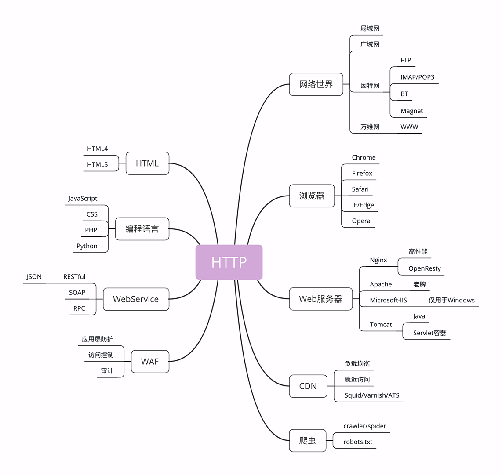

#### 小结

1. 互联网上绝大部分资源都使用HTTP协议传输；
2. 浏览器是HTTP协议里的请求方，即User Agent；
3. 服务器是HTTP协议里的应答方，常用的有Apache和Nginx；
4. CDN（Content Delivery Network）位于浏览器和服务器之间，主要起到缓存加速的作用；
5. 爬虫是另一类User Agent，是自动访问网络资源的程序。

#### 课下作业

1. 你觉得CDN在对待浏览器和爬虫时会有差异吗？为什么？
2. 你怎么理解WebService与Web Server这两个非常相似的词？

#### 作业回答

1. 没有，无法判断请求方。
2. 引用：service通常是指服务程序，跑在server上，server可以理解成容器、平台。（个人从字面上理解吧，server服务器，service服务😂）

### 04｜与HTTP相关的各种协议

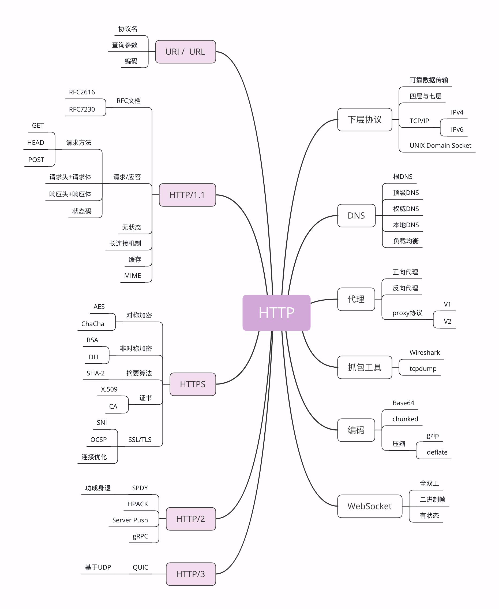

#### 小结

1. TCP/IP是网络世界最常用的协议，HTTP通常运行在TCP/IP提供的可靠传输基础上；
2. DNS域名是IP地址的等价替代，需要用域名解析实现到IP地址的映射；
3. URI是用来标记互联网上资源的一个名字，由”协议名+主机名+路径“构成，俗称URL；
4. HTTPS相当于”HTTP+SSL/TLS+TCP/IP“，为HTTP套了一个安全的外壳；
5. 代理是HTTP传输过程中的”中转站“，可以实现缓存加速、负责均衡等功能。

#### 课下作业

1. DNS与URI有什么关系？
2. 在讲代理时我特意没有举例说明，你能够引入一个”小强“的角色，通过打电话来比喻一下吗？

#### 作业回答

1. URI（Uniform Resource Identifier），中文名称是 统一资源标识符，使用它就能够唯一地标记互联网上资源，DNS是用来将URI中的域名解析为Ip地址的。
2. 你打电话给小强，让小强去找小明来接电话。

### 05｜四层和七层网络模型

#### 四层网络模型

> TCP/IP 协议总共有四层，就像搭积木一样，每一层需要下层的支撑，同时又支撑着上层，任何一层被抽掉都可能会导致整个协议栈坍塌。

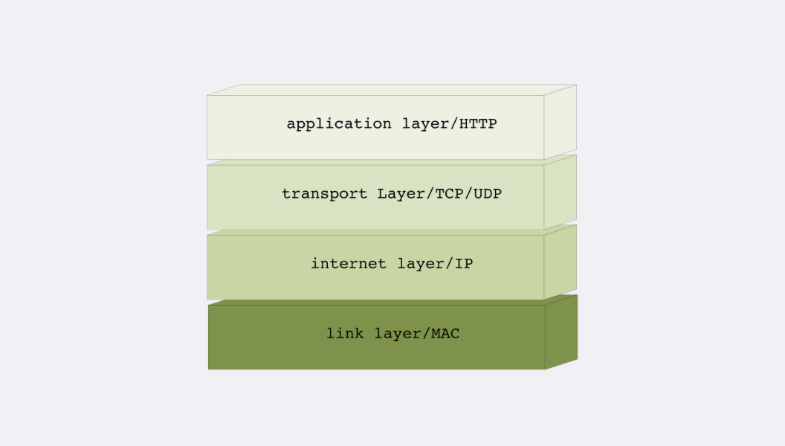

* 第一层是“链接层”（link layer），负责在以太网、Wi-Fi这样的底层网络上发送原始数据包，工作在网卡这个层次，使用MAC地址来标记网络上的设备。
* 第二层是"网络层"（internet layer），IP协议在这一层。
* 第三层是“传输层”（transport layer），保证数据在两点之间的传输，TCP、UDP协议。
* 第四层是“应用层”（application layer），HTTP、Telnet、SSH、FTP、SMTP

#### 七层网络模型

> OSI，全称是“开放式系统互联通信参考模型”（Open System Interconnection Reference Model）。

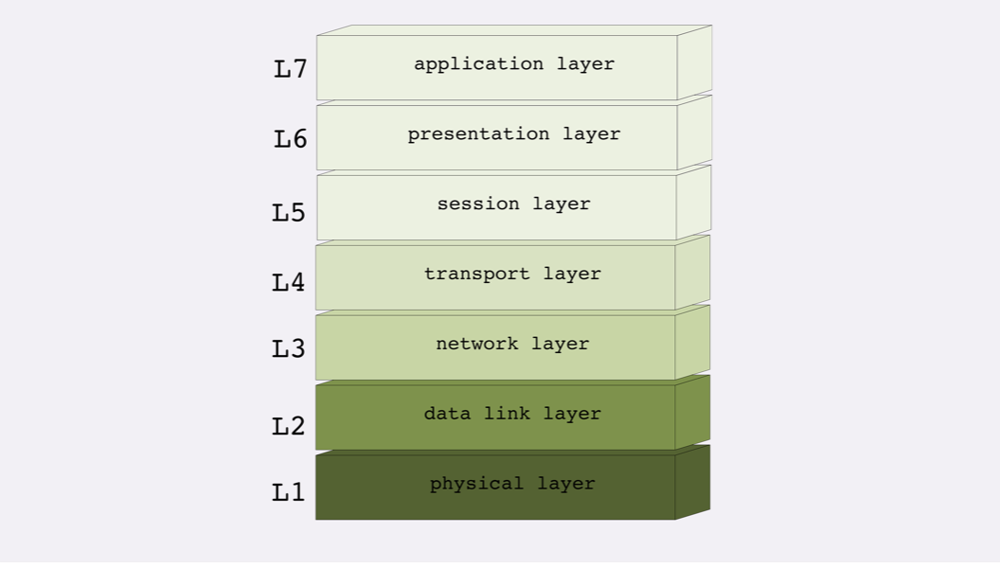

* 第一层：物理层，网络的物理形式，例如电缆、光纤、网卡、集线器等；
* 第二层：数据链路层，它基本相当于TCP/IP的链接层；
* 第三层：网络层，相当于TCP/IP里的网际层；
* 第四层：传输层，相当于TCP/IP里的传输层；
* 第五层：会话层，维护网络中的连接状态，即保持会话和同步；
* 第六层：表示层，把数据转换为合适、可理解的语法和语义；
* 第七层：应用层，面向具体的应用传输数据。

#### 两种模型的对应关系

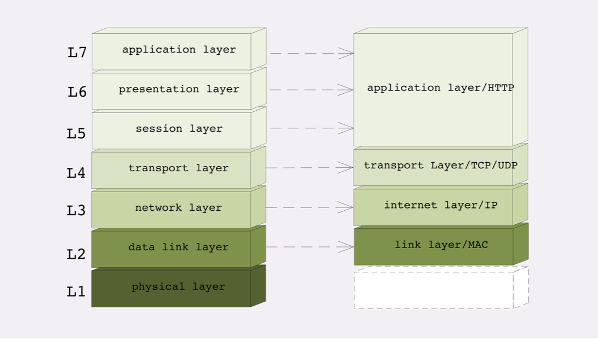

* 第一层：物理层，TCP/IP里无对应；
* 第二层：数据链路层，对应TCP/IP的链接层；
* 第三层：网络层，对应TCP/IP的网际层；
* 第四层：传输层，对应TCP/IP的传输层；
* 第五、六、七层：统一对应到TCP/IP的应用层。

#### 小结

1. TCP/IP分为四层，核心是二层的IP和三层的TCP，HTTP在第四层；
2. OSI分为七层，基本对应TCP/IP协议，TCP在第四层，HTTP在第七层；
3. OSI可以映射到TCP/IP，但这期间一、五、六层消失了；
4. 日常交流的时候我们通常使用OSI模型，用四层、七层等术语；
5. HTTP利用TCP/IP协议栈逐层打包再拆包，实现了数据传输，但下面的细节并不可见。

#### 课下作业

1. 你能用自己的话解释一下“二层转发”“三层路由”吗？
2. 你认为上一讲中的DNS协议位于哪一层呢？
3. 你认为CDN工作在哪一层呢？

#### 作业回答

1. 这里的二层和三层指的都是OSI中的对应层级，二层转发指的是数据链路层，基于MAC地址，通常是交换机，根据目标MAC地址，进行本地转发和广播。三层路由指的是网络层，通常是路由器，根据网段范围，进行本地转发或选择下一个网关。

   > 当数据传输到网络层，路由器会检查目的 IP 是否与自己处于同一网段，是则进行二层转发即请求目的主机的 MAC 地址，否则进行三层转发即进入路由的递归查找。

2. DNS属于应用层，其本身并不负责传输、网际的实际操作，只是将域名解析为IP，方便下一层的使用；

3. CDN属于应用层，是对传输后的数据内容操作。

### 06｜域名里有哪些门道？

#### 域名的形式

* 域名是一个有层次的结构，是一串用“.”分隔的多个单词，最右边的被称为“顶级域名”，然后是“二级域名”，层级关系向左依次降低。
* DNS 的核心系统是一个三层的树状、分布式服务，基本对应域名的结构：
  1. 根域名服务器（Root DNS Server）：管理顶级域名服务器，返回“com”“net”“cn”等顶级域名服务器的 IP 地址；
  2. 顶级域名服务器（Top-level DNS Server）：管理各自域名下的权威域名服务器，比如 com 顶级域名服务器可以返回 apple.com 域名服务器的 IP 地址；
  3. 权威域名服务器（Authoritative DNS Server）：管理自己域名下主机的 IP 地址，比如 apple.com 权威域名服务器可以返回 www.apple.com 的 IP 地址。

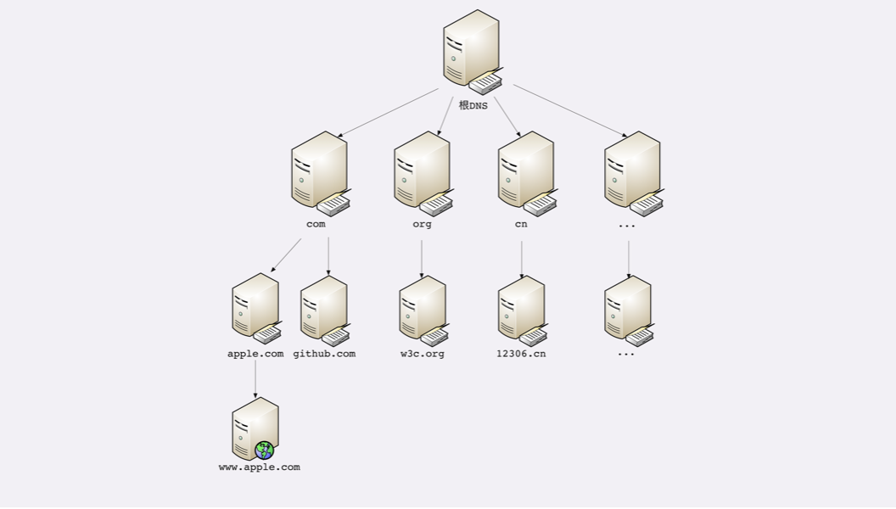

#### 小结

1. 域名使用字符串来代替IP地址，方便用户记忆，本质上是一个名字空间系统；
2. DNS就像是我们现实世界里的电话本、查号台，统管着互联网世界里的所有网站，是一个“超级大管家”；
3. DNS是一个树状的分布式查询系统，但为了提高查询效率，外围有多级的缓存；
4. 使用DNS可以实现基于域名的负载均衡，既可以在内网，也可以在外网。

#### 课下作业

1. 在浏览器地址栏里随便输入一个不存在的域名，比如就叫“www. 不存在.com”，试着解释一下它的 DNS 解析过程。
2. 如果因为某些原因，DNS 失效或者出错了，会出现什么后果？

#### 作业答案

1. 浏览器缓存->操作系统缓存->hosts->dns
2. 结果就是访问网页失败，过程不知。

### 07｜自己动手，搭建HTTP实验环境

#### 配置“最小化”环境的应用软件：

* Wireshark：是著名的网络抓包工具，能够截获在 TCP/IP 协议栈中传输的所有流量，并按协议类型、地址、端口等任意过滤，功能非常强大，是学习网络协议的必备工具。
* Chrome/Firefox：是 Google 开发的浏览器，是目前的主流浏览器之一。它不仅上网方便，也是一个很好的调试器。
* Telnet：是一个经典的虚拟终端，基于 TCP 协议远程登录主机，我们可以使用它来模拟浏览器的行为，连接服务器后手动发送 HTTP 请求，把浏览器的干扰也彻底排除，能够从最原始的层面去研究 HTTP 协议。
* OpenResty：它是基于 Nginx 的一个“强化包”，里面除了 Nginx 还有一大堆有用的功能模块，不仅支持 HTTP/HTTPS，还特别集成了脚本语言 Lua 简化 Nginx 二次开发，方便快速地搭建动态网关，更能够当成应用容器来编写业务逻辑。

> 实现项目地址：[http_study](https://github.com/chronolaw/http_study)

#### 小结

1. 现实的网络环境太复杂，有很多干扰因素，搭建“最小化”的环境可以快速抓住重点，掌握 HTTP 的本质；
2. 我们选择 Wireshark 作为抓包工具，捕获在 TCP/IP 协议栈中传输的所有流量；我们选择 Chrome 或 Firefox 浏览器作为 HTTP 协议中的 user agent；
3. 我们选择 OpenResty 作为 Web 服务器，它是一个 Nginx 的“强化包”，功能非常丰富；
4. Telnet 是一个命令行工具，可用来登录主机模拟浏览器操作；
5. 在 GitHub 上可以下载到本专栏的专用项目源码，只要把 OpenResty 解压到里面即可完成实验环境的搭建。

#### 操作（Mac）

* 启动项目

  ~~~shell
  cd http_study/www/
  openresty -p `pwd` -c conf/nginx.conf
  ~~~

  停止项目

  ~~~shell
  openresty -s quit -p `pwd` -c conf/nginx.conf
  ~~~

  

## 基础篇

### 08｜键入网址再按下回车，后面究竟发生了什么？

#### 交互流程


#### 小结

1. HTTP 协议基于底层的 TCP/IP 协议，所以必须要用 IP 地址建立连接；
2. 如果不知道 IP 地址，就要用 DNS 协议去解析得到 IP 地址，否则就会连接失败；
3. 建立 TCP 连接后会顺序收发数据，请求方和应答方都必须依据 HTTP 规范构建和解析报文； 
4. 为了减少响应时间，整个过程中的每一个环节都会有缓存，能够实现“短路”操作；
5. 虽然现实中的 HTTP 传输过程非常复杂，但理论上仍然可以简化成实验里的“两点”模型。

#### 课下作业

1. 你能试着解释一下在浏览器里点击页面链接后发生了哪些事情吗？
2. 这一节课里讲的都是正常的请求处理流程，如果是一个不存在的域名，那么浏览器的工作流程会是怎么样的呢？

#### 作业回答

1. 1. 浏览器从地址栏的输入中获得服务器的 IP 地址和端口号；
   2. 浏览器用 TCP 的三次握手与服务器建立连接；
   3. 浏览器向服务器发送拼好的报文；
   4. 服务器收到报文后处理请求，同样拼好报文再发给浏览器；
   5. 浏览器解析报文，渲染输出页面。
2. 1. 浏览器从地址栏的输入中获得服务器的域名； 
   2. 解析域名（浏览器缓存->host->局域网/广域网缓存->根域名服务器->顶级域名->权威域名）。

### 09｜HTTP报文是什么样子的？

#### 协议组成

* HTTP协议的请求报文和响应报文的结构基本相同，由三部分组成；
  1. 起始行（start line）：描述请求或响应的基本信息；
  2. 头部字段集合（header）：使用key-value形式更详细地说明报文；
  3. 消息正文（body）：实际传输的数据，它不一定是纯文本，可以是图片、视频等二进制数据。
* 起始行+头部（header）+空行+实体（body）

#### 起始行格式

* 请求行：请求方法+请求目标+版本号，中间用空格隔开。（例如：GET / HTTP/1.1）

* 状态行（响应行）：版本号+状态码+原因，中间用空格隔开。（例如：HTTP/1.1 200 OK）

  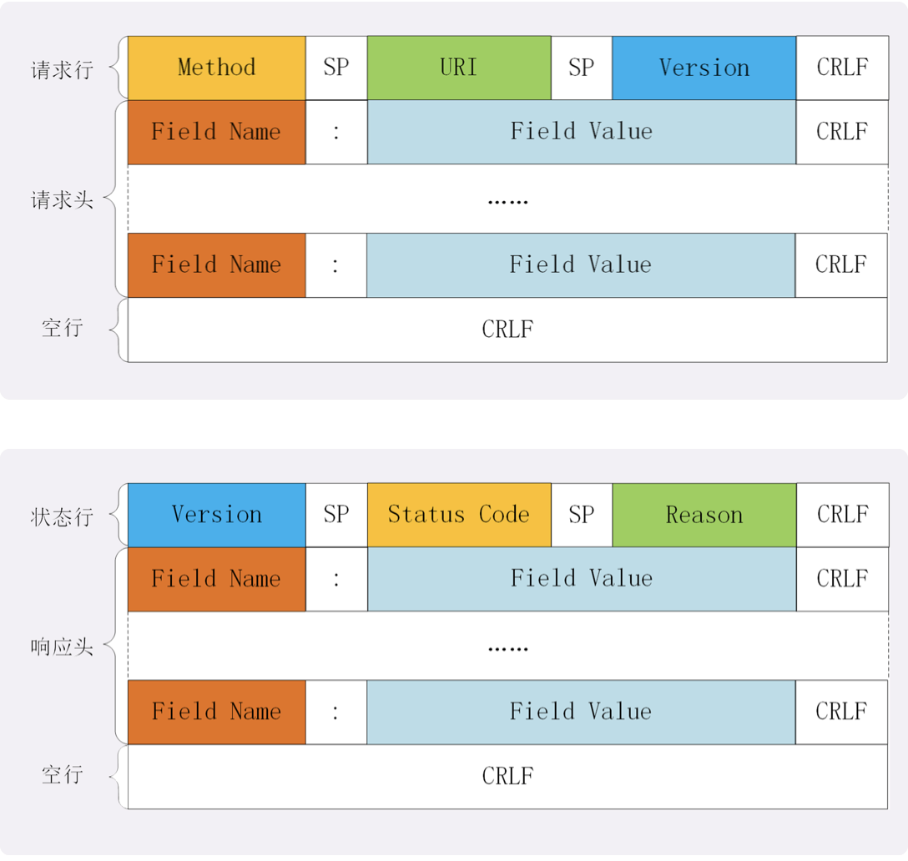

#### 头部字段规则

1. 字字段名不区分大小写，例如“Host”也可以写成“host”，但首字母大写的可读性更好；
2. 字段名里不允许出现空格，可以使用连字符“-”，但不能使用下划线“_”。例如，“test-name”是合法的字段名，而“test name”“test_name”是不正确的字段名；
3. 字段名后面必须紧接着“:”，不能有空格，而“:”后的字段值前可以有多个空格；
4. 字段的顺序是没有意义的，可以任意排列不影响语义；
5. 字段原则上不能重复，除非这个字段本身的语义允许，例如 Set-Cookie。

#### 头部字段分类

1. 通用字段：在请求头和响应头里都可以出现；（Date）
2. 请求字段：仅能出现在请求头里，进一步说明请求信息或者额外的附加条件；（Host，User-Agent）
3. 响应字段：仅能出现在响应头里，补充说明响应报文的信息；（Server）
4. 实体字段：它实际上属于通用字段，但专门描述 body 的额外信息。（Content-Length）

#### 小结

1. HTTP 报文结构就像是“大头儿子”，由“起始行 + 头部 + 空行 + 实体”组成，简单地说就是“header+body”；
2. HTTP 报文可以没有 body，但必须要有 header，而且 header 后也必须要有空行，形象地说就是“大头”必须要带着“脖子”；
3. 请求头由“请求行 + 头部字段”构成，响应头由“状态行 + 头部字段”构成；
4. 请求行有三部分：请求方法，请求目标和版本号；状态行也有三部分：版本号，状态码和原因字符串；
5. 头部字段是 key-value 的形式，用“:”分隔，不区分大小写，顺序任意，除了规定的标准头，也可以任意添加自定义字段，实现功能扩展；
6. HTTP/1.1 里唯一要求必须提供的头字段是 Host，它必须出现在请求头里，标记虚拟主机名。

#### 课下作业

1. 如果拼 HTTP 报文的时候，在头字段后多加了一个 CRLF，导致出现了一个空行，会发生什么？
2. 讲头字段时说“:”后的空格可以有多个，那为什么绝大多数情况下都只使用一个空格呢？

#### 作业回答

1. 头字段下面的空行以后都会被当做body。
2. 节省资源。

### 10｜应该如何理解请求方法？

#### 标准请求方法

* 目前 HTTP/1.1 规定了八种方法，单词都必须是大写的形式

1. GET：获取资源，可以理解为读取或者下载数据；
2. HEAD：获取资源的元信息（GET的简化版，服务器只会返回响应头，没有响应体。）；
3. POST：向资源提交数据，相当于写入或上传数据；
4. PUT：类似 POST，有微妙的不同，POST类似“create”，PUT类似“update”；
5. DELETE：删除资源；
6. CONNECT：建立特殊的连接隧道；
7. OPTIONS：列出可对资源实行的方法；
8. TRACE：追踪请求 - 响应的传输路径。

#### 小结

1. 请求方法是客户端发出的、要求服务器执行的、对资源的一种操作；
2. 请求方法是对服务器的“指示”，真正应如何处理由服务器来决定；
3. 最常用的请求方法是 GET 和 POST，分别是获取数据和发送数据；
4. HEAD 方法是轻量级的 GET，用来获取资源的元信息；
5. PUT 基本上是 POST 的同义词，多用于更新数据；
6. “安全”与“幂等”是描述请求方法的两个重要属性，具有理论指导意义，可以帮助我们设计系统。

#### 课下作业

1. 你能把 GET/POST 等请求方法对应到数据库的“增删改查”操作吗？请求头应该如何设计呢？
2. 你觉得 TRACE/OPTIONS/CONNECT 方法能够用 GET 或 POST 间接实现吗？

#### 作业回答

1. 增：POST 删：DELETE 改：PUT 查：GET
2. 可以，客户端和服务端重新定义操作头字段。

### 11｜你能写出正确的网址吗？

> URI 本质上是一个字符串，这个字符串的作用是唯一地标记资源的位置或者名字。这里我要提醒你注意，它不仅能够标记万维网的资源，也可以标记其他的，如邮件系统、本地文件系统等任意资源。

#### URI的基本组成

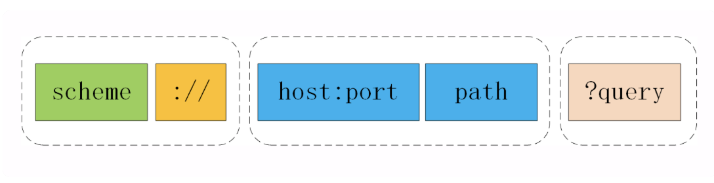

* 主要有三部分组成，第一部分协议名，第二部分主机名（file协议省略了主机名，默认是本地的）+路径，第三部分查询参数。
* 第一部分和第二部分之间用“://”分割
* 第二部分和第三部分之间用“?”分割

~~~java
http://nginx.org
http://www.chrono.com:8080/11-1
http://www.chrono.com:8080/11-1?uid=1234&name=mario
file:///D:/http_study/www/
~~~

#### 协议名（scheme）

* 表示资源使用哪种协议来访问，常见的协议有：http、ftp、ldap、file

#### 主机+路径

* 在“://”之后，是资源所在的主机名，通常是ip或域名加端口号，后面的path表示资源子目录。

#### 查询参数

* 在“?”之后，使用“key=value”的形式，多个键值对之间使用“&”连接。

#### URI的编码

* URI里只能使用ASCII码，如果有中文获其他特殊字符需要进行转义编码；
* 编码的方式，把字符转换成十六进制字节值，然后前面加上“%”；

> 这里的“夸父逐日”是key,省略了value。

```java
http://www.chrono.com:8080/11-1?夸父逐日
http://www.chrono.com:8080/11-1?%E5%A4%B8%E7%88%B6%E9%80%90%E6%97%A5
```

#### 课下作业

1. HTTP 协议允许在在请求行里使用完整的 URI，但为什么浏览器没有这么做呢？
2. URI 的查询参数和头字段很相似，都是 key-value 形式，都可以任意自定义，那么它们在使用时该如何区别呢？

#### 作业回答

1. 因为请求头里面已经有了主机名，所以请求行里，只需要添加路径。

   ```java
   GET /11-1 HTTP/1.1
   Host: www.chrono.com:8080
   ```

2. 个人理解，query参数针对的是资源（uri），而字段针对的是本次请求，也就是报文。一个是长期、稳定的，一个是短期、临时的。

### 12｜响应状态码该怎么用？

#### 状态码种类

* 1××：提示信息，表示目前是协议处理的中间状态，还需要后续的操作；
* 2××：成功，报文已经收到并被正确处理；
* 3××：重定向，资源位置发生变动，需要客户端重新发送请求；
* 4××：客户端错误，请求报文有误，服务器无法处理；
* 5××：服务器错误，服务器在处理请求时内部发生了错误。

#### 小结

1. 状态码在响应报文里表示了服务器对请求的处理结果；
2. 状态码后的原因短语是简单的文字描述，可以自定义；
3. 状态码是十进制的三位数，分为五类，从 100 到 599；
4. 2××类状态码表示成功，常用的有 200、204、206；
5. 3××类状态码表示重定向，常用的有 301、302、304；
6. 4××类状态码表示客户端错误，常用的有 400、403、404；
7. 5××类状态码表示服务器错误，常用的有 500、501、502、503。

#### 课下作业

1. 你在开发 HTTP 客户端，收到了一个非标准的状态码，比如 4××、5××，应当如何应对呢？
2. 你在开发 HTTP 服务器，处理请求时发现报文里缺了一个必需的 query 参数，应该如何告知客户端错误原因呢？

#### 作业回答

1. 统一当成错误处理。
2. 通过响应体里的业务信息字段，提示参数错误信息。

### 13｜HTTP有哪些特点？

####  小结

1. HTTP 是灵活可扩展的，可以任意添加头字段实现任意功能；
2. HTTP 是可靠传输协议，基于 TCP/IP 协议“尽量”保证数据的送达；
3. HTTP 是应用层协议，比 FTP、SSH 等更通用功能更多，能够传输任意数据；
4. HTTP 使用了请求 - 应答模式，客户端主动发起请求，服务器被动回复请求；
5. HTTP 本质上是无状态的，每个请求都是互相独立、毫无关联的，协议不要求客户端或服务器记录请求相关的信息。

#### 课下作业

1. 就如同开头我讲的那样，你能说一下今天列出的这些 HTTP 的特点中哪些是优点，哪些是缺点吗？
2. 不同的应用场合有不同的侧重方面，你觉得哪个特点对你来说是最重要的呢？

#### 作业回答

1. 应该来说都是优点，因为都是为了实现某种功能而存在，缺点就是这些也并不是绝对完美的。
2. 灵活可拓展。

### 14｜HTTP有哪些优点？又有哪些缺点？

#### 小结

1. HTTP 最大的优点是简单、灵活和易于扩展；
2. HTTP 拥有成熟的软硬件环境，应用的非常广泛，是互联网的基础设施；
3. HTTP 是无状态的，可以轻松实现集群化，扩展性能，但有时也需要用 Cookie 技术来实现“有状态”；
4. HTTP 是明文传输，数据完全肉眼可见，能够方便地研究分析，但也容易被窃听；
5. HTTP 是不安全的，无法验证通信双方的身份，也不能判断报文是否被窜改；
6. HTTP 的性能不算差，但不完全适应现在的互联网，还有很大的提升空间。

### 15｜海纳百川：HTTP的实体数据

#### 数据类型与编码

* HTTP的数据类型定义是从MIME协议（“多用途互联网邮件扩展”（Multipurpose Internet Mail Extensions））里借鉴的。使用“type/subtype”方式表示。常用的几种如下：

1. text：即文本格式的可读数据，我们最熟悉的应该就是 text/html 了，表示超文本文档，此外还有纯文本 text/plain、样式表 text/css 等。
2. image：即图像文件，有 image/gif、image/jpeg、image/png 等。
3. audio/video：音频和视频数据，例如 audio/mpeg、video/mp4 等。
4. application：数据格式不固定，可能是文本也可能是二进制，必须由上层应用程序来解释。常见的有 application/json，application/javascript、application/pdf 等，另外，如果实在是不知道数据是什么类型，像刚才说的“黑盒”，就会是 application/octet-stream，即不透明的二进制数据。

* HTTP在传输数据的时候，为了节约宽带，有时会压缩数据，所以会有压缩类型“Encoding type”。常用的以下几种：

1. gzip：GNU zip 压缩格式，也是互联网上最流行的压缩格式；
2. deflate：zlib（deflate）压缩格式，流行程度仅次于 gzip；
3. br：一种专门为 HTTP 优化的新压缩算法（Brotli）。

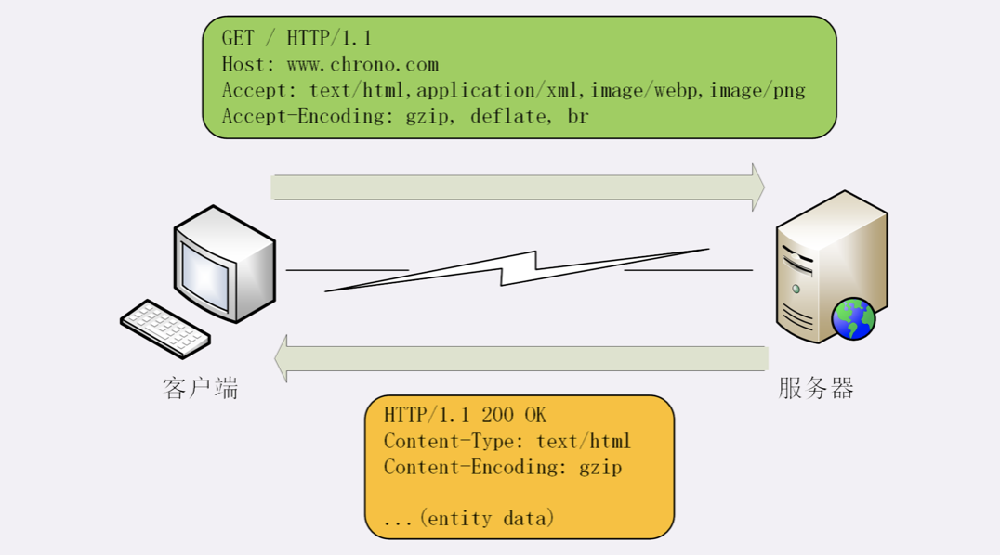

### 语言类型和编码

* 如果说数据类型和编码已经解决了文件传输问题，那还有一个文本读取解析的问题，涉及到字符集。语言类型使用“type-subtype”，例子：en 表示任意的英语，en-US 表示美式英语，en-GB 表示英式英语，而 zh-CN 就表示我们最常使用的汉语。

~~~java
Accept-Language: zh-CN, zh, en
Content-Language: zh-CN
~~~

* 编码方式，没有使用单独字段，追加在Content-Type字段后面，使用“charset=xxx”来表示。

~~~java
Accept-Charset: gbk, utf-8
Content-Type: text/html; charset=utf-8
~~~

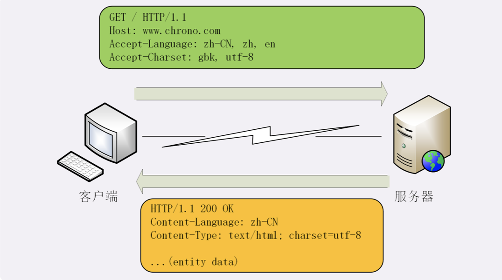

#### 内容协商的质量值（权重）

> 在 HTTP 协议里用 Accept、Accept-Encoding、Accept-Language 等请求头字段进行内容协商的时候，还可以用一种特殊的“q”参数表示权重来设定优先级，这里的“q”是“quality factor”的意思。权重的最大值是 1，最小值是 0.01，默认值是 1，如果值是 0 就表示拒绝。具体的形式是在数据类型或语言代码后面加一个“;”，然后是“q=value”。

~~~java
Accept: text/html,application/xml;q=0.9,*/*;q=0.8
~~~

> 它表示浏览器最希望使用的是 HTML 文件，权重是 1，其次是 XML 文件，权重是 0.9，最后是任意数据类型，权重是 0.8。服务器收到请求头后，就会计算权重，再根据自己的实际情况优先输出 HTML 或者 XML。

#### 内容协商的结果

~~~java
Vary: Accept-Encoding,User-Agent,Accept
~~~

> 这个 Vary 字段表示服务器依据了 Accept-Encoding、User-Agent 和 Accept 这三个头字段，然后决定了发回的响应报文。

#### 课下作业

1. 试着解释一下这个请求头“Accept-Encoding: gzip, deflate;q=1.0, *;q=0.5, br;q=0”，再模拟一下服务器的响应头。
2. 假设你要使用 POST 方法向服务器提交一些 JSON 格式的数据，里面包含有中文，请求头应该是什么样子的呢？
3. 试着用快递发货收货比喻一下 MIME、Encoding 等概念

#### 作业回答

1. 客户端接受的编码方式，按照权重比例优先级依次是：gzip、deflate、任意、br。服务器的响应头可能是：Content-Encoding: gzip；
2. 提交json格式数据，请求头里应该含有字段：Content-Type:application/json。
3. 快递发货，物品类型代表MIME，用盒子包装快递代表Encoding。

### 16｜把大象装进冰箱：HTTP传输大文件的方法

#### 分块传输

* 服务器将文件分块传输给客户端，在响应报文里用头字段“Transfer-Encoding: chunked”来表示，意思是报文里的 body 部分不是一次性发过来的，而是分成了许多的块（chunk）逐个发送。

> “Transfer-Encoding: chunked”和“Content-Length”这两个字段是互斥的，也就是说响应报文里这两个字段不能同时出现，一个响应报文的传输要么是长度已知，要么是长度未知（chunked），这一点你一定要记住。

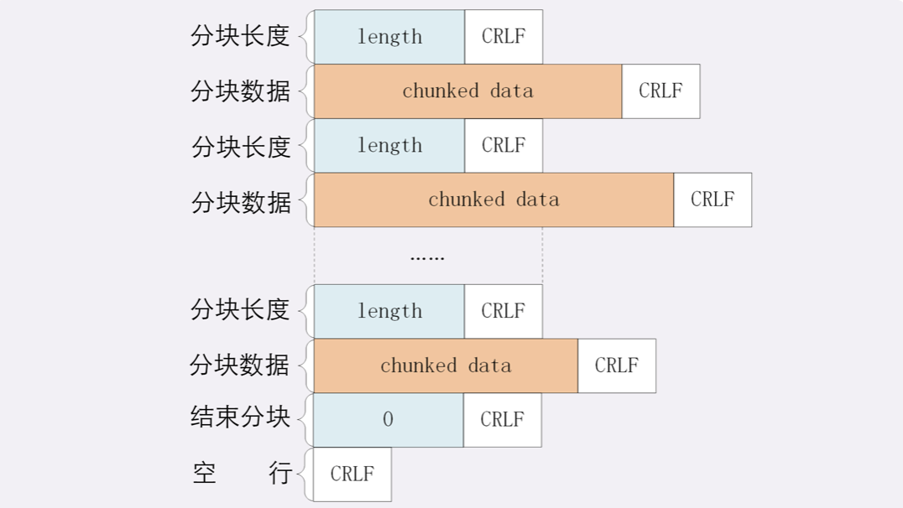

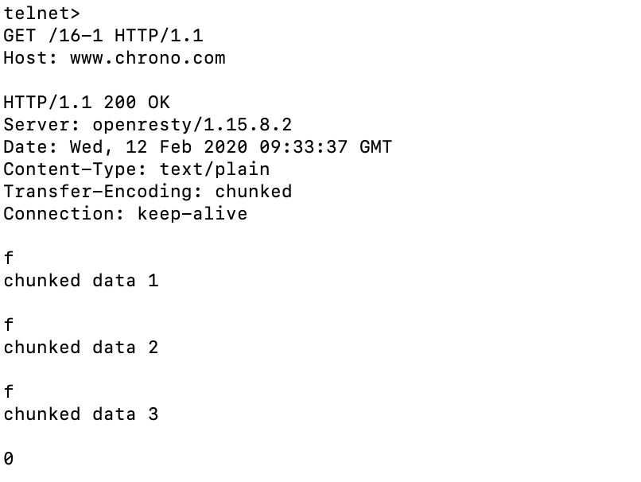

#### 范围请求

* “范围请求”（range requests),允许客户端请求某一部分的文件获取。

> 范围请求不是 Web 服务器必备的功能，可以实现也可以不实现，所以服务器必须在响应头里使用字段“Accept-Ranges: bytes”明确告知客户端：“我是支持范围请求的”。如果不支持的话该怎么办呢？服务器可以发送“Accept-Ranges: none”，或者干脆不发送“Accept-Ranges”字段，这样客户端就认为服务器没有实现范围请求功能，只能老老实实地收发整块文件了。

* 请求头 Range 是 HTTP 范围请求的专用字段，格式是“bytes=x-y”，其中的 x 和 y 是以字节为单位的数据范围。要注意 x、y 表示的是“偏移量”，例如前 10 个字节表示为“0-9”。服务端返回响应码206，表示是原始数据的一部分。

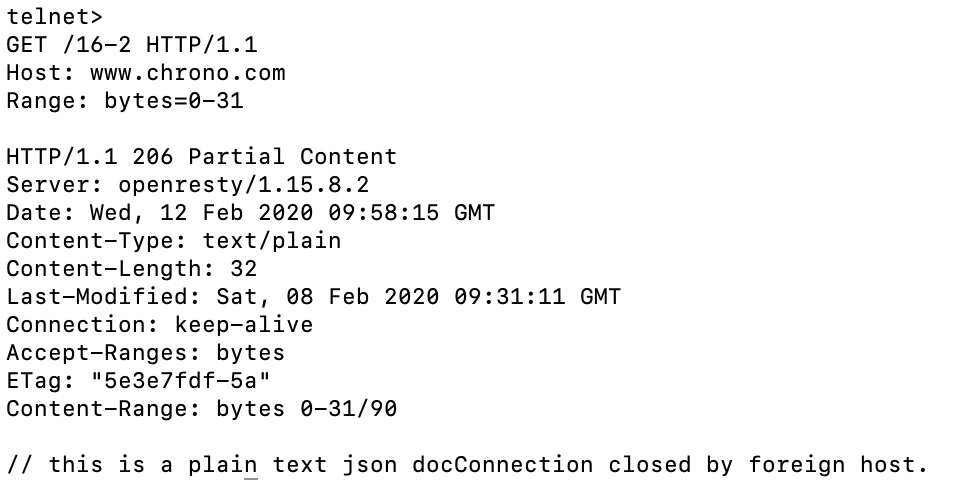

#### 范围请求（多段）

* 跟范围请求类似，只是一次请求多个范围。MIME 类型：“multipart/byteranges”，表示报文的 body 是由多段字节序列组成的，并且还要用一个参数“boundary=xxx”给出段之间的分隔标记。

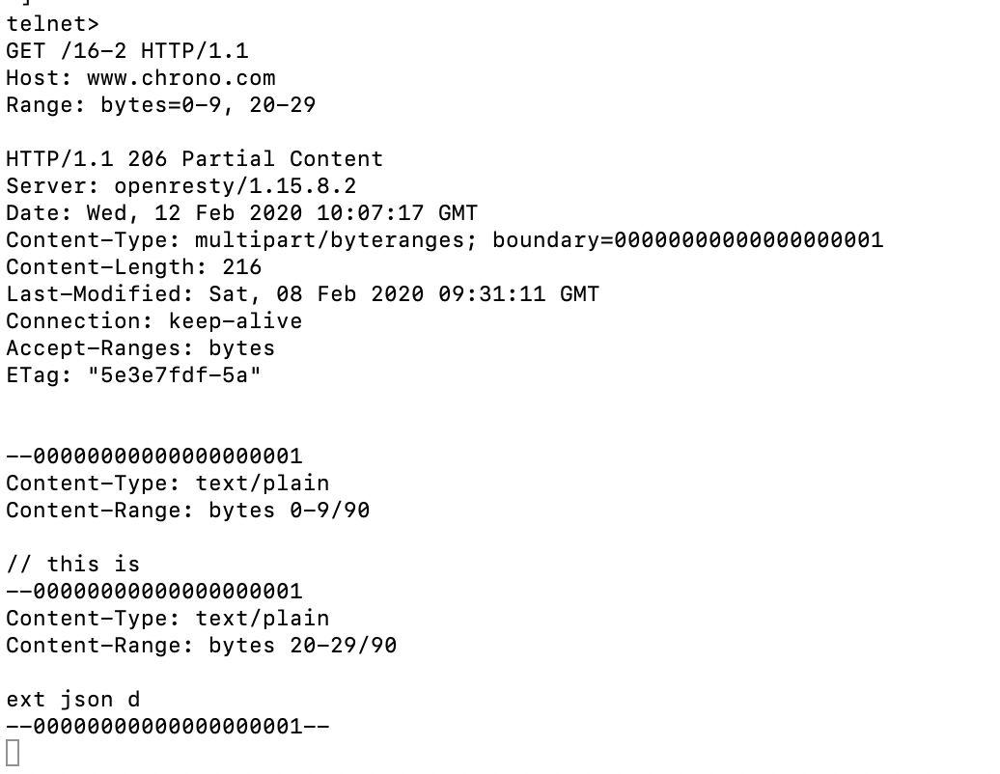

#### 课下作业

1. 分块传输数据的时候，如果数据里含有回车换行（\r\n）是否会影响分块的处理呢？
2. 如果对一个被 gzip 的文件执行范围请求，比如“Range: bytes=10-19”，那么这个范围是应用于原文件还是压缩后的文件呢？

#### 作业回答

1. 不影响，分块传输没块数据都有长度标示。
2. 应用于原文件。

### 17｜排队也要讲效率：HTTP的连接管理

#### 小结

1. 早期的 HTTP 协议使用短连接，收到响应后就立即关闭连接，效率很低；
2. HTTP/1.1 默认启用长连接，在一个连接上收发多个请求响应，提高了传输效率；
3. 服务器会发送“Connection: keep-alive”字段表示启用了长连接；
4. 报文头里如果有“Connection: close”就意味着长连接即将关闭；
5. 过多的长连接会占用服务器资源，所以服务器会用一些策略有选择地关闭长连接；
6. “队头阻塞”问题会导致性能下降，可以用“并发连接”和“域名分片”技术缓解。

#### 课下作业

1. 在开发基于 HTTP 协议的客户端时应该如何选择使用的连接模式呢？短连接还是长连接？
2. 应当如何降低长连接对服务器的负面影响呢？

#### 作业回答

1. 根据请求的频繁程度来选择连接模式。一次性的请求用短链接，频繁与服务端交互的用长连接。
2. 长连接会长期占用服务器资源，根据服务器性能设置连接数和长连接超时时间，保证服务器TCP资源使用处于正常范围。

### 18｜四通八达：HTTP的重定向和跳转

#### 小结

1. 重定向是服务器发起的跳转，要求客户端改用新的 URI 重新发送请求，通常会自动进行，用户是无感知的；
2. 301/302 是最常用的重定向状态码，分别是“永久重定向”和“临时重定向”；
3. 响应头字段 Location 指示了要跳转的 URI，可以用绝对或相对的形式；
4. 重定向可以把一个 URI 指向另一个 URI，也可以把多个 URI 指向同一个 URI，用途很多；
5. 使用重定向时需要当心性能损耗，还要避免出现循环跳转。

### 19｜让我知道你是谁：HTTP的Cookie机制

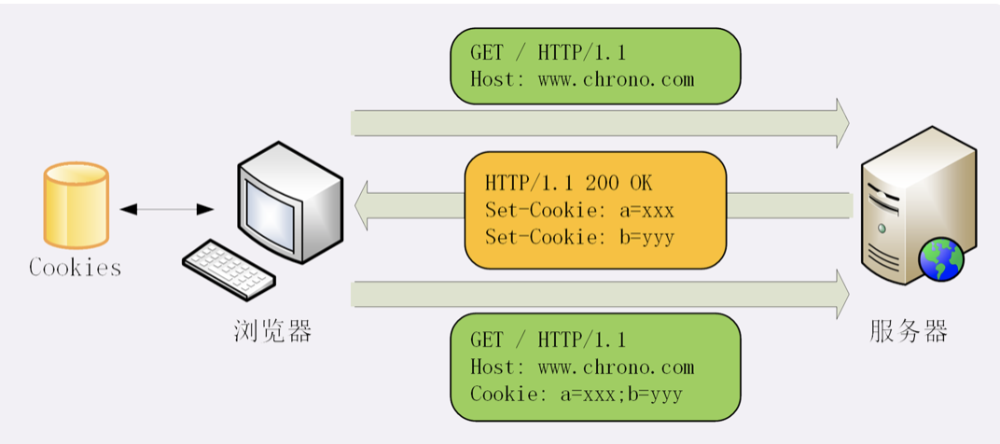

#### 小结

1. Cookie 是服务器委托浏览器存储的一些数据，让服务器有了“记忆能力”；
2. 响应报文使用 Set-Cookie 字段发送“key=value”形式的 Cookie 值；
3. 请求报文里用 Cookie 字段发送多个 Cookie 值；
4. 为了保护 Cookie，还要给它设置有效期、作用域等属性，常用的有 Max-Age、Expires、Domain、HttpOnly 等；
5. Cookie 最基本的用途是身份识别，实现有状态的会话事务。

### 20｜生鲜速递：HTTP的缓存控制

#### 小结

1. 缓存是优化系统性能的重要手段，HTTP 传输的每一个环节中都可以有缓存；
2. 服务器使用“Cache-Control”设置缓存策略，常用的是“max-age”，表示资源的有效期；
3. 浏览器收到数据就会存入缓存，如果没过期就可以直接使用，过期就要去服务器验证是否仍然可用；
4. 验证资源是否失效需要使用“条件请求”，常用的是“if-Modified-Since”和“If-None-Match”，收到 304 就可以复用缓存里的资源；
5. 验证资源是否被修改的条件有两个：“Last-modified”和“ETag”，需要服务器预先在响应报文里设置，搭配条件请求使用；
6. 浏览器也可以发送“Cache-Control”字段，使用“max-age=0”或“no_cache”刷新数据。

#### 21｜良心中间商：HTTP的代理服务

#### 小结

1. HTTP 代理就是客户端和服务器通信链路中的一个中间环节，为两端提供“代理服务”；
2. 代理处于中间层，为 HTTP 处理增加了更多的灵活性，可以实现负载均衡、安全防护、数据过滤等功能；
3. 代理服务器需要使用字段“Via”标记自己的身份，多个代理会形成一个列表；
4. 如果想要知道客户端的真实 IP 地址，可以使用字段“X-Forwarded-For”和“X-Real-IP”；
5. 专门的“代理协议”可以在不改动原始报文的情况下传递客户端的真实 IP。

### 23｜HTTPS是什么？SSL/TLS又是什么？

#### https和http的区别

* 协议名不同，一个是https，一个是http。
* 端口号不同，一个是443，一个是80。
* 安全性不同，一个是加密，一个是明文。

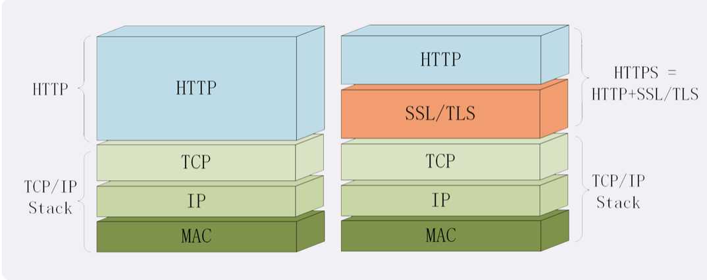

#### SSL/TLS

* SSL 即安全套接层（Secure Sockets Layer），在 OSI 模型中处于第 5 层（会话层），发展到v3版本的时候改名为TLS（传输层安全，Transport Layer Security），最广泛的版本为TLS1.2。

#### 通讯安全

* 机密性：不能被人一眼就看懂了消息。所以使用加密算法，加密明文。
* 完整性：保证数据的完整性，没有缺失或者被修改。
* 身份认证：通讯双方的认证，防止黑客冒充客户端或服务端和对方通讯。

#### OpenSSL

* 一个开源的密码学程序库和工具包，许多应用软件使用它作为底层库来实现TLS功能。

### 24｜固若金汤的根本（上）：对称加密与非对称加密

#### 对称加密

* AES（高级加密标准”（Advanced Encryption Standard）），长度有 128、192 或 256。
* ChaCha20是 Google 设计的另一种加密算法，密钥长度固定为 256 位。

> 对称加密还要结合一个“分组模式”（将明文分组），才是完整的对称加密算法。
>
> 比如，AES128-GCM，意思是密钥长度为 128 位的 AES 算法，使用的分组模式是 GCM；ChaCha20-Poly1305 的意思是 ChaCha20 算法，使用的分组模式是 Poly1305。

缺点：无法把密钥安全的传递给对方。

#### 非对称加密

有两个密钥，一个公钥，一个私钥，公钥加密只能私钥解密，私钥加密只能公钥解密。

* RSA（发明人的名字首写），1024、2048，基于“整数分解”的数学难题。
* ECC（Elliptic Curve Cryptography），160、224，基于“椭圆曲线离散对数”的数学难题。

缺点：因为都是基于复杂的数学难题，运算量大，所以加密速度慢。

#### 混合加密

* 结合对称加密和非对称加密，就是TLS目前使用的混合加密方式。先使用非对称加密交换对称加密的密钥，后续使用对称加密的密钥通讯。

> HTTPS 连接大致上可以划分为两个部分，第一个是建立连接时的非对称加密握手，第二个是握手后的对称加密报文传输。

### 25｜固若金汤的根本（下）：数字签名与证书

#### 摘要算法

给数据生成一串“摘要”字符串，不可逆。常说的散列函数、哈希函数（Hash Function）。

常用的有MD5、SHA-1、SHA-2、SHA256。

为了保证数据的完整性。

#### 数字签名

使用私钥加密“摘要”，获得数字签名，使用公钥解密数字签名，获得“摘要”，再比对原文的摘要。

> 刚才的这两个行为也有专用术语，叫做“签名”和“验签”。只要你和网站互相交换公钥，就可以用“签名”和“验签”来确认消息的真实性，因为私钥保密，黑客不能伪造签名，就能够保证通信双方的身份。

#### 数字证书和 CA

由权威机构认证的，保证公钥的可靠性。

### 26｜信任始于握手：TLS1.2连接过程解析

#### 简图

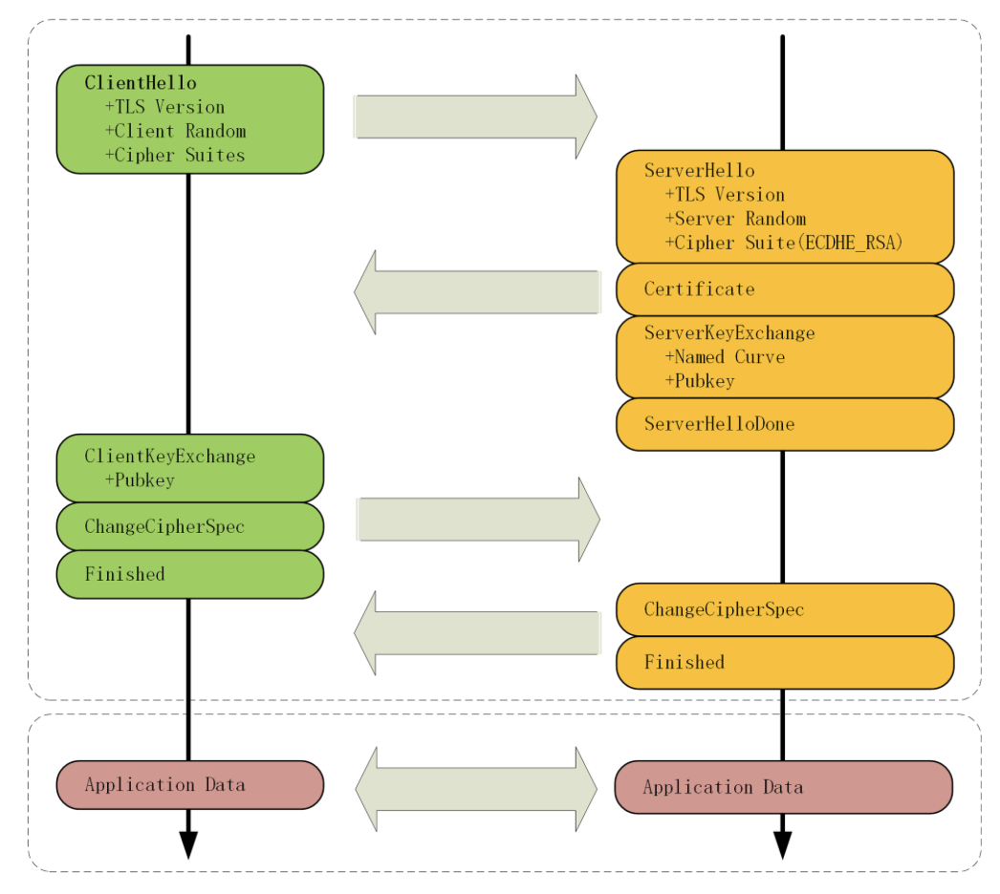

#### ECDHE握手过程


#### 流程分析

关键的是4个TCP包，服务端和客户端两个来回。

1. 第一个包：客户端发送给服务端

   * “Client Hello”（版本号、随机数（Client Random）、支持的密码套件）。

     ~~~java
     Handshake Protocol: Client Hello
         Version: TLS 1.2 (0x0303)
         Random: 1cbf803321fd2623408dfe…
         Cipher Suites (17 suites)
             Cipher Suite: TLS_ECDHE_RSA_WITH_AES_128_GCM_SHA256 (0xc02f)
             Cipher Suite: TLS_ECDHE_RSA_WITH_AES_256_GCM_SHA384 (0xc030)
     ~~~

2. 第二个包：服务端回复客户端

   * “Server Hello”（版本号、随机数（Server Random）、选择的密码套件）

     ~~~java
     Handshake Protocol: Server Hello
         Version: TLS 1.2 (0x0303)
         Random: 0e6320f21bae50842e96…
         Cipher Suite: TLS_ECDHE_RSA_WITH_AES_256_GCM_SHA384 (0xc030)
     ~~~

   * “Certificate”，服务端把证书发给客户端。

   * "Server Key Exchange"，椭圆曲线的公钥（Server Params），私钥的签名。

     ~~~java
     Handshake Protocol: Server Key Exchange
         EC Diffie-Hellman Server Params
             Curve Type: named_curve (0x03)
             Named Curve: x25519 (0x001d)
             Pubkey: 3b39deaf00217894e...
             Signature Algorithm: rsa_pkcs1_sha512 (0x0601)
             Signature: 37141adac38ea4...
     ~~~

   * "Server Hello Done"，服务端回复结束。

3. 第三个包：客户端发送给服务端

   * “Client Key Exchange”，椭圆曲线的公钥（Client Params）。

     ~~~java
     Handshake Protocol: Client Key Exchange
         EC Diffie-Hellman Client Params
             Pubkey: 8c674d0e08dc27b5eaa…
     ~~~

   * "Change Cipher Spec"，加密通信生效。

   * “Encrypted Handshake Message”(经过加密的消息)

4. 第四个包：服务端回复客户端

   * “Change Cipher Spec”
   * “Encrypted Handshake Message”(经过加密的消息)

#### 最终会话密钥的生成（客户端和服务端分别通过算法生成）

1. 由客户端和服务端的通过算法生成的公钥，生成“Pre-Master”。
2. 由客户端和服务端的随机数，加上“Pre-Master"，生成“Master Secret”，用于会话的主密钥。

#### RSA握手过程

区别在于Pre-Master是由客户端直接生成的一个随机数。


#### 简单小结（ECDHE）

1. 第一步，客户端和服务端，确认加密算法，交换随机数，交换公钥，客户端拿到服务端证书和数字签名。
2. 第二步，通过公钥生成“Pre-Master”，通过随机数和“Pre-Master”生成最终会话密钥“Master Secret”。

### 27｜更好更快的握手：TLS1.3特性解析

#### 简图

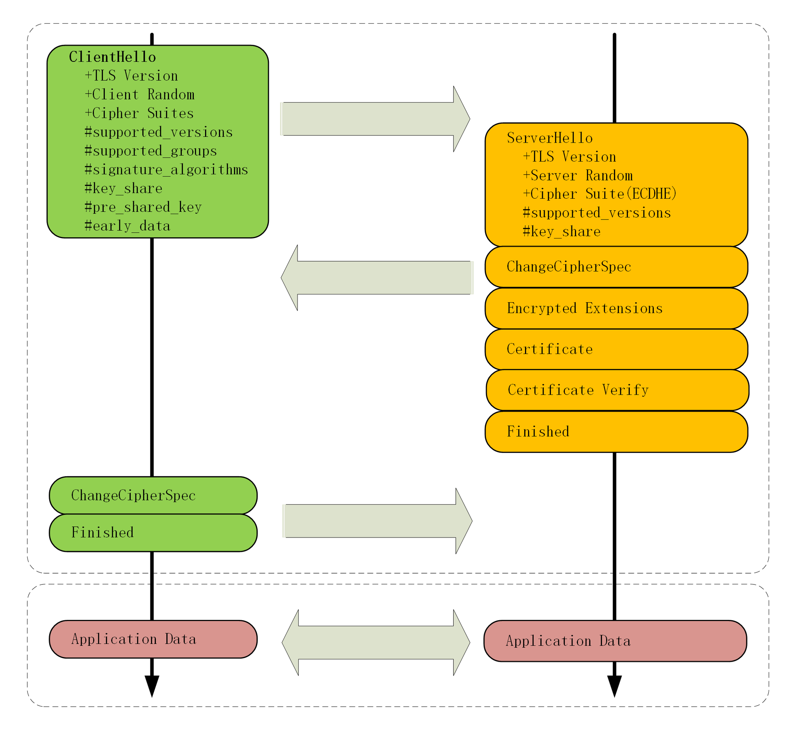

#### 握手流程


#### 流程分析

> 1.3对比1.2，精简了算法套件，简化了握手流程，加强了安全性。默认使用ECDHE。

1. 第一个包：客户端发送给服务端（和1.2流程相比，新增了很多拓展字段）

   * “Client Hello”（版本号、随机数（Client Random）、支持的密码套件）。

     ~~~java
     Handshake Protocol: Client Hello
         Version: TLS 1.2 (0x0303)
         Random: cebeb6c05403654d66c2329…
         Cipher Suites (18 suites)
             Cipher Suite: TLS_AES_128_GCM_SHA256 (0x1301)
             Cipher Suite: TLS_CHACHA20_POLY1305_SHA256 (0x1303)
             Cipher Suite: TLS_AES_256_GCM_SHA384 (0x1302)
         Extension: supported_versions (len=9)
             Supported Version: TLS 1.3 (0x0304)
             Supported Version: TLS 1.2 (0x0303)
         Extension: supported_groups (len=14)
             Supported Groups (6 groups)
                 Supported Group: x25519 (0x001d)
                 Supported Group: secp256r1 (0x0017)
         Extension: key_share (len=107)
             Key Share extension
                 Client Key Share Length: 105
                 Key Share Entry: Group: x25519
                 Key Share Entry: Group: secp256r1
     ~~~

     > 注意“Client Hello”里的扩展，“supported_versions”表示这是TLS1.3，“supported_groups”是支持的曲线，“key_share”是曲线对应的参数。

2. 第二个包：服务端回复客户端（也是和1.2类似的，多一些拓展字段）

   * “Server Hello”（版本号、随机数（Server Random）、选择的密码套件）

     ~~~java
     Handshake Protocol: Server Hello
         Version: TLS 1.2 (0x0303)
         Random: 12d2bce6568b063d3dee2…
         Cipher Suite: TLS_AES_128_GCM_SHA256 (0x1301)
         Extension: supported_versions (len=2)
             Supported Version: TLS 1.3 (0x0304)
         Extension: key_share (len=36)
             Key Share extension
                 Key Share Entry: Group: x25519, Key Exchange length: 32
     ~~~

     > 表面上看和 TLS1.2 是一样的，重点是后面的扩展。“supported_versions”里确认使用的是 TLS1.3，然后在“key_share”扩展带上曲线和对应的公钥参数。

     > 这时只交换了两条消息，客户端和服务器就拿到了四个共享信息：Client Random 和 Server Random、Client Params 和 Server Params，两边就可以各自用 ECDHE 算出“Pre-Master”，再用 HKDF 生成主密钥“Master Secret”，效率比 TLS1.2 提高了一大截。

   * “Change Cipher Spec”，加密通讯生效

   * http-over-tls，后面的数据都是加密的。

3. 第三个包：客户端发送服务端（省略）

   * “Change Cipher Spec”，加密通讯生效
   * http-over-tls，后面的数据都是加密的。

