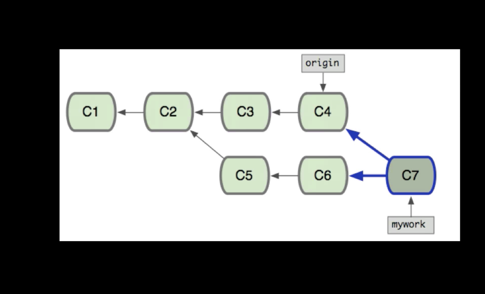
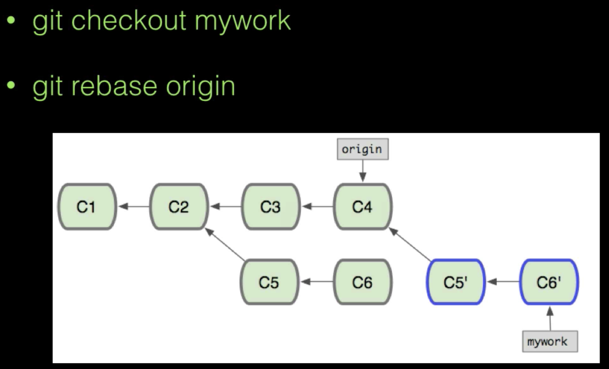

#### ，mac常用命令行

* cd 打开用户目录（cd . .打开上一层目录，cd - 打开上一次的目录）
* pwd 列出当前路径

* ls -al 显示目录详情
* tree  显示树形结构目录（tree -L 2 显示两级目录）
* rm 移除文件（rm -rf 递归删除文件，rm -rf /* 禁止执行此命令，删除所有文件）
* mkdir 创建文件夹（mkdir folder）
* touch 创建文件（touch test.txt）
* vi 编辑文件
* cat 输出文件内容
* echo 将文本输入到文件（echo 字符串 > test.txt）
  * echo "ssss" > test.txt 覆盖文件内容
  * echo "ssss" >> test.txt 追加到文件末尾
* diff 文件1 文件2 比较两个文件的差异
  * diff -u 文件1 文件2 详细的比较两个文件的差异。
* ssh-keygen 生成公钥和私钥（会在用户目录下的.ssh文件夹下生成两个文件）

#### 辅助功能

* control+a 光标移到开始
* control+e 光标移到结尾
* control+L 清屏 
  *  Command + K 清屏

#### git命令

* git init 初始化一个仓库

* git clone git@github.com:alless1/myGithubTest1.git 拉取项目到本地，会建立myGithubTest1文件夹

  * git clone git@github.com:alless1/myGithubTest1.git mytest 拉取项目到本地，内容都保存到mytest文件夹里。

* git status 查看当前状态

* git branch 查看分支

  * git branch -a 查看分支（包含远程的分支）
  * git branch -av 查看分支带提交节点（包含远程的分支）

  * git branch <新分支名> 创建新分支
  * git branch -d <分支名> 删除分支
  * git branch -D <分支名> 强制删除分支
  * git branch -m 原分支名 新分支名 分支改名 

* git chechout 分支名 切换分支 （git checkout - 切回上一次的分支）

  * git switch 分支名 切换分支
  * git checkout -d <新分支名> 新建并切换到新分支

* git merge <分支1> 将分支1的改动合并到当前分支

* git add 文件名 添加文件到缓存区

* git commit 提交到版本库（-m 内容说明）

  * git commit --amend -m "xxxxx"（重新修改上一次日志记录，不能修改指定记录的信息吗？）
  * git commit -am "xxxx" (相当于git add . 和git commit -m，只针对修改文件有用)

* git log 查看提交日志 q退出查看

  * git log -n (最近n条日志)
  * git log --graph（图形化显示日志）
  * git reflog 查看操作日志（当回退之后，无法看到最新的提交日志，可以查看操作日志记录）
  * git log origin/master 查看远程分支的日志记录

* git restore 文件名 （恢复工作区删除的文件）

  * 旧版的命令：git checkout -- 文件名

* git restore --staged 文件名 （恢复暂存区的文件和操作）

  * 旧版的命令：git reset HEAD 文件名

* git blame 文件 查看文件的修改记录

* git tag -a v1.0 -m "第一版正式" v1.0就是标签名

  * git tag 显示标签列表
  * git show v1.0 显示标签详情
  * git push origin v1.0 推送标签到远程
  * git push origin refs/tags/v1.0:refs/tags/v1.0 推送标签到远程完整的写法
  * git push origin --tags 推送所有的标签到远程

工作区、暂存区、版本区，两两比较。

* git diff 比较的是工作区与暂存区之间的差别
* git diff HEAD 比较的是工作区与最新提交的差别
* git diff --cached 比较的是最新的提交与暂存区之间的差别
  * git diff --cahced commitId 比较的是某次提交与暂存区的差别。
* git merge 分支1 将分支1合并到当前分支
* git pull 拉取远程代码（等于 git fetch + git merge）
* git push 推送代码到远程
  * 完整写法git push origin src:dest ，src本地分支名，dest远程分支名
  * git push 相当于 git push origin dev:dev ，dev是当前分支名，如果关联的远程分支和本地分支名不同，执行git push就会出错。
* git config --global alias.br branch (起别名，global应用范围，br是别名，替代branch，注意是内部命令，外部命令要加!)

#### 账户和邮箱

对于user.name与user.email来说，有3个地方可以设置

1. /etc/gitconfig （针对系统，几乎不会使用）
   * git config --system
2. ~/.gitcofig （针对用户，cd目录，常用）
   * git config --global
3. 针对于当前项目.git/config （针对项目，常用，git config --local user.name xxx）
   * git config --local 

优先级是3>2>1，查看用户名或邮箱 git config user.name/user.email

#### git的文件管理

* 对工作区的任何文件的修改（添加，删除，修改），都要先纳入暂存区（add），才能提交到版本库(commit)。

#### 文件删除

* git rm 文件名 
  1. 删除了一个文件。相当于执行命令rm 文件名
  2. 将被删除的文件纳入到暂存区（stage,index），相当于执行命令git add 文件名。当前可以commit。
* rm 文件名
  1. 只是删除了一个文件，被删除的文件并未纳入暂存区中。当前无法commit，需要先add。

#### 文件恢复

* 使用rm删除的文件，只需要一步
  1. git restore 文件名 （将工作区的操作撤销）
* 使用git rm删除的文件，需要两步，第一步将暂存区的修改撤销，再将文件恢复。
  1. git restore --staged 文件名（将暂存区的操作撤销）
  2. git restore 文件名 （将工作区的操作撤销）

#### 文件重命名

* 使用git mv 文件1 文件2 （完成重命名并纳入暂存区，然后可以commit）
* 使用mv 文件1 文件2 （完成重命名并未纳入暂存区，需要手动git add 文件1 文件2）

#### 撤销文件重命名

这个操作比较复杂，这里涉及到两个并行的操作。

1. 文件1删除，改动提交到暂存区。
2. 文件2创建，改动提交到暂存区。

如果要撤销到重命名之前的状态

1. 将文件1的改动从暂存区撤销，将文件1恢复。
2. 将文件2的改动从暂存区撤销，将文件2删除。

执行操作

* 文件1的操作
  1. git restore --staged 文件1
  2. git restore 文件1
* 文件2的操作
  1. git restore --staged 文件2
  2. rm 文件2

#### 文件忽略

添加.gitignore文件，并在其中添加需要过滤的文件或者正则表达式。（git会自动忽略掉空的文件夹）

.gitignore只会忽略还没加入到track的文件

* settings.prpperties 忽略文件settings.prpperties (忽略指定的文件（不限制路径）或者指定的文件夹下的所有文件，如果前面加了/就限制了在根目录下。)

  * /test1.txt 根目录下的test1.txt会被忽略，不忽略其他目录下的。例如mydir/test1.txt是不会被忽略的。

  * /*/test1.txt 二级目录下的test1.txt文件会被忽略

  * /**/test1.txt 所有目录下的test1.txt文件会被忽略

  * mydir/ 忽略mydir目录下所有文件，并没有限制mydir是在几级目录。后面加不加/意思一样。

  * doc/*.txt 会忽略doc/notes.txt，但不会忽略doc/server/arch.txt。

    ~~~java
    doc/*.txt	#表示会忽略doc一级目录下的.txt文件
    doc/*/*.txt	#表示会忽略doc二级目录下的.txt文件
    doc/**/*.txt #表示会忽略doc所有目录下的.txt文件
    ~~~

* *.txt 忽略.txt后缀的文件

* !test.txt 不忽略test.txt文件

> .gitignore只会忽略还没加入过暂存区的文件。如果想要将之前已经加入过暂存区的文件，加入忽略，只能先将所有文件移除缓存区，再添加进去。

~~~java
git rm -r --cached .
git add .
git commit -m 'update .gitignore' //这一步貌似不需要
~~~

#### 分支

分支就只是一个分支指针，分支指针指向节点，HEAD是当前工作位置的指针，指向分支指针

* 合并分支

  > 个人理解的fast-forward，本地没有修改代码，其他人修改了代码，本地pull，会直接获取到最新版本，指向最新节点，而不需要手动合并再提交。
  >
  > 就是分支指针直接前移。而不是通过commit来移动的。

  * git merge <分支1> 将分支1合并到当前分支，如果当前分支并未改动，会自动执行fast-forward，即将当前分支的指针移动到分支1的最新节点。

    

  * git merge --no-ff dev 将分支dev合并到当前分支，并禁止使用fast-forward，即新建节点。

    

#### git rebase

功能和merge类似，但原理不同。

merge合并分支

rebase合并分支

rebase过程出现冲突

1. 解决冲突，git add
2. 继续，git rebase --continue

rebase过程终止

1. git rebase --abort

rebase使用建议

* 不要对master分支执行rebase，容易引发问题。
* 一般来说，执行rebase的分支都是自己的本地分支，没有推送到远程版本库。

#### git版本回退

* 回退到上一版本
  * git reset --hard HEAD^（^这个代表上一次，n个^代表上n次）
  * git reset --hard HEAD~1（1代表上一次，n代表上n次）
  * git reset --hard commitId（通知指定commitId回到指定的位置）
* 可以使用checkout到指定的一个节点，会提示在游离状态，当前新建分支就可以了，然后把以前的分支删除掉。也可以实现类似回退的功能。

#### 保存工作现场

需要切换分支，但是不想提交改动，就先保存工作现场。

* 保存现场
  * git stash 保存现场
  * git stash list 查看保存的现场
* 恢复现场
  * git stash apply（stash内容并不删除，需要通过git stash drop stash@{0}手动删除）
  * git stash pop（恢复的同时也将stash内容删除）
  * git stash apply stash@{0}

#### 本地仓库提交到远程仓库

https

~~~java
//1.添加远程仓库，origin是远程仓库标识
git remote add origin https://github.com/xx/xx.git
//2.关联远程仓库，并推送到远程。（本地当前是master）和远程分支master关联）
git push -u origin master
~~~

ssh

~~~java
git remote add origin git@github.com:alless1/myGithubTest1.git
//git remote show origin // ssh -T git@github.com 尝试连接远程主机GitHub,会提示无法访问远程仓库，需要添加公钥到GitHub。
git push -u origin master
~~~

生成公钥和密钥

~~~java
ssh-keygen
//不需要设置密码，一直回车。私钥位置/Users/chengjie/.ssh/id_rsa 公钥位置/Users/chengjie/.ssh/id_rsa.pub
//将公钥内容添加到GitHub网站上。
~~~

> https和ssh的区别在于，ssh在push代码到远程的时候，不需要再输入账户和密码。
>
> 如果在项目下添加公钥，其他项目就无法使用相同的公钥，可以在github账户下添加公钥。

如果在GitHub上面创建新仓库时候添加了文件README.mk，就是生成了一次提交。在本地已有仓库的情况下，执行上面的push会出问题。

~~~java
git push -u origin master //错误信息提示： 远程仓库有提交，需要先pull
  
git pull origin master //fatal: refusing to merge unrelated histories 说明有两个不同的仓库

git pull origin master --allow-unrelated-histories //允许合并不同的分支,会执行一次合并提交。
  
git push -u origin master //关联并推送到远程  

~~~

本地新建了分支，远程没有新分支。远程需要新建分支和本地关联。

~~~java
git push --set-upstream origin dev	//dev代表源分支，目标分支默认相同，远程自动新建dev分支，并和本地dev关联,和git push -u origin dev作用相同，新版建议使用--set-upstream
git push --set-upstream origin dev/dev2 //如果远程分支不想和本地分支名字相同，可以写上目标分支名，远程分支名dev2
~~~

远程有了新分支，本地没有新分支。本地需要新建分支和远程关联。

~~~java
git checkout -b dev origin/dev	//本地新建dev分支，并和远程dev关联。
git checkout --track origin/dev //新版的使用方式。
~~~

删除远程分支

~~~java
git push origin :dev	//推送一个空分支到远程的dev
git push origin --delete dev //新版使用方式。
~~~

删除远程标签

~~~java
git push origin :refs/tags/v1.0 //推送一个空标签到远程的v1.0标签
git push origin --delete tag v1.0 //新版使用方式
//删除本地的标签
git tag -d v1.0
~~~

#### git开发流程规范建议

1. Gitflow
2. 基于Git分支的开发模型：
   * develop分支（频繁变化的一个分支）
   * test分支（供测试与产品等人员使用的一个分支，变化不是特别频繁）
   * master分支（生产发布分支，变化非常不频繁的一个分支）
   * bugfix（hotfix）分支（生产系统当中出现了紧急Bug，用于紧急修复的分支）

#### .git文件夹详情

> git gc 会压缩并移动一些文件。

~~~java
├── COMMIT_EDITMSG	
├── FETCH_HEAD		//执行fetch的时候的当前head
├── HEAD					//ref: refs/heads/dev
├── ORIG_HEAD			//d7bace4ad46cdadf4b8c3c07054b9ddcde8b61ee
├── branches
├── config				//本地配置文件，用户名邮箱之类
├── description
├── gitk.cache
├── hooks
│   ├── applypatch-msg.sample
│   ├── commit-msg.sample
│   ├── fsmonitor-watchman.sample
│   ├── post-update.sample
│   ├── pre-applypatch.sample
│   ├── pre-commit.sample
│   ├── pre-push.sample
│   ├── pre-rebase.sample
│   ├── pre-receive.sample
│   ├── prepare-commit-msg.sample
│   └── update.sample
├── index
├── info
│   └── exclude
├── logs
│   ├── HEAD
│   └── refs
│       ├── heads
│       │   ├── dev
│       │   ├── master
│       │   ├── test
│       │   └── test2
│       └── remotes
│           └── origin
│               ├── dev
│               ├── master
│               ├── test
│               └── test2
├── objects		//节点信息，04+a1…… 代表commitID，这是一个节点二进制文件。
│   ├── 04
│   │   ├── a1d15db3309daaf962dcc4dc9d00f2a2877d58
│   │   └── a3311d219ce2e4f47f457201fc90a030a042b0
│   ├── f4
│   │   └── a958c87f2dc711bf3926d6a455f737a34d49b5
│   ├── f7
│   │   └── 61ec192d9f0dca3329044b96ebdb12839dbff6
│   ├── info
│   └── pack
├── refs		//本地分支、远程分支、标签，的指针信息。
│   ├── heads
│   │   ├── dev
│   │   ├── master
│   │   ├── test
│   │   └── test2
│   ├── remotes
│   │   └── origin
│   │       ├── dev
│   │       ├── master
│   │       ├── test
│   │       └── test2
│   └── tags
│       ├── v1.0
│       └── v2.0
~~~

#### git submodule

git的子模块，一个git项目可以引用多个其他git项目作为子模块。

添加子模块

~~~java

~~~

获取子模块的更新

~~~java
git pull //在子模块目录中执行
git submodule foreach git pull //在主项目目录下执行，遍历所有的子模块
~~~

其他用户获取主项目（包含子项目的），需要手动初始化子项目，和更新子项目

~~~java
1.克隆主项目-和以前操作一样 
  git clone xxx 目录
2.初始化子项目,在主项目目录下执行
  git submodule init
3.更新子项目
  git submodule update --recursive
  
//更简单的一种方式，只需要在克隆命令后添加参数--recursive
1. git clone xxx 目录 --recursive
~~~

#### git subtree

~~~java
1.主项目里增加另外一个远程库subtree-origin
git remote add subtree-origin xxxxx
2.将项目添加到subtreedir目录下，关联分支master。--squash是不保留子项目的日志。注意：squash如果使用了，后面拉取子项目代码都要使用squash。
git subtree add --prefix=subtreedir subreee-rigin master --squash
~~~

拉取远程子项目的更新

~~~java
git subtree pull --prefix=subtreeedir subtree-origin master --squash
~~~

推送子项目到更新到远程（子项目仓库）

~~~java
git subtree push --prefix=subtreedir subtree-origin master
~~~

#### git cherry-pick

将分支的修改复制到其他分支

~~~java
git cherry-pick commitId	//如果不是连续的节点，可能会有冲突
~~~

