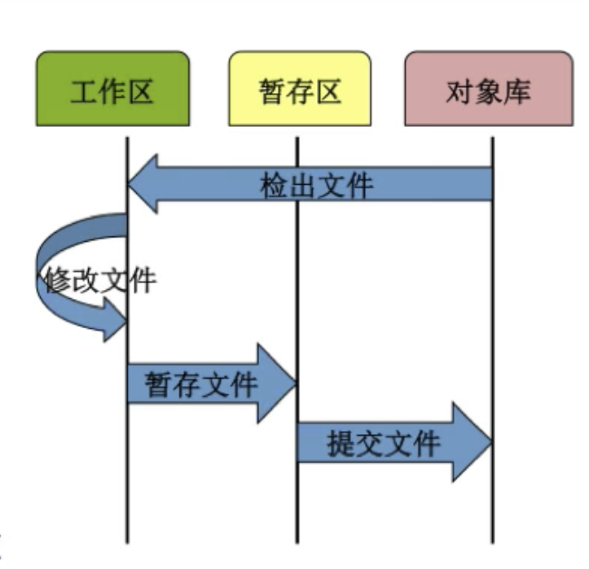
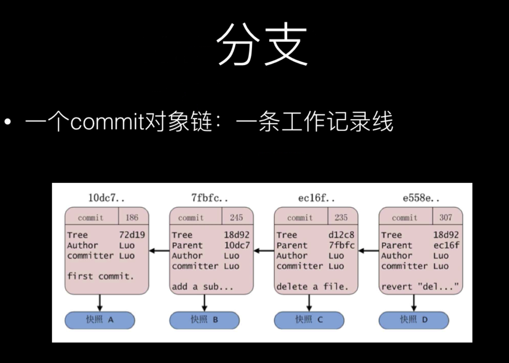
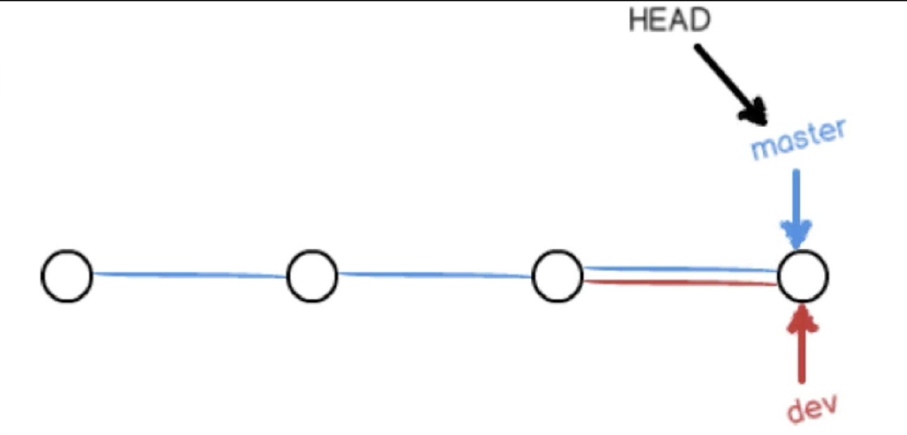
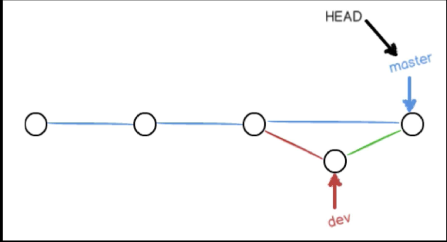

#### mac常用命令行

* cd 打开用户目录（cd . .打开上一层目录，cd - 打开上一次的目录）
* pwd 列出当前路径

* ls -al 显示目录详情
* tree  显示树形结构目录（tree -L 2 显示两级目录）
* rm 移除文件（rm -rf 递归删除文件，rm -rf /* 禁止执行此命令，删除所有文件）
* mkdir 创建文件夹（mkdir folder）
* touch 创建文件（touch test.txt）
* vi 编辑文件
* cat 输出文件内容
* echo 将文本输入到文件（echo 字符串 > test.txt）
* diff 文件1 文件2 比较两个文件的差异
  * diff -u 文件1 文件2 详细的比较两个文件的差异。
* ssh-keygen 生成公钥和私钥（会在用户目录下的.ssh文件夹下生成两个文件）

#### 辅助功能

* control+a 光标移到开始
* control+e 光标移到结尾

#### git命令

* git init 初始化一个仓库

* git status 查看当前状态

* git branch 查看分支

  * git branch -a 查看分支（包含远程的分支）

  * git branch <新分支名> 创建新分支
  * git branch -d <分支名> 删除分支
  * git branch -D <分支名> 强制删除分支
  * git branch -m 原分支名 新分支名 分支改名 

* git chechout 分支名 切换分支 （git checkout - 切回上一次的分支）

  * git switch 分支名 切换分支

* git checkout -d <新分支名> 新建并切换到新分支

* git merge <分支1> 将分支1的改动合并到当前分支

* git add 文件名 添加文件到缓存区

* git commit 提交到版本库（-m 内容说明）

  * git commit --amend -m "xxxxx"（重新修改上一次日志记录，不能修改指定记录的信息吗？）
  * git commit -am "xxxx" (相当于git add . 和git commit -m，只针对修改文件有用)

* git log 查看提交日志 q退出查看

  * git log -n (最近n条日志)
  * git log --graph（图形化显示日志）
  * git reflog 查看操作日志（当回退之后，无法看到最新的提交日志，可以查看操作日志记录）

* git restore 文件名 （恢复工作区删除的文件）

  * 旧版的命令：git checkout -- 文件名

* git restore --staged 文件名 （恢复暂存区的文件和操作）

  * 旧版的命令：git reset HEAD 文件名

* git blame 文件 查看文件的修改记录

工作区、暂存区、版本区，两两比较。

* git diff 比较的是工作区与暂存区之间的差别
* git diff HEAD 比较的是工作区与最新提交的差别
* git diff --cached 比较的是最新的提交与暂存区之间的差别
  * git diff --cahced commitId 比较的是某次提交与暂存区的差别。

#### 账户和邮箱

对于user.name与user.email来说，有3个地方可以设置

1. /etc/gitconfig （针对系统，几乎不会使用）
   * git config --system
2. ~/.gitcofig （针对用户，cd目录，常用）
   * git config --global
3. 针对于当前项目.git/config （针对项目，常用，git config --local user.name xxx）
   * git config --local 

优先级是3>2>1，查看用户名或邮箱 git config user.name/user.email

#### git的文件管理

* 对工作区的任何文件的修改（添加，删除，修改），都要先纳入暂存区（add），才能提交到版本库(commit)。

#### 文件删除

* git rm 文件名 
  1. 删除了一个文件。相当于执行命令rm 文件名
  2. 将被删除的文件纳入到暂存区（stage,index），相当于执行命令git add 文件名。当前可以commit。
* rm 文件名
  1. 只是删除了一个文件，被删除的文件并未纳入暂存区中。当前无法commit，需要先add。

#### 文件恢复

* 使用rm删除的文件，只需要一步
  1. git restore 文件名 （将工作区的操作撤销）
* 使用git rm删除的文件，需要两步，第一步将暂存区的修改撤销，再将文件恢复。
  1. git restore --staged 文件名（将暂存区的操作撤销）
  2. git restore 文件名 （将工作区的操作撤销）

#### 文件重命名

* 使用git mv 文件1 文件2 （完成重命名并纳入暂存区，然后可以commit）
* 使用mv 文件1 文件2 （完成重命名并未纳入暂存区，需要手动git add 文件1 文件2）

#### 撤销文件重命名

这个操作比较复杂，这里涉及到两个并行的操作。

1. 文件1删除，改动提交到暂存区。
2. 文件2创建，改动提交到暂存区。

如果要撤销到重命名之前的状态

1. 将文件1的改动从暂存区撤销，将文件1恢复。
2. 将文件2的改动从暂存区撤销，将文件2删除。

执行操作

* 文件1的操作
  1. git restore --staged 文件1
  2. git restore 文件1
* 文件2的操作
  1. git restore --staged 文件2
  2. rm 文件2

#### 文件忽略

添加.gitignore文件，并在其中添加需要过滤的文件或者正则表达式。（git会自动忽略掉空的文件夹）

* settings.prpperties 忽略文件settings.prpperties (忽略指定的文件（不限制路径）或者指定的文件夹下的所有文件，如果前面加了/就限制了在根目录下。)

  * /test1.txt 根目录下的test1.txt会被忽略，不忽略其他目录下的。例如mydir/test1.txt是不会被忽略的。

  * /*/test1.txt 二级目录下的test1.txt文件会被忽略

  * /**/test1.txt 所有目录下的test1.txt文件会被忽略

  * mydir/ 忽略mydir目录下所有文件，并没有限制mydir是在几级目录。后面加不加/意思一样。

  * doc/*.txt 会忽略doc/notes.txt，但不会忽略doc/server/arch.txt。

    ~~~java
    doc/*.txt	#表示会忽略doc一级目录下的.txt文件
    doc/*/*.txt	#表示会忽略doc二级目录下的.txt文件
    doc/**/*.txt #表示会忽略doc所有目录下的.txt文件
    ~~~

* *.txt 忽略.txt后缀的文件

* !test.txt 不忽略test.txt文件

  

#### 分支

分支就只是一个分支指针，分支指针指向节点，HEAD是当前工作位置的指针，指向分支指针

* 合并分支

  * git merge <分支1> 将分支1合并到当前分支，如果当前分支并未改动，会自动执行fast-forward，即将当前分支的指针移动到分支1的最新节点。

    

  * git merge --no-ff dev 将分支dev合并到当前分支，并禁止使用fast-forward，即新建节点。

    

#### git版本回退

* 回退到上一版本
  * git reset --hard HEAD^（^这个代表上一次，n个^代表上n次）
  * git reset --hard HEAD~1（1代表上一次，n代表上n次）
  * git reset --hard commitId（通知指定commitId回到指定的位置）

#### 保存工作现场

需要切换分支，但是不想提交改动，就先保存工作现场。

* 保存现场
  * git stash 保存现场
  * git stash list 查看保存的现场
* 恢复现场
  * git stash apply（stash内容并不删除，需要通过git stash drop stash@{0}手动删除）
  * git stash pop（恢复的同时也将stash内容删除）
  * git stash apply stash@{0}

#### 本地仓库提交到远程仓库

https

~~~java
git remote add origin https://github.com/xx/xx.git
git push -u origin master
~~~

ssh

~~~java
git remote add origin git@github.com:alless1/myGithubTest1.git
//git remote show origin // ssh -T git@github.com 尝试连接远程主机GitHub,会提示无法访问远程仓库，需要添加公钥到GitHub。
git push -u origin master
~~~

生成公钥和密钥

~~~java
ssh-keygen
//不需要设置密码，一直回车。私钥位置/Users/chengjie/.ssh/id_rsa 公钥位置/Users/chengjie/.ssh/id_rsa.pub
//将公钥内容添加到GitHub网站上。
~~~

> https和ssh的区别在于，ssh在push代码到远程的时候，不需要再输入账户和密码。

#### git开发流程规范建议

1. Gitflow
2. 基于Git分支的开发模型：
   * develop分支（频繁变化的一个分支）
   * test分支（供测试与产品等人员使用的一个分支，变化不是特别频繁）
   * master分支（生产发布分支，变化非常不频繁的一个分支）
   * bugfix（hotfix）分支（生产系统当中出现了紧急Bug，用于紧急修复的分支）