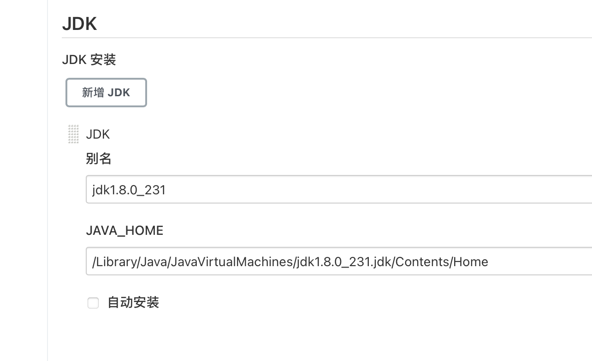
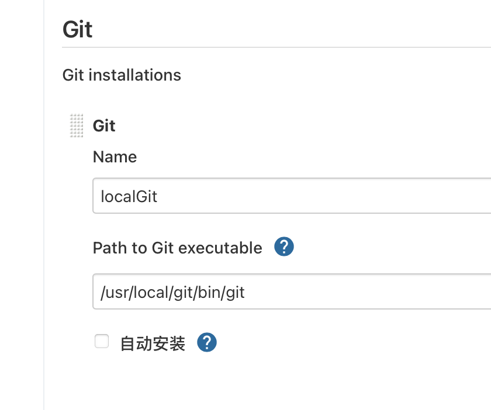
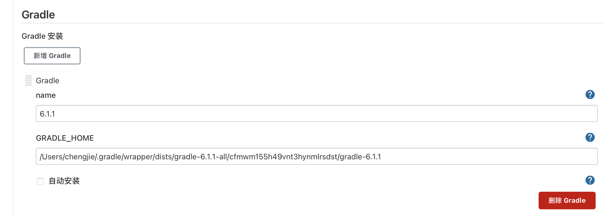
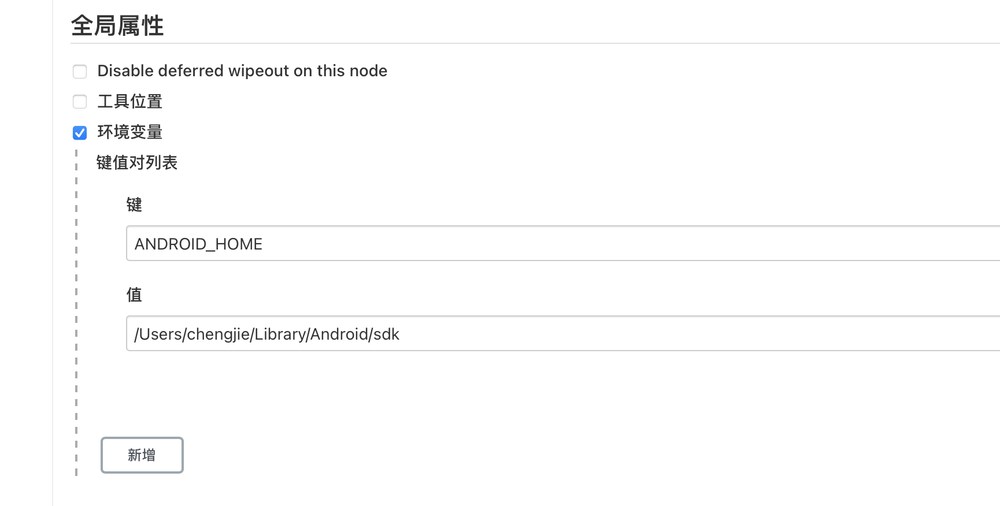
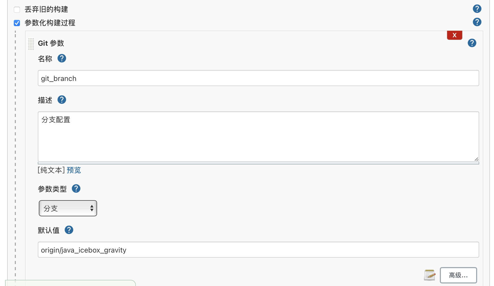
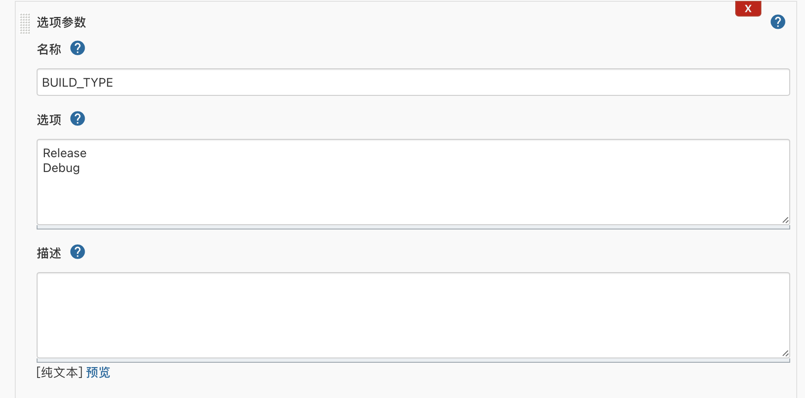
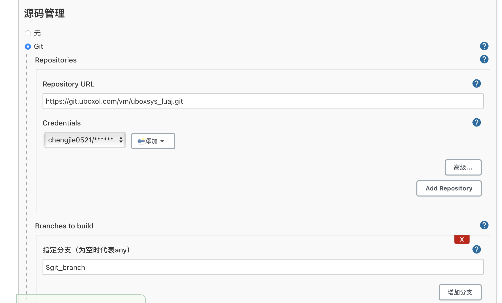
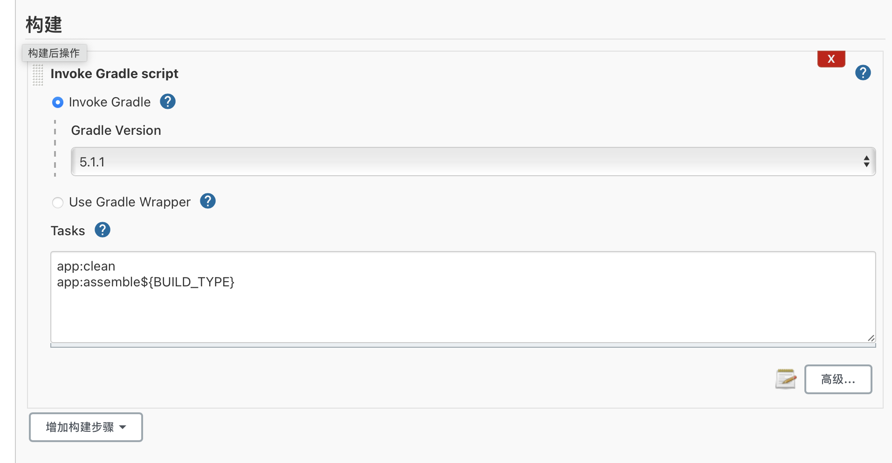
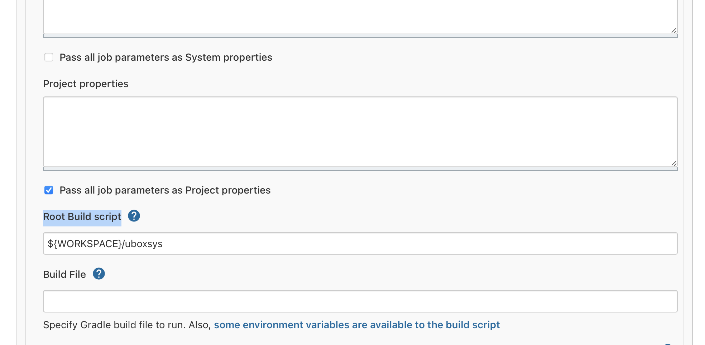

git-parameter.hpimac上安装jenkins打包android

## 一.安装jenkins

~~~java
brew install jenkins-lts
~~~

## 二.安装插件和环境配置

* Git plugin
* Gradle Plugin
* Git Parameter Plug-In

> 无法在线安装可以离线下载安装包文件git-parameter.hpi

#### 系统配置>全局工具配置

* jdk
* git

* gradle

  

#### 系统配置>全局属性

* sdk

  

### 三.构建项目

1. 参数化构建过程，Git参数（需要插件Git Parameter），会自动拉取分支列表。

   

2. 参数化构建过程，选项参数，

   

   

3. 源码管理 Git仓库设置，添加，输入账户和密码。

   指定分支配合Git参数（git_branch）。

4. 构建，Invoke Gradle，选择本地配置的gradle。Use Gradle Wrapper会提示没用权限。

   

5. 构建->高级，勾选Pass all job parameters as Project properties，运行时将参数修改到gradle.properties

   * Root Build script，设置脚本运行的根目录。

   

