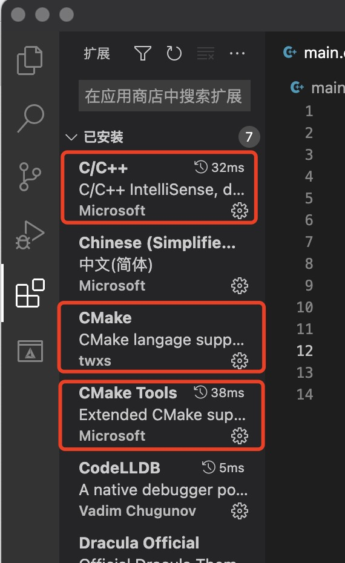
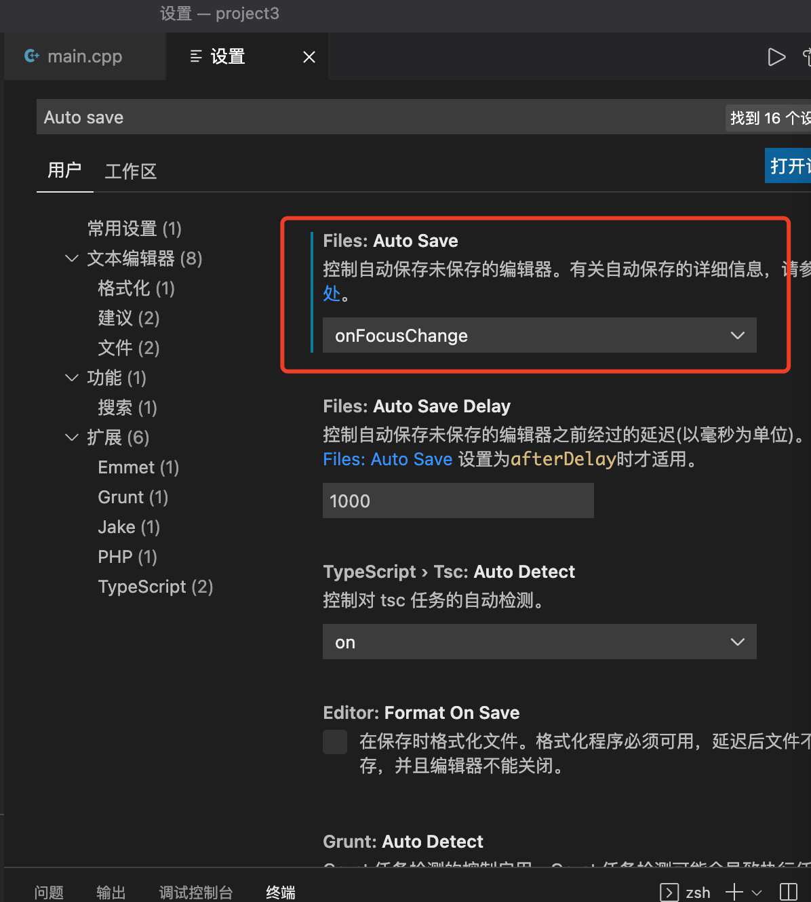
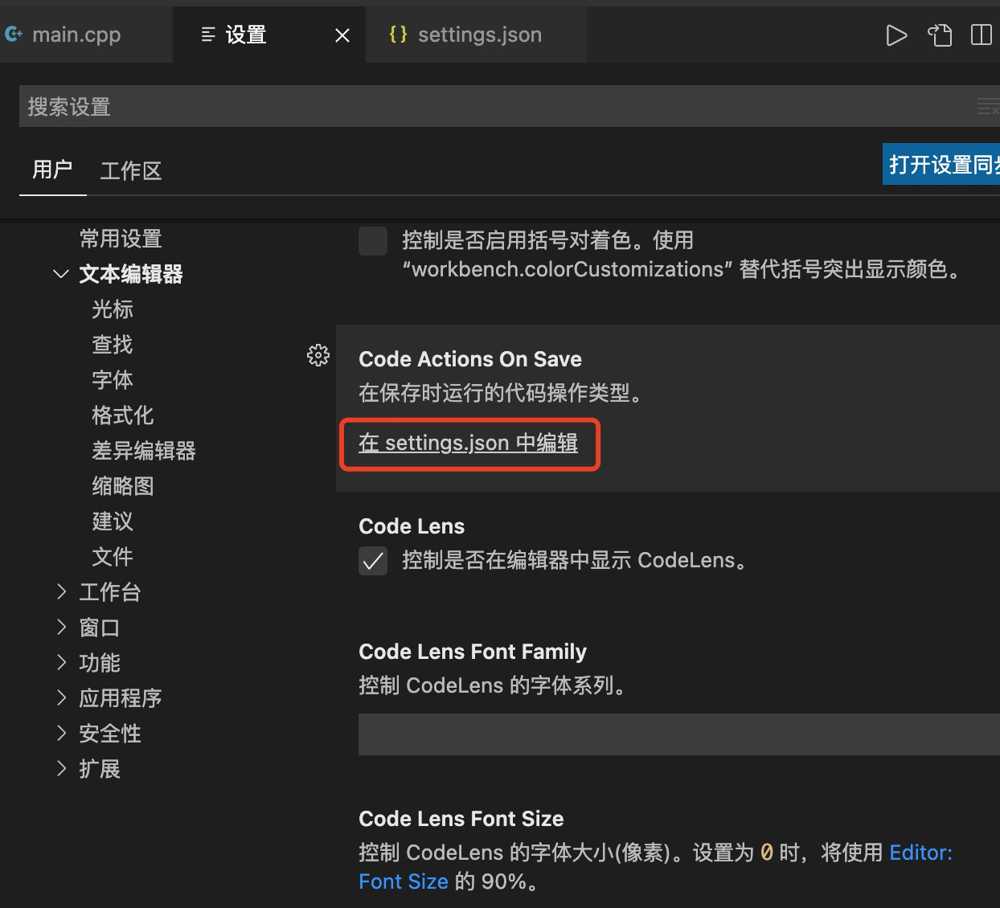
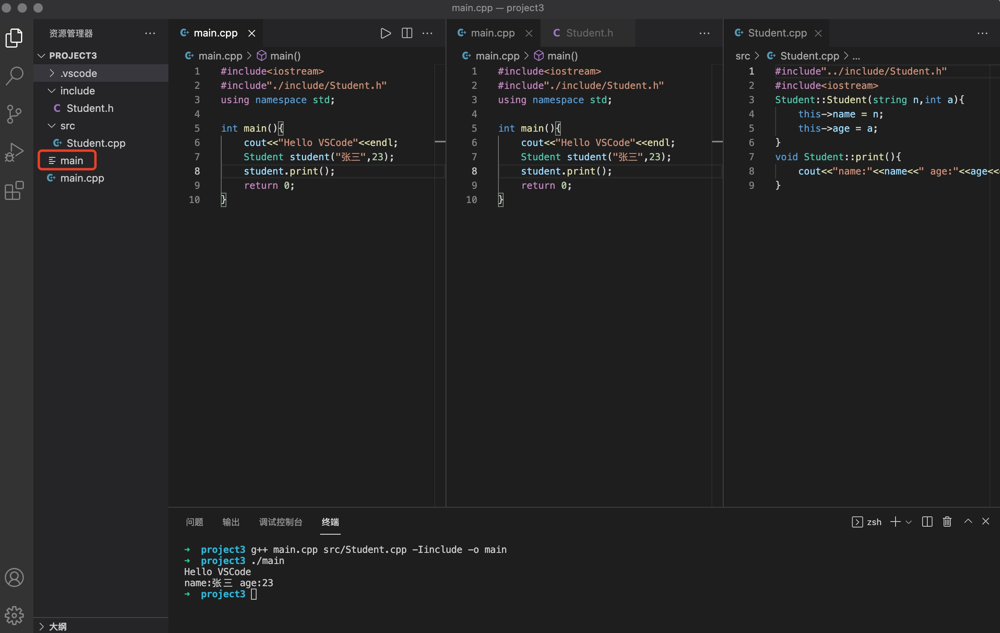
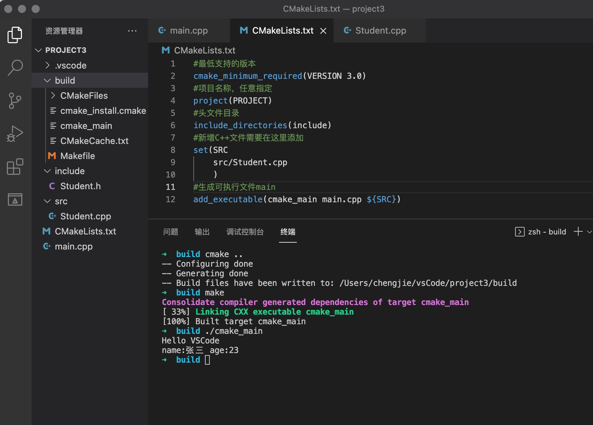

# MacOS VSCode C++的使用

## 1. 安装应用和插件

> 可能需要另外安装cmake

* 必须的插件C/C++,CMake,CMake Tools。千万别装C/C++ Clang，会导致头文件爆红，但编译正常。

## 2.全局基本设置

* 首选项-设置，Auto save，选择一种文件自动保存的方式。

## 3. 简单项目运行

1. 新建一个项目文件夹

2. 创建一个用于存放头文件的目录include

3. 创建一个用于存放C++文件的目录src

4. 编译文件：g++ main.cpp src/Student.cpp -Iinclude -o main

5. 执行文件：./main

   

## 4. 使用Cmake编译项目

1. 在项目根目录下，创建文件CMakeLists.txt

   ~~~txt
   #最低支持的版本
   cmake_minimum_required(VERSION 3.0)
   #项目名称，任意指定
   project(PROJECT)
   #头文件目录
   include_directories(include)
   #新增C++文件需要在这里添加
   set(SRC 
       src/Student.cpp
       )
   #生成可执行文件cmake_main
   add_executable(cmake_main main.cpp ${SRC})
   ~~~

2. 创建文件夹build，用于存放cmake生成文件。

3. 在build目录下，执行命令：cmake ..

4. 执行命令：make

5. 运行可执行文件：./cmake_main

## 5. 使用Cmake运行和调试项目

1. 新建一个tasks.json文件，自动执行cmake和make指令。

   ~~~json
   {   
       "version": "2.0.0",
       "options": {
           "cwd": "${workspaceFolder}/build"
       },
       "tasks": [
           {
               "type": "shell",
               "label": "cmake",
               "command": "cmake",
               "args": [
                   ".."
               ]
           },
           {
               "label": "make",
               "group": {
                   "kind": "build",
                   "isDefault": true
               },
               "command": "make",
               "args": [
   
               ]
           },
           {
               "label": "Build",
   			"dependsOrder": "sequence", // 按列出的顺序执行任务依赖项
               "dependsOn":[
                   "cmake",
                   "make"
               ]
           }
       ]
   
   }
   ~~~

   

2. 新建launch.json文件，修改program和preLaunchTask。

   ~~~json
   {
       "version": "0.2.0",
       "configurations": [
           {
               "name": "g++ - 生成和调试活动文件",
               "type": "cppdbg",
               "request": "launch",
               "program": "${workspaceFolder}/build/cmake_main",//当前的可执行文件
               "args": [],
               "stopAtEntry": false,
               "cwd": "${workspaceFolder}",
               "environment": [],
               "externalConsole": false,
               "MIMode": "lldb",
               "preLaunchTask": "Build"//指向tasks
           }
       ]
   }
   ~~~

3. 打开CMakeLists.txt文件，添加内容。

   ~~~json
   set(CMAKE_BUILD_TYPE Debug)
   ~~~

4. 打断点，点击运行和调试。

