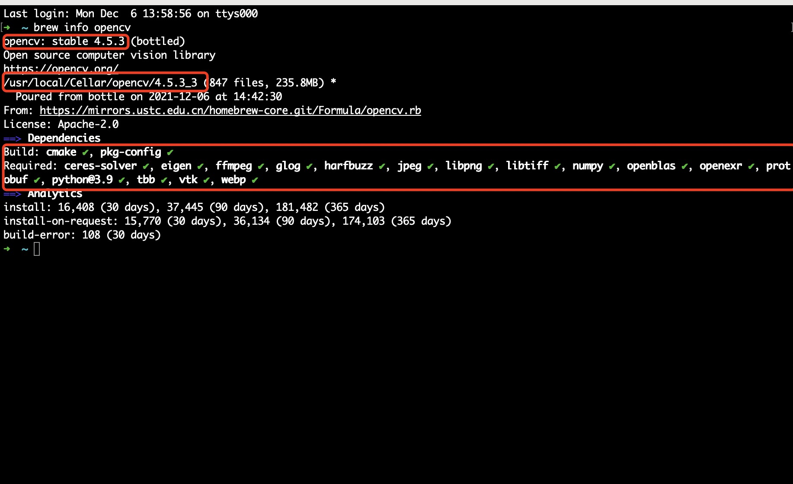
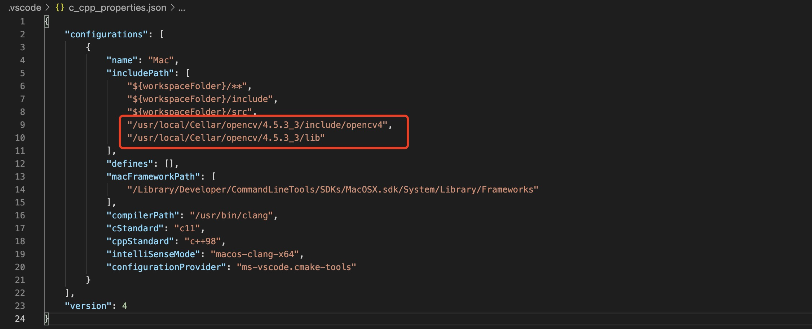
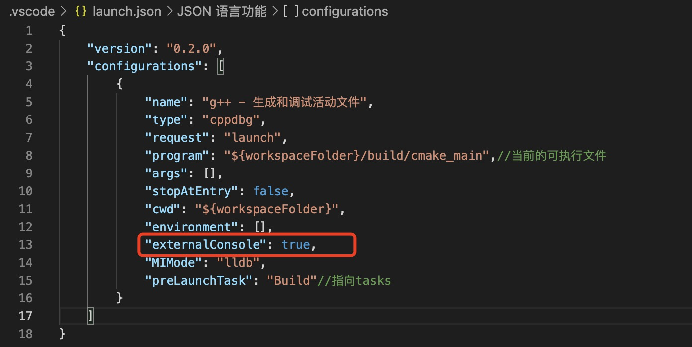
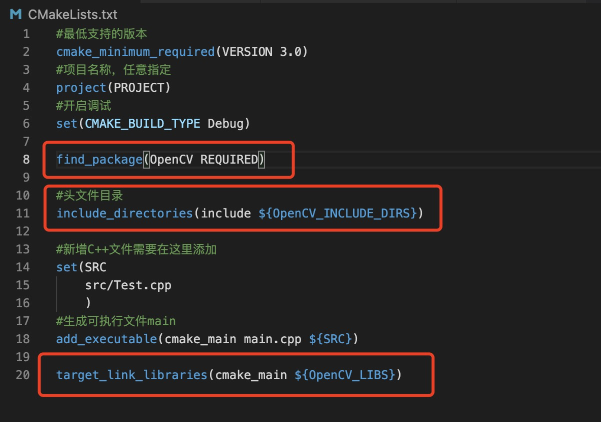

# MacOS VSCode OpenCV的使用

> 基于《MacOS VSCode C++的使用》文档，安装好vscode，配置好cmakeLists。

## 1.安装OpenCV

安装opencv

~~~java
brew install opencv
~~~

查看opencv安装结果,标识处分别是版本号、安装目录、依赖工具。

~~~java
brew info opencv
~~~

## 2.配置vscode

将opencv库文件路径添加到c_cpp_properties.json文件中。

launch.json里打开控制台设置

## 3.配置CMakeLists.txt文件

## 4.运行测试

~~~ja
#include <opencv2/opencv.hpp>
using namespace cv;
int main(int argc, char *argv[])
{

  Mat img = imread("/Users/chengjie/Desktop/test/1.jpg");//载入图片，不支持中文路径。
  imshow("显示图片", img);//显示图像窗口
  waitKey(0);//等待任意按键按下关闭窗口

  return 0;
}
~~~

