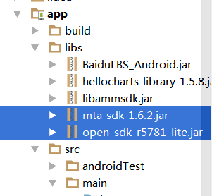

## QQ第三方登录的思路：
	1.先登录成功获取token和openid
	2.再通过token和openid获取用户的信息。

-在开放者平台创建应用，获取APPip,不需要通过审核。

## 集成步骤 ##
### 一、导入SDK的jar文件 ###

### 二、配置AndroidManifest ###
 <!--QQ授权登录-->
        <activity
            android:name="com.tencent.connect.common.AssistActivity"
            android:configChanges="orientation|keyboardHidden|screenSize"
            android:theme="@android:style/Theme.Translucent.NoTitleBar" />

        <activity
            android:name="com.tencent.tauth.AuthActivity"
            android:launchMode="singleTask"
            android:noHistory="true">
            <intent-filter>
                <action android:name="android.intent.action.VIEW" />

                <category android:name="android.intent.category.DEFAULT" />
                <category android:name="android.intent.category.BROWSABLE" />

                <data android:scheme="1105811048" /><!--你的appid,有的前面加tencent-->
            </intent-filter>
        </activity>

### 三、使用 ###
	//初始化
	Tencent mTencent = Tencent.createInstance(你的AppId,this);

	//1.调用qq登录
	public void loginQQ(){
        /** 判断是否登陆过 */
        if (!mTencent.isSessionValid()){
            mTencent.login(this, "all",loginListener);
        }/** 登陆过注销之后在登录 */
        else {
            mTencent.logout(this);
            mTencent.login(this, "all",loginListener);
        }
    }

	//2.QQ授权回调
  	IUiListener loginListener = new IUiListener() {
        @Override
        protected void doComplete(JSONObject values) {
			//储存token和openId
            initOpenidAndToken(values);
        }
    };
	
	//3.存储token和openid 
	public static void initOpenidAndToken(JSONObject jsonObject) {
        try {
            String token = jsonObject.getString(Constants.PARAM_ACCESS_TOKEN);
            String expires = jsonObject.getString(Constants.PARAM_EXPIRES_IN);
            String openId = jsonObject.getString(Constants.PARAM_OPEN_ID);
            if (!TextUtils.isEmpty(token) && !TextUtils.isEmpty(expires) && !TextUtils.isEmpty(openId)) {
                mTencent.setAccessToken(token, expires);
                mTencent.setOpenId(openId);
            }
        } catch(Exception e) {
        }
    }
	
	 			//4.获取用户信息
				Tencent mTencent = Tencent.createInstance(你的AppId,this);
				if(mTencent != null && mTencent.isSessionValid()) {
	                UserInfo mInfo = new UserInfo(this,mTencent.getQQToken());
	                mInfo.getUserInfo(new IUiListener() {
	
	                    @Override
	                    public void onError(UiError e){
	
	                    }
	
	                    @Override
	                    public void onComplete(final Object response){
	                        JSONObject json = (JSONObject) response;
	                        Log.d(TAG, "onComplete: "+json);;
	                        try {
	                            headImgUrl = json.getString("figureurl_qq_2");
	                            Glide.with(mContext).load(headImgUrl).into(mContactIcon);
	                        } catch(JSONException e) {
	                            e.printStackTrace();
	                        }
	                    }
	
	                    @Override
	                    public void onCancel(){
	
	                    }
	                });
	            }

-获取信息json.getString("字段名")

		{
		    "is_yellow_year_vip": "0",
		    "ret": 0,
		    "figureurl_qq_1": "http://q.qlogo.cn/qqapp/222222/8C75BBE3DC6B0E9A64BD31449A3C8CB0/40",
		    "figureurl_qq_2": "http://q.qlogo.cn/qqapp/222222/8C75BBE3DC6B0E9A64BD31449A3C8CB0/100",
		    "nickname": "小罗",
		    "yellow_vip_level": "0",
		    "msg": "",
		    "figureurl_1": "http://qzapp.qlogo.cn/qzapp/222222/8C75BBE3DC6B0E9A64BD31449A3C8CB0/50",
		    "vip": "0",
		    "level": "0",
		    "figureurl_2": "http://qzapp.qlogo.cn/qzapp/222222/8C75BBE3DC6B0E9A64BD31449A3C8CB0/100",
		    "is_yellow_vip": "0",
		    "gender": "男",
		    "figureurl": "http://qzapp.qlogo.cn/qzapp/222222/8C75BBE3DC6B0E9A64BD31449A3C8CB0/30"
		}

-登录成功无法返回数据。

	@Override
    protected void onActivityResult(int requestCode, int resultCode, Intent data) {
        if (requestCode == Constants.REQUEST_LOGIN || requestCode == Constants.REQUEST_APPBAR) {
            Tencent.onActivityResultData(requestCode, resultCode, data, qqLoginListener);
        }
        super.onActivityResult(requestCode, resultCode, data);
    }