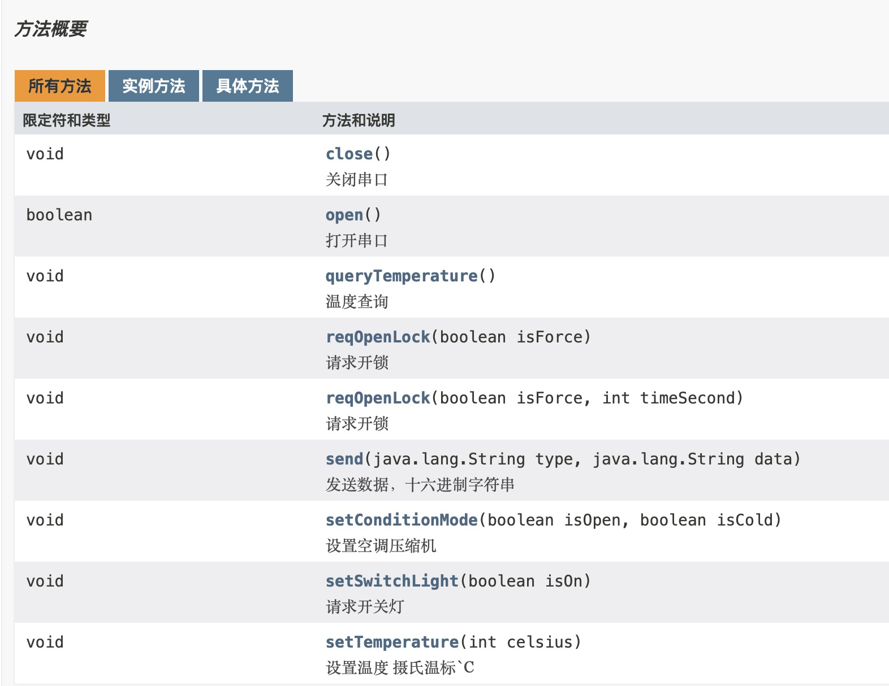
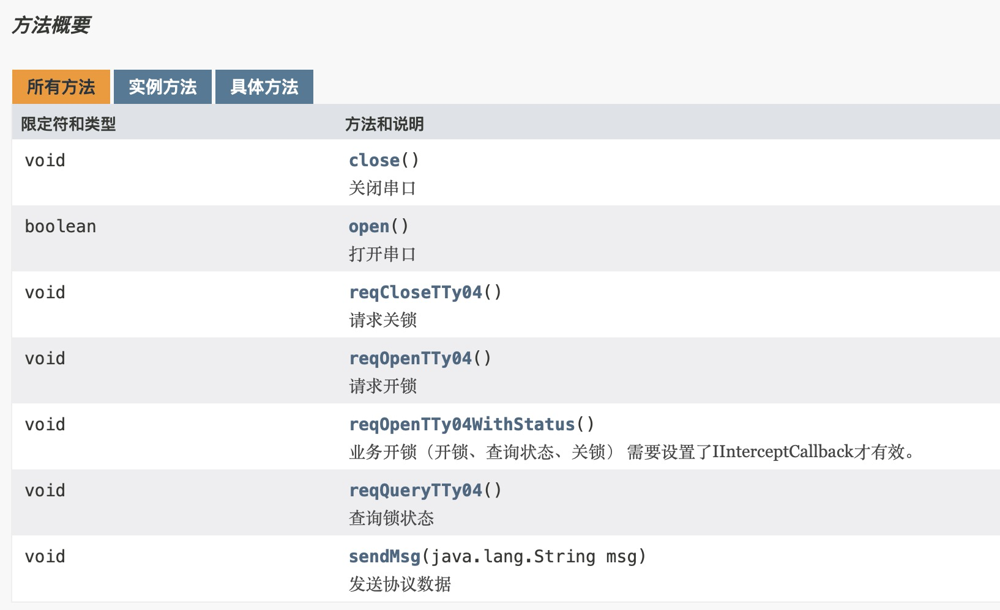

# 荷叶货柜门锁库类说明

## 一、初始化

~~~java
            SerialLib2.setILogger(mILogger);//设置日志打印
            SerialLib2.setIInterceptCallback(mIInterceptLock);//设置门锁消息拦截
            mSerialClassTyO2 = SerialLib2.getPortO2(mSerialProcessTyO2);//获取ttyO2串口（美的）
            boolean openTyO2 = mSerialClassTyO2.open();//打开ttyO2串口
            LogInfo.infos("openTyO2:" + openTyO2);
            mSerialClassTyO4 = SerialLib2.getPortO4(mSerialProcessTyO4);//获取ttyO4串口（星星）
            boolean openTyO4 = mSerialClassTyO4.open();//打开ttyO4串口
            LogInfo.infos("openTyO4:" + openTyO4);
~~~

## 二、API说明

* SerialClassTtyO2负责美的门锁控制，主要方法如下：

  

* SerialClassTtyO4负责星星门锁控制，主要方法如下：

  

