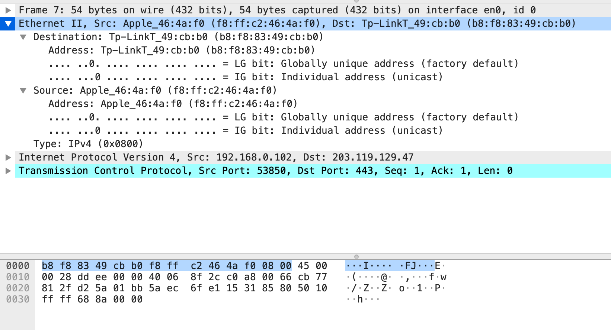
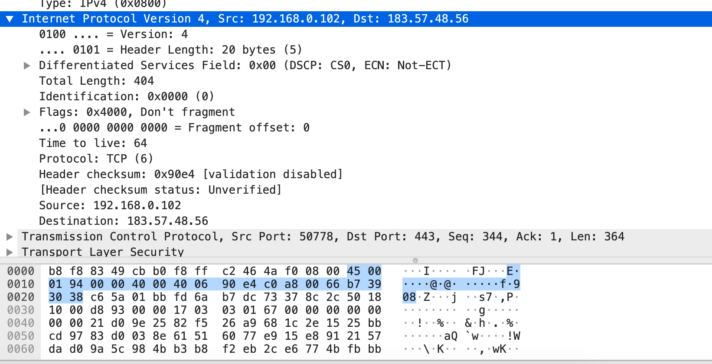
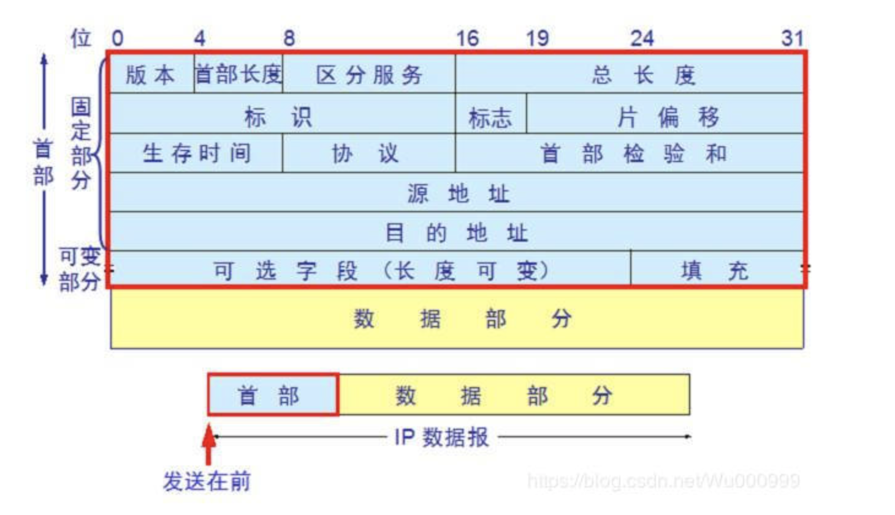
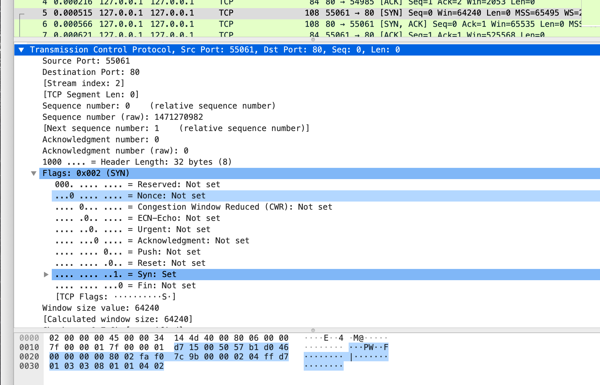
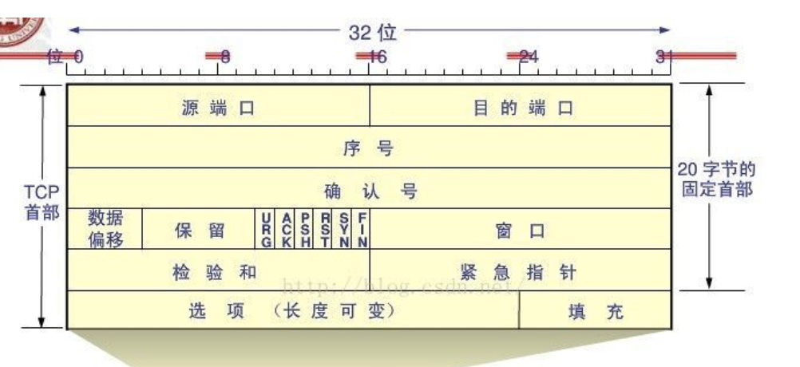
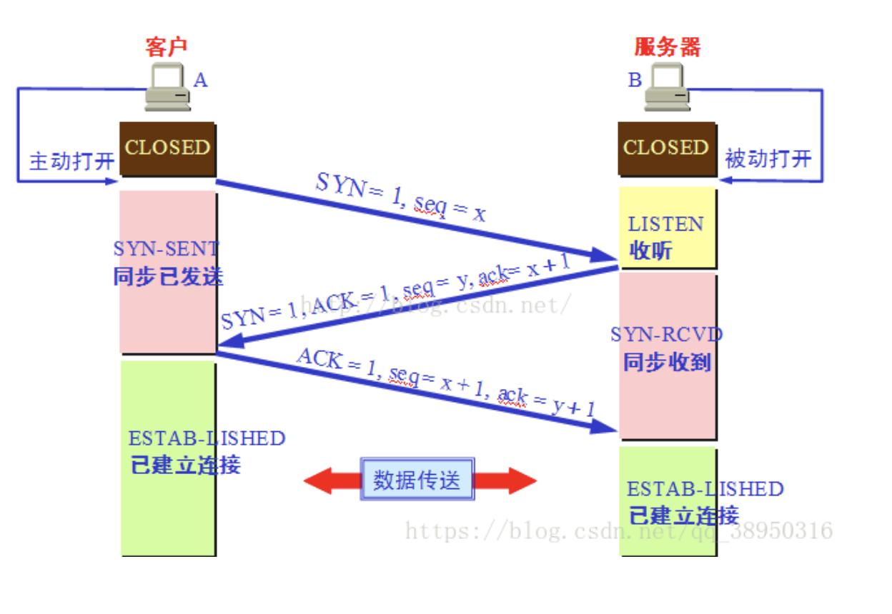
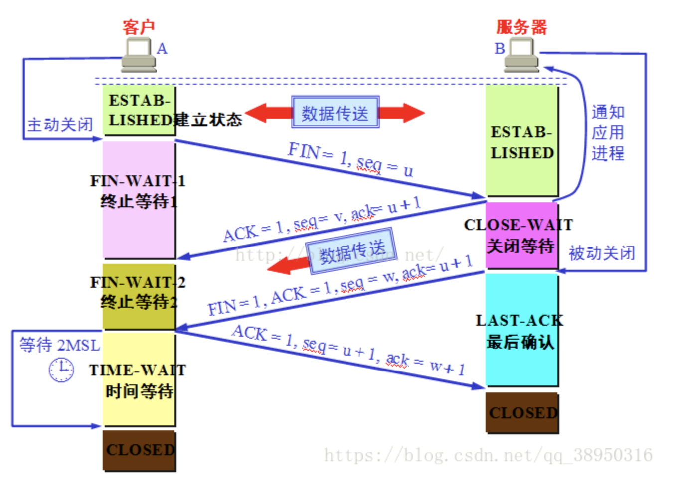
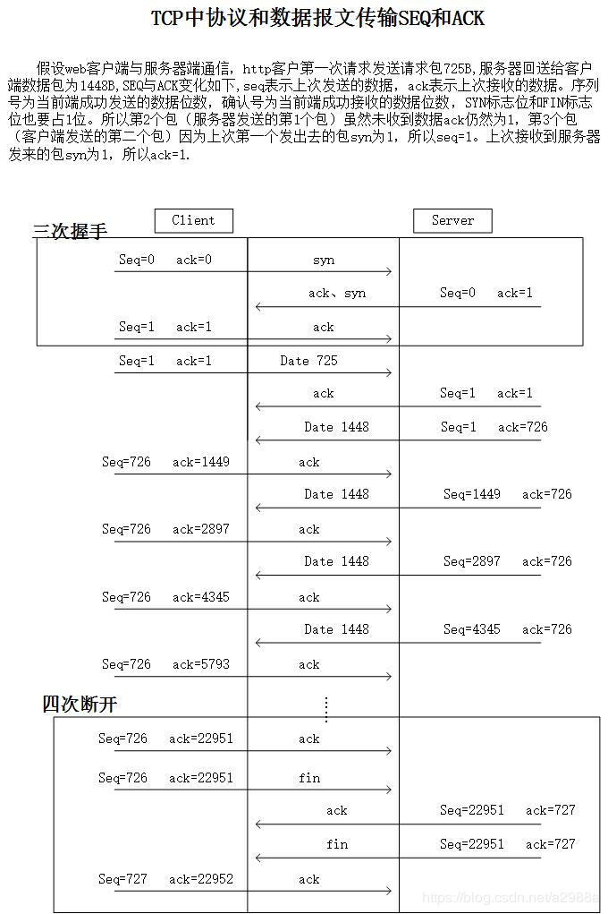

### TCP/IP协议报文分析

#### 链路层，物理地址。

* EthernetII 以太网帧格式
* 通常是，目标网卡地址+源网卡地址+类型（用来标志上一层使用的是什么协议）

#### IP层

* IP层结构参考

#### TCP层

* TCP层数据&握手协议第一步

* TCP层结构参考

#### TCP三次握手

#### TCP四次挥手

* seq：序列号，指当前端，上一次发送成功的数据位数。
* ack：确认号，指当前端，上一次接收成功的数据位数。

* SYN：标志符，代表同步，用于建立连接的时候。
* ACK：标志符，代表确认，用于收到消息后的回复。
* FIN：标志符，代表终止，用于断开连接的时候。

> 从图片中来看：
>
> seq等于自己这边上一次的seq加上发送的Len(图片里的Data)，SYN和FIN也算1位。
>
> ack等于等于自己这边上一次的ack加上接收的Len(图片里的Data)，SYN和FIN也算1位。

#### 总结

1.不管是客户端还是服务端，每次收到消息，都要回复对方一个ACK。

2.tcp三次握手流程：客户端发送一个SYN，服务端回复一个ACK和SYN，客户端再回复一个ACK。

3.tcp四次挥手流程：客户端发送一个FIN，服务端回复ACK，服务端准备好了，服务端发送一个FIN，客户端回复一个ACK。

4.为什么握手是三次，挥手是四次？因为一次信息交流，最少要三次，客户端请求，服务端确认并回复，客户端回复。挥手是因为不能马上断开，客户端请求断开，服务端回复确认，但服务端不能马上断开，所以会另外再发送断开给客户端。

